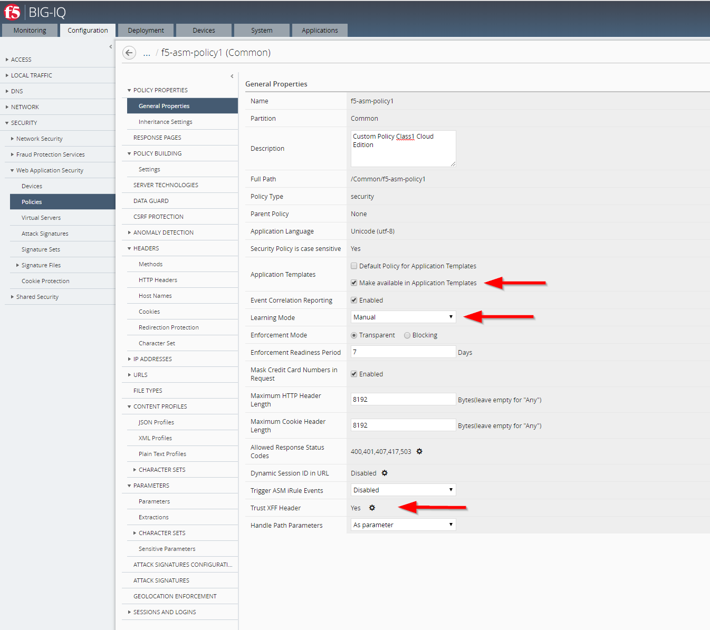
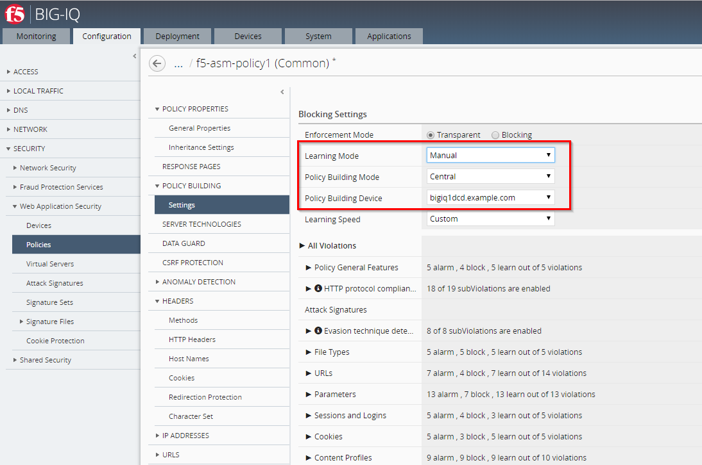
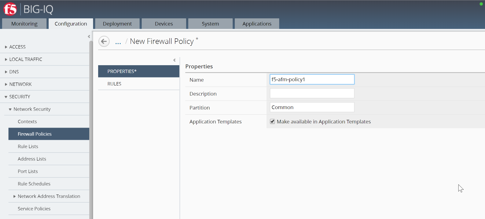
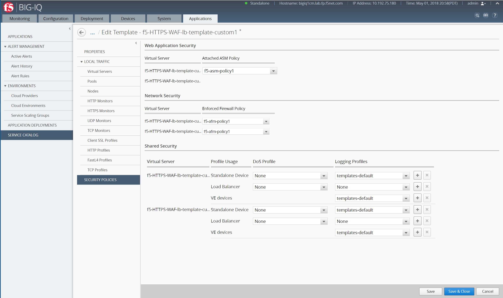

Lab 2.2: Create custom security policies & Application Service Template
-----------------------------------------------------------------------
Connect as **larry**

1. Create the custom ASM policy, go to *Configuration* > *SECURITY* > *Web Application Security* > *policies*.

.. image:: ../pictures/module2/img_module2_lab2_1.png
  :align: center
  :scale: 50%

|

Select the ``f5-asm-policy1`` ASM policy from the list and look through its settings. Notice the policy is in Transparent mode.

Edit the Policy ``f5-asm-policy1``, switch to ``Manual`` Learning Mode and ``Make available in Application Templates``, click Save.

|

.. note:: Set ``Trust XFF Header`` to ``Yes`` if you want the client IP/Country visible in the Security Analytics

In addition, go to *POLICY BUILDING* > *Settings* and set *Policy Building Mode* to ``Central`` and switch to ``Manual`` Learning Mode, click Save & Close.

.. note:: The intent for the initial release 6.0 was to be able to push a basic (negative only) security policy that can provide a basic level of protection for most applications. For 6.0, it is recommended that learning shouldn’t be enabled with app templates – it should be a fundamental policy. However, if you want to use learning/blocking mode, you will need a dedicated app template per application.

.. warning:: Ignore the unauthorized error when saving the policy.

2. Create the AFM Policy, go to *Configuration* > *SECURITY* > *Network Security* > *Firewall Policies*, click Create.
Then enter the name of your policy: ``f5-afm-policy1``. Make sure the box ``Make available in Application Templates`` is checked. Click Save.

|

Create 2 Rules:

- rule 1: set the destination ports to ``443`` and ``80``, Protocol to ``tcp``
- rule 2: set action to ``reject`` and log to ``true``

Click Save & Close.

.. image:: ../pictures/module2/img_module2_lab2_6.png
  :align: center
  :scale: 50%

|

Connect as **marco**

1. Create a Clone of the *Default-f5-HTTPS-WAF-lb-template* policy, go to *Applications* > *SERVICE CATALOG*, and click on *Clone*.
Enter the name of your cloned template: ``f5-HTTPS-WAF-lb-template-custom1``

.. image:: ../pictures/module2/img_module2_lab2_7.png
  :align: center
  :scale: 50%

|

2. Then select the ASM policy ``test-asm-policy_1``, the AFM policy ``f5-afm-policy1`` and the Logging Profile ``templates-default`` in the SECURITY POLICIES section on both Virtual Servers (Standalone Device).

.. warning:: The virtual servers within the same application have to use the same ASM policies. Therefore, the ASM policy attached to the 1st virtual server will apply to ALL the virtual servers automatically. 

|

Save & Close

.. image:: ../pictures/module2/img_module2_lab2_9.png
  :align: center
  :scale: 50%

|

3. **[New 6.0.1]** Publish your custom template after creation.

.. image:: ../pictures/module2/img_module2_lab2_9b.png
  :align: center
  :scale: 50%

4. In order to allow Paula to use the custom application template, go to : *System* > *Role Management* > *Roles*
and select *CUSTOM ROLES* > *Application Roles* > *Application Creator VMware* role (already assigned to Paula). Select the Template *f5-HTTPS-WAF-lb-template-custom1*, drag it to the right.

.. image:: ../pictures/module2/img_module2_lab2_10.png
    :align: center
    :scale: 50%

|

Click on *Save & Close*

.. note:: A DoS Profile could also be assign to the template but we are not using it for this lab.

.. warning:: Application DOS is only supported on Standalone device. The Network DOS is supported on Standalone and Tier 1 device (in a context of SSG)
