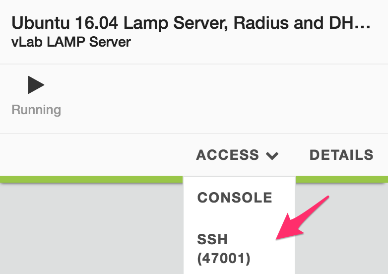

Lab 4.2: Deploy our ``SSG`` in ``AWS``
--------------------------------------

Since we have already seen the different components needed to deploy a ``SSG`` successfully, 
we will automatically deploy it and review its configuration. 

Retrieve our BIG-IP SEA Public IP 
*********************************

We will establish a ``VPN`` connection between our ``UDF`` environment and ``AWS``. 
This will be setup automatically with our BIG-IP SEA as one of the ``VPN endpoint``. 

In your ``UDF`` blueprint, find your BIG-IP called **SEA-vBIGIP01.termmarc.com.v13.1.0.5 (VPN)** 
and click on **Access** > **TMUI**. It will open a new tab in your browser to access its GUI. 

Here copy the ``hostname`` you see in your browser : 

.. image:: ../pictures/module4/img_module4_lab2_2.png
  :align: center
  :scale: 50%

|

Ping this ``hostname`` to retrieve its IP Address: 

.. code:: 

    PAR-ML-00026375:~ menant$ ping 443cbace-334b-491d-8b10-3772c26d70bb.access.udf.f5.com
    PING 443cbace-334b-491d-8b10-3772c26d70bb.access.udf.f5.com (129.146.155.127): 56 data bytes
    Request timeout for icmp_seq 0

In the example above, we can see that our public IP is **129.146.155.127**. 

.. note:: the ping will fail, it's fine. we just needed to retrieve the public IP

Launch our ``SSG`` - Access our orchestrator
********************************************

To setup ``BIG-IQ`` and ``AWS`` automatically, open a ``SSH`` connection on the 
UDF system called: **Ubuntu 16.04 Lamp Server, Radius and DHCP**

|

Once connected via ``SSH``, go into the folder: **AWS-CFT-Cloud-Edition**: 

    ``cd AWS-CFT-Cloud-Edition/``

we will need to edit the following files: 

* **config.yml**: This file will contains all the information needed to 
    deploy the ``AWS`` environment successfully. 
* **08-create-aws-auto-scaling.yml**: we will change the setup of the default ``SSG`` 
    that gets deployed. we want to deploy 2 instances to review how it is setup as 
    part of a ``SSG`` group. 

Launch our ``SSG`` - Update config.yml
***************************************

Use your favorite editor to update this file. 

    ``vi config.yml``

Here are the settings you will need to change to deploy everything successfully: 

* AWS_ACCESS_KEY_ID: Use the ``AWS Access Key`` you retrieved from the previous 
    lab (IAM section).
* AWS_SECRET_ACCESS_KEY: Use the ``AWS Secret Access Key`` you retrieve from the 
    previous lab (IAM section).
* PREFIX: Specify a ``prefix`` that will be used on each object automatically 
    created. we will use **udf-<your NAME>**. For example: **udf-MENANT** 

  .. warning:: 
        DO NOT PUT a ``-`` at the end or your deployment will fail. 
        
        We need you to put something so that your PREFIX will be UNIQUE to you or it will overlap with 
        other student's env. If your name is 'common', pick something else that should be unique or append 
        your first name to it. 

        Use udf- in the prefix or your ``SSG`` deployment will fail
        
        Remember that the PREFIX must be 10 CHARACTERS MAX

        

* AWS_SSH_KEY: Use the ``AWS Key Pair`` we created in the previous lab. In our example, it was **CE-Lab-MENANT** 
    but yours should have a different name.
* CUSTOMER_GATEWAY_IP: Use the Public IP Address of your BIG-IP **SEA BIG-IP** that you retrieved earlier. 

Save the config file. 

Here is an example of the updated **config.yml** file:

.. code::

    ##################################################################################################
    ###########################         UPDATE VARIABLE BELOW          ###############################
    ##################################################################################################

    AWS_ACCESS_KEY_ID: *****************
    AWS_SECRET_ACCESS_KEY: *********************

    # A unique searchable prefix to all resources which are created
    # Use a prefix w/o spaces or special characters (NO MORE THAN 10 CHARACTERS, no end with - or special characters)
    PREFIX: udf-MENANT

    # Select on of  the region below (default US EST N. Virginia)
    DEFAULT_REGION: us-east-1
    AWS_AZ_1A: us-east-1a
    AWS_AZ_1B: us-east-1b

    # Update your SSH AWS KEY (EC2 > NETWORK & SECURITY > Key Pairs)
    AWS_SSH_KEY: CE-Lab-MENANT

    # Get the public IP of SEA-vBIGIP01.termmarc.com, go to Access Methods, e.g. nslookup 49efa5b7-224c-4e7b-9f04-cf52591ec443.access.udf.f5.com)
    # Fill the IP address returned by the nslookup here
    # /!\ IF THE IP ADDRESS ENDS WITH A x.x.x.0 (e.g. 129.43.54.0), DELETE YOUR DEPLOYMENT AND RESTART A NEW ONE.
    CUSTOMER_GATEWAY_IP: 129.146.19.143

    BYOL_BIGIP_AMI: "ami-58c3d327" # us-east-1 F5 Networks BIGIP-13.1.1-0.0.4 BYOL - All Modules 1 Boot Location

.. note:: We don't have to change anything else as long as we use the US-East (N. Virginia) Region

.. warning:: in your **config.yml** file, you have the default password that will be used for the admin user 
    This password will be enforced on all the VEs deployed in your ``SSG``. 

    .. code:: 
        
        # BIG-IQ SSG CONFIG
        BIGIP_USER: admin
        BIGIP_PWD: **************

    MAKE SURE TO NOTE IT SOMEWHERE

Launch our ``SSG`` - Update our SSG configuration
*************************************************

To update configuration pushed by the orchestrator, we will update the file called 
**08-create-aws-auto-scaling.yml**. Use your favorite editor to update it 

Look for this section in the file: 

.. code::

    - include_tasks: ./helpers/post.yml
      with_items:
        - name: Create service scaling group
          url: "{{BIGIQ_URI}}/cm/cloud/service-scaling-groups"
          body: >
            {
                "name": "{{SSG_NAME}}",
                "description": "AWS scaling group",
                "environmentReference": {
                    "link": "https://localhost/mgmt/cm/cloud/environments/{{cloud_environment_result.id}}"
                },
                "minSize": 1,
                "maxSize": 3,
                "maxSupportedApplications": 3,
                "desiredSize": 1,
                "postDeviceCreationUserScriptReference": null,
                "preDeviceDeletionUserScriptReference": null,
                "scalingPolicies": [
                {
                    "name": "scale-out",
                    "cooldown": 15,
                    "direction": "ADD",
                    "type": "ChangeCount",
                    "value": 1
                },
                {
                    "name": "scale-in",
                    "cooldown": 15,
                    "direction": "REMOVE",
                    "type": "ChangeCount",
                    "value": 1
                }]
            }

Change the **minSize** and **desiredSize** from 1 to 2 : 

.. code::

    - include_tasks: ./helpers/post.yml
      with_items:
        - name: Create service scaling group
          url: "{{BIGIQ_URI}}/cm/cloud/service-scaling-groups"
          body: >
            {
                "name": "{{SSG_NAME}}",
                "description": "AWS scaling group",
                "environmentReference": {
                    "link": "https://localhost/mgmt/cm/cloud/environments/{{cloud_environment_result.id}}"
                },
                "minSize": 2,
                "maxSize": 3,
                "maxSupportedApplications": 3,
                "desiredSize": 2,
                "postDeviceCreationUserScriptReference": null,
                "preDeviceDeletionUserScriptReference": null,
                "scalingPolicies": [
                {
                    "name": "scale-out",
                    "cooldown": 15,
                    "direction": "ADD",
                    "type": "ChangeCount",
                    "value": 1
                },
                {
                    "name": "scale-in",
                    "cooldown": 15,
                    "direction": "REMOVE",
                    "type": "ChangeCount",
                    "value": 1
                }]
            }

Launch our ``SSG`` - Trigger the deployment 
*******************************************

Now that the relevant files have been updated, we can trigger the deployment. 

To trigger the deployment, run the following command: 

 ``./000-RUN_ALL.sh nopause``

It will ask you to press Enter to confirm that you subscribed and agreed to 
the EULA in the marketplace. Press enter to start the deployment. 

You should see something like this: 

.. code::

    f5@03a920f8b4c0410d8f:~/AWS-CFT-Cloud-Edition$ nohup ./000-RUN_ALL.sh nopause &
    f5@03a920f8b4c0410d8f:~/AWS-CFT-Cloud-Edition$ tail -f nohup.out

    Did you subscribed and agreed to the software terms in AWS Marketplace?

    https://aws.amazon.com/marketplace/pp/B07G5MT2KT/

    Press [Enter] key to continue... CTRL+C to Cancel
    [DEPRECATION WARNING]: [defaults]hostfile option, The key is misleading as it can also be a list of hosts, a directory or a list of paths , use [defaults] inventory=/path/to/file|dir
    instead. This feature will be removed in version 2.8. Deprecation warnings can be disabled by setting deprecation_warnings=False in ansible.cfg.

    PLAY [Install and configure dependencies and verify environment] ************************************************************************************************************************

    TASK [Gathering Facts] ******************************************************************************************************************************************************************
    ok: [localhost]

    TASK [command] **************************************************************************************************************************************************************************
    changed: [localhost]

    TASK [command] **************************************************************************************************************************************************************************
    changed: [localhost]

    TASK [command] **************************************************************************************************************************************************************************
    changed: [localhost]

    TASK [command] **************************************************************************************************************************************************************************
    changed: [localhost]

    TASK [command] **************************************************************************************************************************************************************************
    changed: [localhost]

    PLAY RECAP ******************************************************************************************************************************************************************************
    localhost                  : ok=6    changed=5    unreachable=0    failed=0

    [DEPRECATION WARNING]: [defaults]hostfile option, The key is misleading as it can also be a list of hosts, a directory or a list of paths , use [defaults] inventory=/path/to/file|dir
    instead. This feature will be removed in version 2.8. Deprecation warnings can be disabled by setting deprecation_warnings=False in ansible.cfg.

    PLAY [Deploy prerequisite infrastructure for SSG to AWS] ********************************************************************************************************************************

    TASK [Gathering Facts] ******************************************************************************************************************************************************************
    ok: [localhost]

    TASK [Set AWS Region] *******************************************************************************************************************************************************************
    changed: [localhost]

    TASK [Retrieve available subnets] *******************************************************************************************************************************************************
    ok: [localhost]

    TASK [Fail if there aren't enough availability zones] ***********************************************************************************************************************************
    skipping: [localhost]

    TASK [Build VPC CloudFormation] *********************************************************************************************************************************************************

At this stage, we should start deploying your environment in ``AWS``. 
In your ``AWS Console``, go to **Services** > **CloudFormation**. 

.. image:: ../pictures/module4/img_module4_lab2_3.png
  :align: center
  :scale: 50%

|

Here we can see that ``CloudFormation Stacks`` are being deployed with the prefix 
**udf-MENANT** as mentioned in **config.yml** file (prefix attribute)

In the next lab, we will review what has been setup on ``BIG-IQ`` and what was 
deployed in our ``AWS VPC``.

