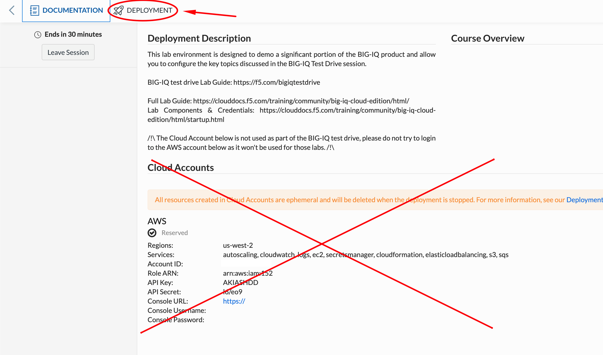
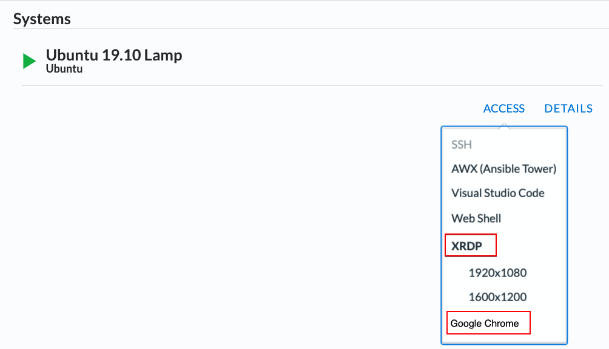
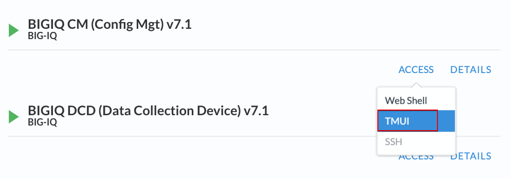
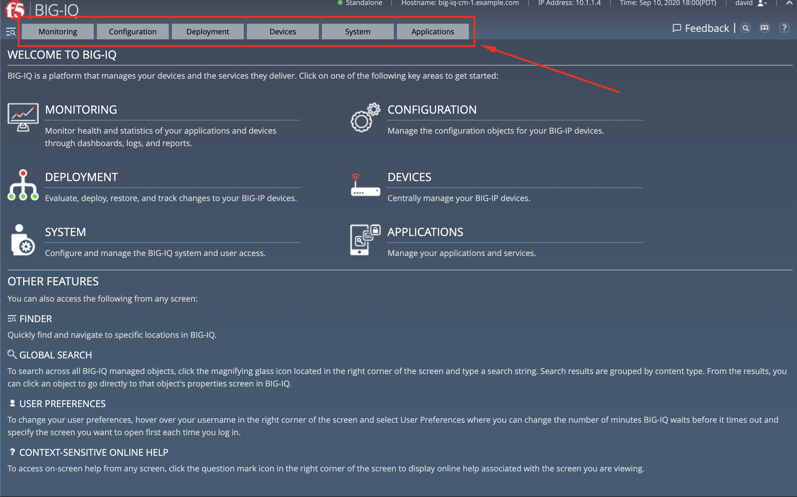

Lab environment access
^^^^^^^^^^^^^^^^^^^^^^

Once you connect to the UDF course portal, you will land on the **Documentation** tab where you can find the link to the lab guide.

Once you have the lab guide open, click on the **Deployment** tab to access the various systems in the lab.

|udf|

In order to complete this lab, you will find 2 ways to access the different systems in this lab.

1. Going directly to the BIG-IQ CM or BIG-IP TMUI or WEB SHELL/SSH (**RECOMMENDED**).

   To access the BIG-IQ directly, click on the *ACCESS* button under **BIG-IQ CM**
   and select *TMUI*. The credentials to access the BIG-IQ TMUI are ``david/david`` and ``paula/paula`` as directed in the labs.

   |udf_bigiq_tmui|

   To ssh into a system, you can click on *WEB SHELL* or *SSH* (you will need your ssh keys setup in the lab environment for SSH).

   You can also click on *DETAILS* on each component to see the credentials (login/password).

2. From the lab embeded Google Chrome browser.

   In your lab deployment, click on the *ACCESS* button of the **Ubuntu Lamp Server** system and click on
   *Google Chrome*.

   You can also use *XRDP* as an alternative, click on the resolution that works for your laptop. 
   When the RDP session launches showing *Session: Xorg*, simply click *OK*, no credentials are needed.
   Modern laptops with higher resolutions you might want to use 1440x900 and once XRDP is launched Zoom to 200%.

   |
   
   |udf_ubuntu_rdp_vnc|

BIG-IQ User Interface
---------------------

Once you connect to BIG-IQ, you can navigate in the following tabs:

- **Applications** - Application Management (Legacy, AS3) and Cloud Environment
- **System** - Manage all aspects for BIG-IQ and DCDs.
- **Devices** - Discover, Import, Create, Onboard (DO) and Manage BIG-IP devices.
- **Deployment** - Manage evaluation task and deployment for Configuration Management (none AS3)
- **Configuration** - ADC and Security Object Management (ASM, AFM, APM, DDOS, SSLo config/monitoring)
- **Monitoring** - Event collection per device, statistics monitoring, iHealth reporting integration, alerting, and audit logging.

|welcomebigiq|

