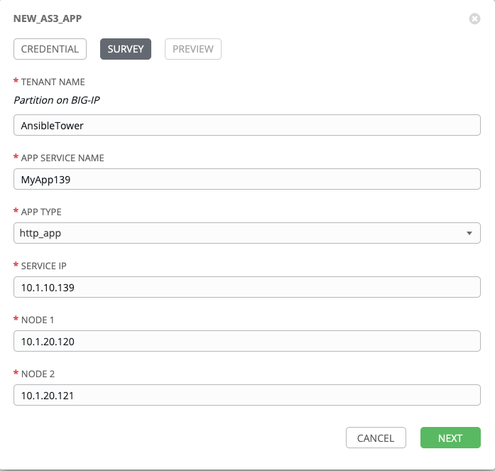
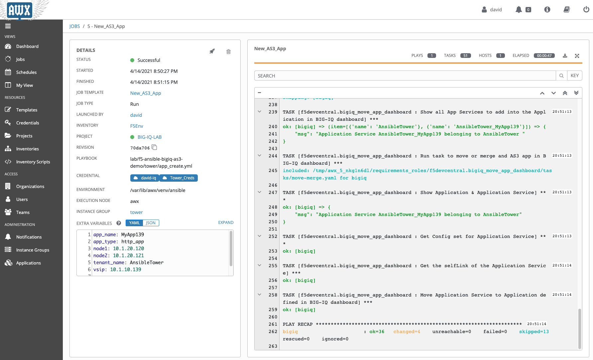

Lab 3: AS3 Application creation and deletion using AWX/Ansible Tower and BIG-IQ
-------------------------------------------------------------------------------

David has been tasked with the creation of a new application on the BIG-IP  that has been requested by the application owner. 
David will use AS3 declaration and BIG-IQ to build the application on the appropriate BIG-IPs using an 
Ansible Playbook that is stored in their GitHub repository. First the Admin will need to login to Ansible Tower to ensure that the latest templates have the pulled from Github

.. include:: ./accesslab.rst

Exercise 3.1 – Application Creation
^^^^^^^^^^^^^^^^^^^^^^^^^^^^^^^^^^^

1. Click on the *AWX (Ansible Tower)* button on the system *Ubuntu
   Lamp Server* in the Lab Environment. Use admin/purple123 to
   authenticate.

|image26|

2. Navigate to the **Projects** page and click on the refresh button
   for the BIG-IQ-LAB project to get the latest version of the templates. 

|image27|

3. Navigate to the **Jobs** page and click on the *BIG-IQ-LAB* job to 
   to verify it was successful.
   
   *Note: There may be more than one job with this name.* *Choose the first in the list*
   
|image50|

|image51|

4. Navigate to the **Templates** page and click on *job Template* beside **New_AS3_App** to review the template

|image53|

5.	Make sure the PLAYBOOK **lab/f5-ansible-bigiq-as3-demo/tower/app_create.yml** is selected.

|image54|

.. note:: You can go on the GitHub repository https://github.com/f5devcentral/f5-big-iq-lab/tree/develop/lab/f5-ansible-bigiq-as3-demo to review the playbooks and Jinja2 templates.

6. Log out of *AWX (Ansible Tower)* as Admin by clicking on the *Power Button* in the upper right corner 

|image48|

7. Login on as **david** (david/david)* to create the new application. Then click on *Sign In*

|image49|

8. Navigate to the **Templates** page and click on *job Template* beside **New_AS3_App** to review the template

|image28|

9. Click on *Launch*

|image30|

10. **CREDENTIAL**: Select *BIG-IQ Creds* as **Credential Type**. Then select *david-iq*. Click on *NEXT*

   |image31|

11. **SURVEY**: Enter below information regarding your application service definition. Click on *NEXT*
   
+-------------------+-------------------------------+
| TENANT NAME       | AnsibleTower                  |
+-------------------+-------------------------------+
| APP SERVICE NAME  | MyApp139                      |
+-------------------+-------------------------------+
| APP TYPE          | http_app                      |
+-------------------+-------------------------------+
| SERVICE IP        | 10.1.10.139                   |
+-------------------+-------------------------------+
| NODES             | 10.1.20.120 and 10.1.20.121   |
+-------------------+-------------------------------+

   |image32|

12. **PREVIEW**: Review the summary of the template deployment. Click on *LAUNCH*

   |image33|

13. Follow the Job deployment of the Ansible playbook.

   |image34|

   .. note:: The *FAILED - RETRYING* messages are expected as the playbook runs into a LOOP to check the AS3 task completion and will show failed until loop is completed.

14. When the job is completed, check the **PLAY RECAP** and make sure that *failed=* status is **0**.

    |image35|

15. From within the LAMP server RDP/noVNC session, logon to **BIG-IQ** as **david** *(davidi/david)*
    by opening a browser and go to: ``https://10.1.1.4`` or directly via
    the TMUI.
    Go to the Application tab and check the application is displayed and configured correctly.
   

16. Select *AnsibleTower* Application tile,

   |image36|

17. Select *AnsibleTower_MyApp139* Application Service. 

    |image37|

18. Click on the **Properties** bubble under *APPLICATION SERVICE*, then click on the **Configuration** tab,
    and review the AS3 configuration.

    |image38|

Exercise 3.2 – Application Deletion
^^^^^^^^^^^^^^^^^^^^^^^^^^^^^^^^^^^

The application owner has informed David that the application is no longer needed and needs to be deleted. David will use an AS3 declaration and BIG-IQ to remove the previously added application from the BIG-IPs. 

1. Return to *AWX (Ansible Tower)* and if needed log back in as **david** *(david/david)*  
   Navigate to the **Templates** page and click on **Delete_AS3_App**

   |image39|

2. Click on the *Launch* button to start a job using this
   template*. 

   |image40|

3. **CREDENTIAL**: Select *BIG-IQ Creds* as **Credential Type**. Then
   select *david-iq*. Click on *NEXT*

   |image41|

4. **SURVEY**: Enter below information regarding your application
   service definition. Click on *NEXT.*

+-------------+-------------------------------+
| TENANT NAME | AnsibleTower                  |
+-------------+-------------------------------+

   |image42|

5. **PREVIEW**: Review the summary of the template deployment. 
   Click on *LAUNCH*

   |image43|

6. Follow the JOB deployment of the Ansible playbook.

   |image44|

   .. note:: The *FAILED - RETRYING* messages are expected as the playbook runs into a LOOP to check the AS3 task completion and will show failed until loop is completed. 
   

7.  When the job is completed, check the **PLAY RECAP** and make sure that *failed=* status is **0**.

   |image45|

8. Logon on **BIG-IQ** as **david** *(david/david)*, go to main Application page 
    
9. Select *AnsibleTower* Application tile

   |image46|

10. Notice that the application is now deleted.

   |image47|

.. |image26| image:: images/lab3/image27.png
   :width: 3.79545in
   :height: 2.69677in
.. |image27| image:: images/lab3/image28.png
   :width: 7.49167in
   :height: 3.6933in
.. |image48| image:: images/lab3/image49b.png
   :width: 3.79545in
   :height: 2.69677in
.. |image49| image:: images/lab3/image50a.png
   :width: 3.79545in
   :height: 2.69677in

.. |image29| image:: images/lab3/image30.png
   :width: 7.54167in
   :height: 3.71795in

.. |image36| image:: images/lab3/image37a.png
   :width: 7.55in
   :height: 3.68215in

.. |image39| image:: images/lab3/image40.png
   :width: 7.28788in
   :height: 3.59284in
.. |image40| image:: images/lab3/image40a.png
   :width: 7.31818in
   :height: 3.60778in

.. |image44| image:: images/lab3/image45.png
   :width: 7.31818in
   :height: 3.60778in
.. |image45| image:: images/lab3/image46.png
   :width: 7.54167in
   :height: 3.71795in

.. |image47| image:: images/lab3/image48a.png
   :width: 7.55in
   :height: 3.72206in
.. |image50| image:: images/lab3/image51.png
   :width: 7.55in
   :height: 3.72206in
.. |image51| image:: images/lab3/image52.png
   :width: 7.55in
   :height: 3.72206in
.. |image52| image:: images/lab3/image53.png
   :width: 7.55in
   :height: 3.72206in

.. |image55| image:: images/lab3/image56.png
   :width: 7.55in
   :height: 2.125in
