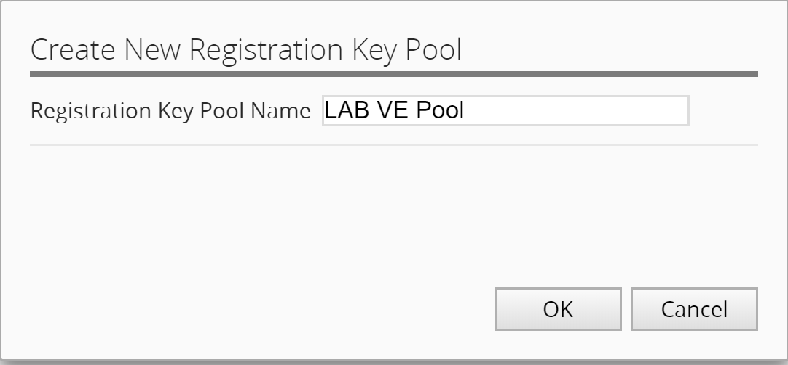

Module 1: Add licensing base-key to BIG-IQ for consumption
==========================================================

**Step 1: Activate Purchased License Pool**

Navigate to "LICENSE MANAGEMENT > Licenses" under the "Device" tab.

|image6|

Click "Add License"

|image7|

Fill in the form for your purchased license pool (VEP)

|image8|

License Name: **PurchasedPool\_1G\_Best**

Copy and Paste the VEP license key obtained from your lab instructor.

Click "Activate" in the lower right

Click "Accept" in the lower right to accept the EULA.

**Step 2: Activate Volume License Pool**

Click on “Add License” button again for the Volume license pool.

|image9|

While the Volume Pool is activating, click on the pool name to see the activation of all of the offering types for the pool.

License Name: **VolumeLicensePool\_10G\_Best**

Copy and Paste the VLS license key obtained from your lab instructor.

|image10|

|image11|

.. NOTE::
     This pool will not be active until all of the offerings complete activation.

Click the arrow at the top of the pool properties screen to add the next pool.

|image12|

**Step 3: Activate Utility License Pool**

3. Repeat steps 6-8 for the Utility license pool (MSP)

License Name: **UtilityLicensePool**

Copy and Paste the MSP license key obtained from your lab instructor.

|image13|

.. NOTE::
	 Utility pools activate offerings, just like the Volume pools, so the same holds true that the pool will not be active until the offerings are activated.

**Step 4: Active A pool of single standalone BIG-IP VE registration keys**

Now, we will create a new pool to hold our LAB VE keys. Click the **New RegKey Pool** button.
   
|image14|

Fill out the Registration Key pool name:

|image15|

Click the "Add RegKey" to add your first LAB VE key:

|image16|

Copy and Paste the first LAB VE key.

|image17|

Click "Activate" in the lower right.

Click "Accept" in the lower right to accept the EULA.

|image18|

Click the "Add RegKey" button again to repeat the above steps for your second LAB VE regkey.

You should now have a screen that looks like this:

|image19|

Stay on this screen for the next Task to assign the license key to a BIG-IP device.

.. |image11| image:: media/image11.png
   :width: 3.04129in
   :height: 3.48915in
.. |image12| image:: media/image12.png
   :width: 4.89522in
   :height: 0.98946in
.. |image13| image:: media/image13.png
   :width: 5.10353in
   :height: 2.82256in

.. |image16| image:: media/image16.png
   :width: 6.50000in
   :height: 2.73333in
.. |image17| image:: media/image17.png
   :width: 6.49583in
   :height: 3.25417in

