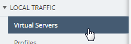

Module 3: Managing DNS Listeners
=================================

A \ *listener* is a specialized virtual server that passively checks for DNS packets on port 53 and the IP address you assign to the listener.

When a DNS query is sent to the IP address of the listener, BIG-IP DNS either handles the request locally or forwards the request to the appropriate resource.

You can view the DNS listeners configured for the DNS sync groups you manage by navigating to "Configuration > DNS > Delivery > Listeners".

From there, click a listener to edit it, click Create to set up a new one.

**Edit an Existing DNS listener**

You can view and modify the properties for existing DNS listeners. Since you are working with an existing listener, you can modify only some settings.

1. At the top of the screen, click Configuration, then, on the left, click "DNS > Delivery > Listeners".

The screen displays the list of listeners defined on this device.

|image13|

2. Click the name of the listener you want to edit.

The screen displays the current settings for the selected listener.

|image14|

3. Make the changes to the settings you want to revise. Change VLAN Traffic from All VLANs to Enabled on /Common/External, and then, when your edits are complete, click Save & Close.

|image15|

The system updates the listener with the settings you specified.

**Create a DNS listener**

Before you create a DNS listener, make sure you have a pool of DNS servers.

You can configure a listener that alerts BIG-IP DNS to DNS queries
destined for a pool of DNS servers. The best practice is to create four
listeners: one with an IPv4 address that handles UDP traffic, and one
with the same IPv4 address that handles TCP traffic; one with an IPv6
address that handles UDP traffic, and one with the same IPv6 address
that handles TCP traffic.

1. At the top of the screen, click Configuration, then, on the left, click "DNS > Delivery > Listeners".

The screen displays the list of listeners defined on this device.

2. Click Create.

The New Listener screen opens.

3. Type a Name for the DNS listener: **my-listener-udp**

4. Select a BIG-IP Device on which the DNS listener will run: **SEA-vBIGIP01.termmarc.com**

5. In the Listener area, type the IP Address on which the BIG-IP system listens for connections: **10.1.10.204**

The BIG-IP system receives traffic sent to this IP address and processes it as needed.

|image16|

6. Scroll down to the Service area and select the DNS Profile that defines how the listener handles DNS traffic: **mydnsprofile.**

|image17|

The options are a list of system-supplied and user-defined DNS profiles.

7. Specify any additional settings needed to suit the requirements for this listener.

Name, Device, Address, and DNS Profile are the only required parameters when you create a listener. The remaining parameters on this screen are optional and perform the same function as they do when you configure a listener on a BIG-IP device.

8. Click Save & Close.

The system creates the new listener you specified and adds it to the list of listeners.

9. Create another listener with the same IPv4 address and configuration, but **select TCP from the Protocol list**.

| Name: **my-listener-tcp**
| BIG-IP Device: **SEA-vBIGIP01.termmarc.com** 
| IP Address: **10.1.10.204**
| DNS Profile: **mydnsprofile**

When you finish that, the BIG-IP device for which you created these
listeners will be able to receive DNS queries, handle wide IP requests,
and forward all other DNS queries to members of the pool of DNS servers.

|image18|

.. |image13| image:: media/image14.png
   :width: 6.49583in
   :height: 3.07500in
.. |image14| image:: media/image15.png
   :width: 6.49167in
   :height: 5.00000in

.. |image16| image:: media/image17.png
   :width: 6.49167in
   :height: 3.90000in
.. |image17| image:: media/image18.png
   :width: 4.97500in
   :height: 3.16250in
.. |image18| image:: media/image19.png
   :width: 6.50000in
   :height: 2.20833in
