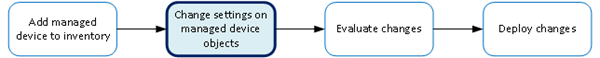

Class 6 - Local Traffic Management Virtual Servers
====================================================

Goal:

In this lab, we will demonstrate how to manage Virtual Servers on the managed BIG-IP devices.

BIG-IQ is able to create nodes, monitors, pools, profiles, and virtual servers, so a user can create and stage a new application directly on the BIG-IQ, then deploy the change to the Managed BIG-IP device.

You will need to understand the basic workflow such as creating a new Virtual Server on a Managed BIG-IP device.

For example, the following figure illustrates the basic workflow you perform to manage the objects on BIG-IP® devices.

|image0|

Tasks:

6.1: Stage a new application on BIG-IQ for deployment

6.2: Create a new virtual server by cloning an existing virtual server

6.3: Create iRule and attach to multiple virtual servers

6.4: Deploy Staged Changes

6.5: Decommission a virtual server

.. toctree::
   :maxdepth: 1
   :glob:

   lab*/lab*

