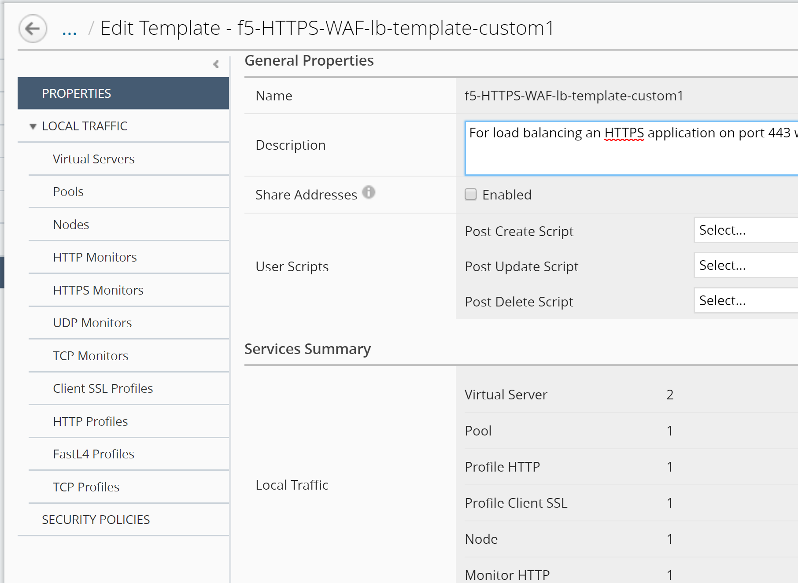

Lab 2: Create Application Service Template by Cloning
=====================================================

Log out of **larry** and log back in as **marco**.

1. Create a Clone of the **Default-f5-HTTPS-WAF-lb-template policy**:

Go to \ *Applications* > *SERVICE CATALOG*, check the "Default-f5-HTTPS-WAF-lb-template" policy and click on \ *Clone*. 

Enter the name of your cloned template: **f5-HTTPS-WAF-lb-template-custom1**

|image7|

2.	Click on “Clone” button on the Name window to edit the template properties:

|image07|

Click on the left “LOCAL TRAFFIC >> Virtual Servers” to see the Virtual Server instances that the default template attached to. 

|image08|

3.	Click on the SECURITY POLICIES on the left, then select the ASM policy viol\_subviol, the AFM policy f5-afm-policy1 and the Logging Profile templates-default in the SECURITY POLICIES section on both Virtual Servers (Standalone Device).

Click on Save & Close

|image8|

Click on Save & Close to complete the cloning of the Application Service Template.

Now that we have completed creating the customized Application Service Template with the ASM and AFM security policies, we can proceed to create our own Application.

.. |image7| image:: media/image8.png
   :width: 6.50000in
   :height: 2.80884in
.. |image08| image:: media/image08.png   
.. |image8| image:: media/image9.png
   :width: 6.50000in
   :height: 3.85489in