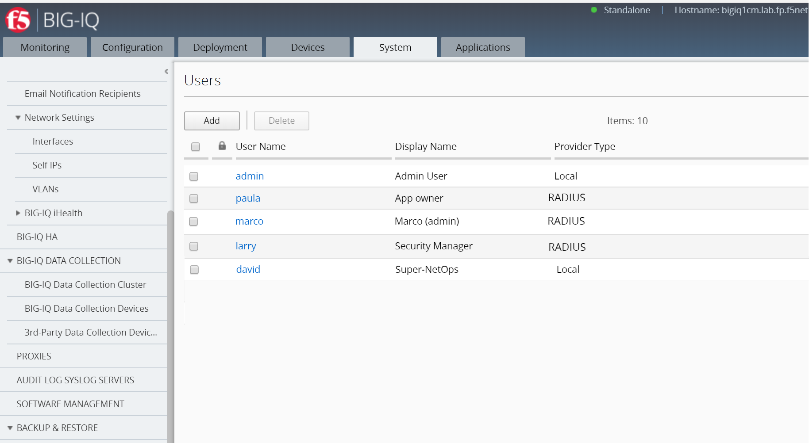

Module 1: Create personas in BIG-IQ for Application Deployment
~~~~~~~~~~~~~~~~~~~~~~~~~~~~~~~~~~~~~~~~~~~~~~~~~~~~~~~~~~~~~~

We will be using 4 main personas for this lab:

1. **Marco**: Full Administrator

2. **David**: Super-NetOps

3. **Larry**: Application Security Manager

4. **Paula**: Application Manager

**Marco** will have full access to BIG-IQ. He knows a lot about F5
products (BIG-IQ/BIG-IP). He will provide the access to David, Larry and
Paula. He will also manage the Service Scaline Group (SSG) and
application templates.

**Larry** will manage the Web Application Firewall (WAF) policies. He
will work with Paula’s team to define the necessary security policies
for each applications. Ensure teams comply with security policies,
industry rules and regulations, and best practices. Keeping up to date
on threats, determining their potential impact, and mitigating the
risks.

**Paula** will manage the application deployments, monitor levels of app
incidents, building solutions to address identified, prioritized
business problems in a timely manner. Maximizing value of app through
capabilities design, adoption, and usage. Ensuring that the app fits
within the rest of the organization’s app portfolio strategy.

**David** will try automating whenever possible, to enable efficiency
and ability to solve problems at scale. Automate common network patterns
that the other teams can consume. Automate existing environment
management and troubleshooting tasks.

.. NOTE::
	 Marco, Paula and Larry are already created in the blueprint, so only the \ **david** user needs to be created.

Connect to your BIG-IQ as \ **admin** and go to: *System* > *Users Management* > *Users* and verify each user & role below and change where needed.

**1. Marco: Full Administrator**

-  *Auth Provider* = Radius

-  *User Name* = marco

-  *Full Name* = Full Administrator

-  (*Password stored in Radius server* = marco)

-  *Role* = Administrator Role

**2. Larry: Application Security Manager**

-  *Auth Provider* = Radius

-  *User Name* = larry

-  *Full Name* = Application Security Manager

-  (*Password stored in Radius server* = larry)

-  *Role* = Security Manager

**3. Paula: Application Manager**

-  *Auth Provider* = Radius

-  *User Name* = paula

-  *Full Name* = Application Manager

-  (*Password stored in Radius server* = paula)

-  *Role* = Application Editor

**4. David: Super-NetOps**

Click on \ *Add*

-  *Auth Provider* = local

-  *User Name* = david

-  *Full Name* = Super-NetOps

-  *Password* = david

-  *Role* = Administrator Role

Click on \ *Save & Close*

|image0|

