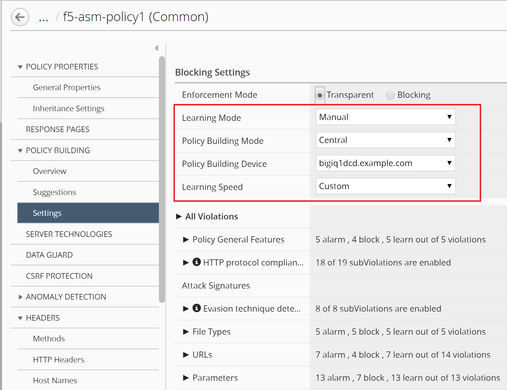

Create Custom Security Policies
--------------------------------

Connect as \ **larry**

1. Create the custom ASM policy, go to \ *Configuration* > *SECURITY* > *Web Application Security* > *policies*.

|image2|

Select the viol\_subviol ASM policy from the list and look through its settings. Notice the policy is in Transparent mode.

Edit the Policy viol\_subviol, switch to Manual Learning Mode and Make available in Application Templates, click Save.

|image3|

In addition, go to \ *POLICY BUILDING* > *Settings* and set \ *Policy Building Mode* to Central and switch to Manual Learning Mode, click Save & Close.

|image4|

.. NOTE::
	 If you want to use learning/blocking mode, you will need a dedicated app template per application.

2. Create the AFM Policy, go to \ *Configuration* > *SECURITY* > *Network Security* > *Firewall Policies*, click Create. Then enter the name of your policy: f5-afm-policy1. Make sure the box Make available in Application Templates is checked. Click Save.

|image5|

Create 2 Rules by clicking on the “Create Rule” button and then the pencil icon at the beginning of each rule. 

Use the “add” button in each column under the title to:

-  rule 1: set the destination ports to 443 and 80, Protocol to tcp

-  rule 2: set action to reject and log to true

Click Save & Close.

|image6|

Now that we have created our own ASM & AFM security policies, we can proceed to create our own Application Service Template that consists of these two security policies.

.. |image6| image:: media/image7.png
   :width: 6.50000in
   :height: 2.19608in
