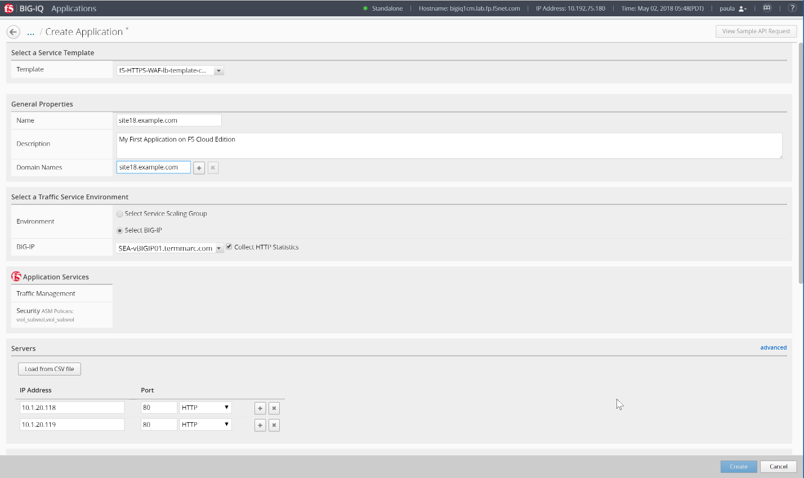
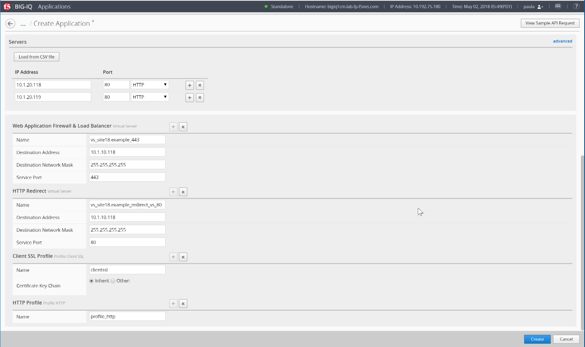
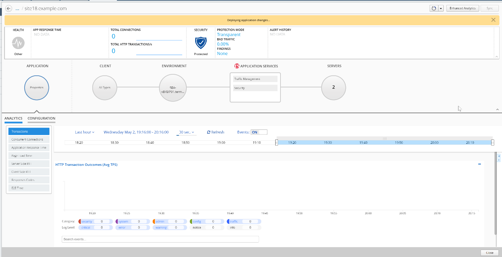
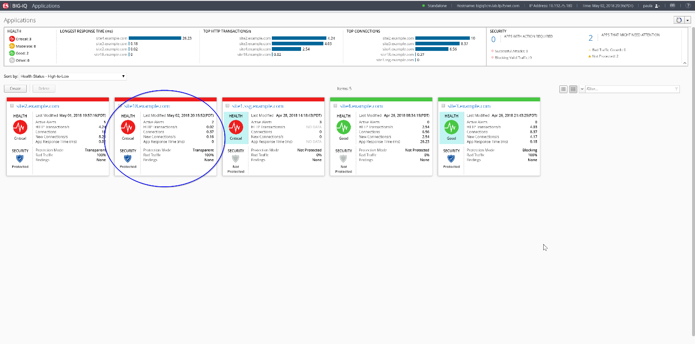
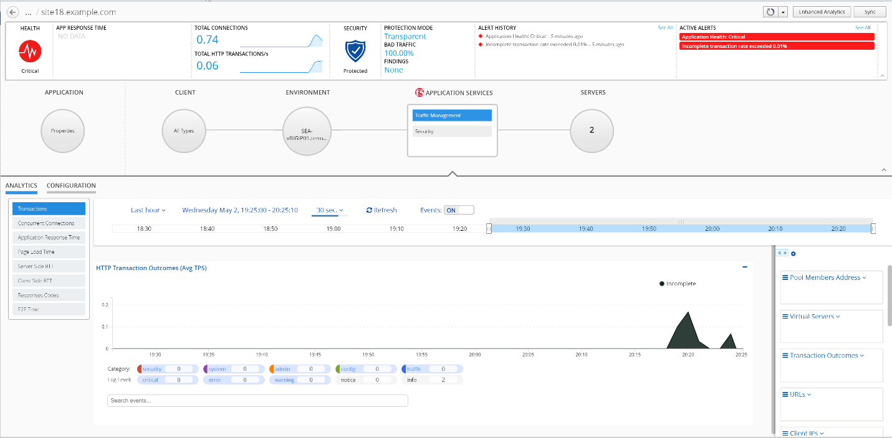
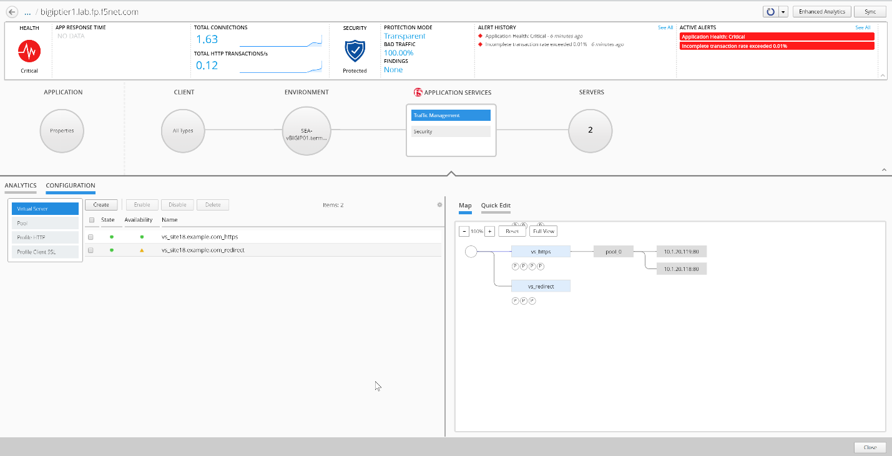
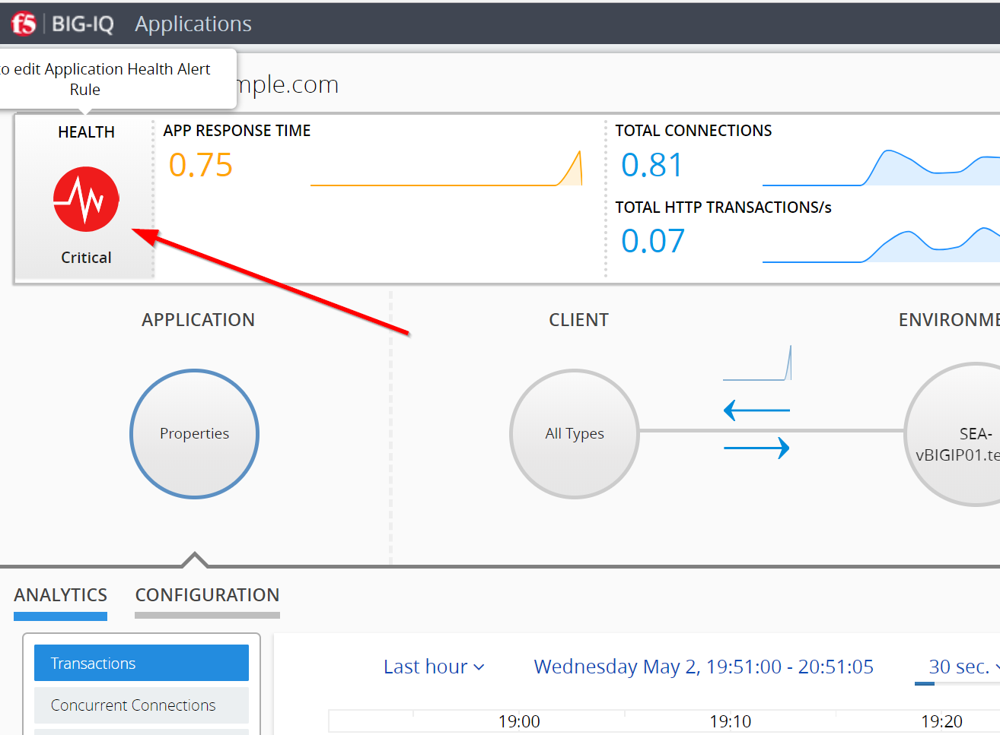
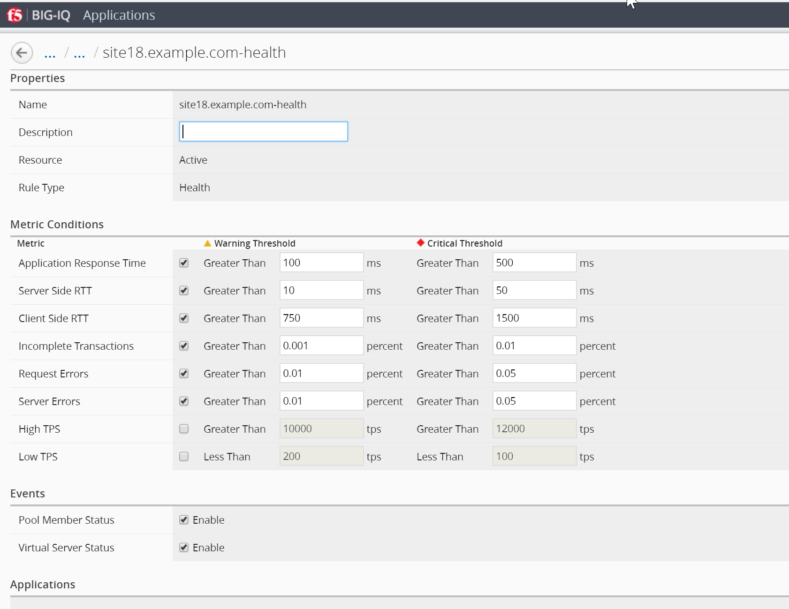

Lab 3: Create Application
=========================

Connect as \ **paula** to create a new application, and click
on \ *Create*, select the template previously
created f5-HTTPS-WAF-lb-template-custom1.

Type in a Name for the application you are creating.

-  Application Name: site18.example.com

To help identify this application when you want to use it later, in the
Description field, type in a brief description for the application you
are creating.

-  Description: My First Application on F5 Cloud Edition

Type the domain of your application (then the ASM policy will always be
transparent for this domain)

-  Domain Names: site18.example.com

For Device, select the name of the device you want to deploy this
application to. (if the HTTP statistics are not enabled, they can be
enabled later on after the application is deployed)

-  BIG-IP: Select SEA-vBIGIP01.termmarc.com and
   check Collect HTTP Statistics

|image9|

Determine the objects that you want to deploy in this application. To
omit any of the objects defined in this template, click the (X) icon
that corresponds to that object. To create additional copies of any of
the objects defined in this template, click the (+) icon that
corresponds to that object.

In the example, fill out the Server’s IP addresses/ports (nodes) and
virtual servers names, IPs and ports.

-  Servers (Pool Member): 10.1.20.118 and 10.1.20.119

-  Service Port: 80

-  Name WAF & LB (Virtual Server): vs\_site18.example.com\_https

-  Destination Address: 10.1.10.118

-  Destination Network Mask: /32

-  Service Port: 443

-  Name HTTP Redirect (Virtual Server): vs\_site18.example.com\_redirect

-  Destination Address: 10.1.10.118

-  Destination Network Mask: /32

-  Service Port: 80

It is good practice to type the Prefix that you want the system to use
to make certain that all of the objects created when you deploy an
application are uniquely named.

|image10|

Then Click on Create (bottom right of the window). The Application is
deployed.

|image11|

.. NOTE::
	 In case the Application fails, connect as \ **Marco** and go to Applications > Application Deployments to have more details on the failure. You try retry in case of failure.

You can also tail the logs: /var/log/restjavad.0.log

In Paula’s Dashboard, she can see her Application.

|image12|

Click on the Application and check the details (alarms, security
enabled, configuration, …)

|image13|

Click on Traffic Management > Configuration

|image14|

Paula can update Application Health Alert Rules by clicking on the
Health Icon on the top left of the Application Dashboard.

|image15|

|image16|

