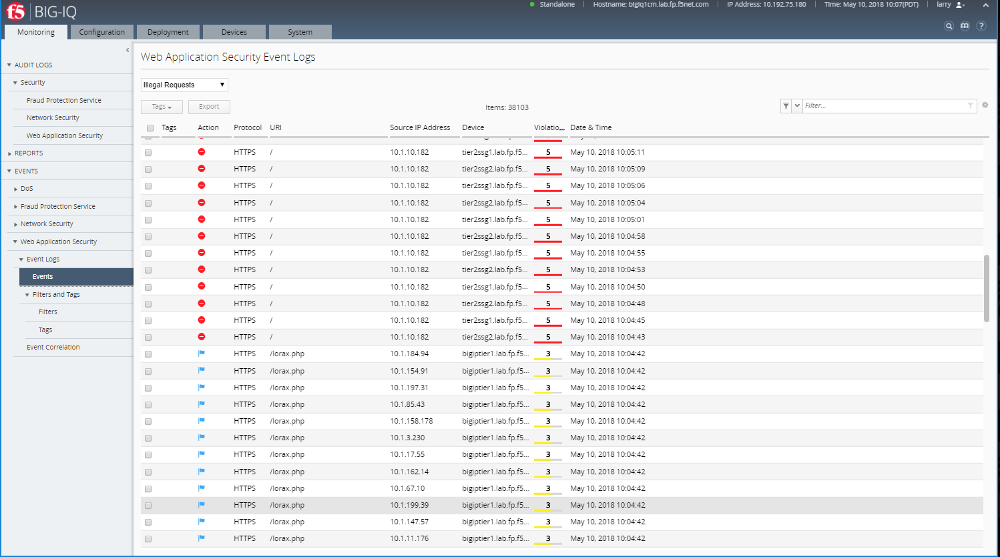

Security workflows
--------------------

Connect as \ **larry**

1. Larry check the Firewall policy.

Go to Monitoring > REPORTS > Security > Network Security > Rule
statistics and
select \ *vs\_site18.example.com\_https* SEA-vBIGIP01.termmarc.com

|image17|

2. Larry check the Web Application Security for viol\_subviol ASM
   Policy.

Go to Configuration > SECURITY > Web Application Security > Policies

Click on Suggestions, then Accept the Learning.

|image18|

3. Go to Deployment > EVALUATE & DEPLOY > Web Application Security

Under Deployments, click on \ **Create**. Name your Deployment, select
SEA-vBIGIP01.termmarc.com, choose method \ **Deplot immediatly**, then
click on \ **Create**.

|image19|

4. Go back to Configuration > SECURITY > Web Application Security >
   Policies

Update the Enforcement Mode to Blocking.

|image20|

Connect as \ **paula**

Select site18.example.com

1. Paula enforce the policy APPLICATION SERVICES > Security >
   CONFIGURATION tab > click on Start Blocking

|image21|

2. Let’s generate some bad traffic, connect on the \ *Ubuntu Lamp
   Server* server and launch the following script:

# /home/f5/scripts/generate\_bad\_traffic.sh

3. In Application Dashboard, navigate to the Security Statistics and
   notice the Malicious Transactions.

Connect as \ **larry**

1. Check ASM type of attacks

Monitoring > EVENTS > Web Application Security > Event Logs > Events

|image22|

