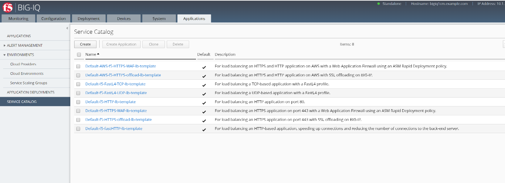

Module 2: Application Templates & Deployment
~~~~~~~~~~~~~~~~~~~~~~~~~~~~~~~~~~~~~~~~~~~~

In this module, we will learn how to use Application Templates and how
to deploy an \ **Application**.

The Application Templates will be created by \ **marco**, the
Administrator. \ **larry** will create the security policies and let
Marco know about the ones to associate with the templates. Once the
template is ready with all the necessary information, it will be ready
to use by the Application owner.

**paula** needs to deploy an application, she has multiple Application
servers. At this time, she needs to test the performance of her
application, she also wants to make her application secure before
staging it to production. She connects to the BIG-IQ and has access to
her Application Dashboard. \ **paula**\ uses the application template
created by Marco to deploy her Application.

After a week of testing her application (in the class ~5 min), she will
ask \ **larry** to fine tune and validate the learning done by the
Application Firewall (BIG-IP ASM).

.. NOTE::
	 A traffic generator located on the \ *Ubuntu Lamp Server, LDAP and DHCP* server, is sending good traffic every minute to the virtual servers.

Once the security policy is tuned and validated, \ **paula** will enforce blocking mode in the policy.

Finally, we will simulate “bad” traffic to show the security policy blocking it.

.. NOTE::
	 A traffic generator located on the \ *Ubuntu Lamp Server, LDAP and DHCP* server, can be launched manually to send bad traffic to the virtual servers.

**Built-in templates**

BIG-IQ v6.0 will have the default templates below built-in. These default templates cannot be modified but they can be cloned. They can be used to deploy various type of applications. These default templates are only displayed after BIG-IQ is managing a BIG-IP device.

-  Default-AWS-f5-fastHTTP-lb-template: For load balancing an HTTP-based application, speeding up connections and reducing the number of connections to the back-end server. (only for AWS)

-  Default-AWS-f5-HTTPS-WAF-lb-template: For load balancing an HTTPS application on port 443 with a Web Application Firewall using an ASM Rapid Deployment policy. (only for AWS)

-  Default-f5-FastL4-TCP-lb-template: For load balancing a TCP-based application with a FastL4 profile.

-  Default-f5-FastL4-UDP-lb-template: For load balancing a UDP-based application with a FastL4 profile.

-  Default-f5-HTTP-lb-template: For load balancing an HTTP application on port 80.

-  Default-f5-fastHTTP-lb-template: For load balancing an HTTP-based application, speeding up connections and reducing the number of connections to the back-end server.

-  Default-f5-HTTPS-WAF-lb-template: For load balancing an HTTPS application on port 443 with a Web Application Firewall using an ASM Rapid Deployment policy.

-  Default-f5-HTTPS-offload-lb-template: For load balancing an HTTPS application on port 443 with SSL offloading on BIG-IP.

..Warning::
     Templates with virtual servers without a HTTP profiles can not be     depoyed to a Service Scaling Group

Connect as \ **marco**, go to \ *Applications* > *SERVICE CATALOG*:

Look through the different default templates.

|image1|

.. toctree::
   :maxdepth: 1
   :glob:

   lab*
   
