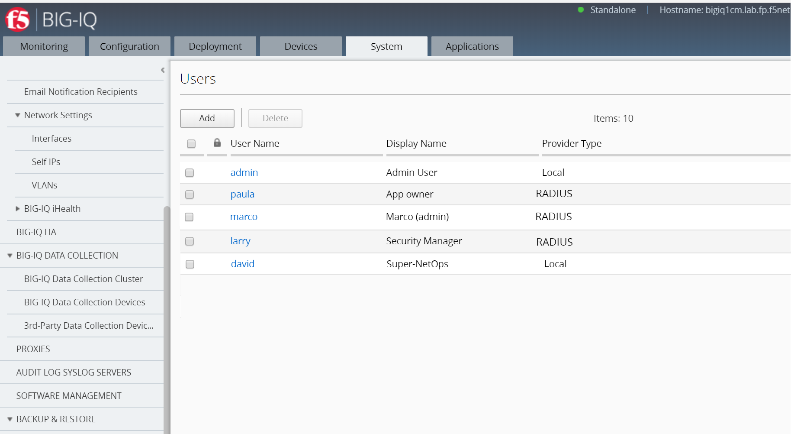

Lab 1: Creation of each persona in BIG-IQ
-----------------------------------------
.. note:: Users accouts for Marco, Paula, Paul and Larry are already created in this lab, only the **david** user needs to be created.

We will be using 4 main personas for this lab:

1. **Marco**: Full Administrator
2. **Larry**: Security Manager
3. **Paula**: Application Manager VMware
4. **Paul**: Application Manager AWS
5. **David**: Super-NetOps

**Marco** will have full access to BIG-IQ. He knows a lot about F5 products (BIG-IQ/BIG-IP).
He will provide the access to David, Larry and Paula. He will also manage the application templates.

**Larry** will manage the Web Application Firewall (WAF) policies. He will work with Paula's team
to define the necessary security policies for each applications.
Ensure teams comply with security policies, industry rules and regulations, and best practices.
Keeping up to date on threats, determining their potential impact, and mitigating the risks.

**Paula** and **Paul** will manage the application deployments, monitor levels of app incidents, building solutions to address identified, prioritized business problems in a timely manner.
Maximizing value of app through capabilities design, adoption, and usage.
Ensuring that the app fits within the rest of the organization’s app portfolio strategy.

**David** will try automating whenever possible, to enable efficiency and ability to solve problems at scale.
Automate common network patterns that the other teams can consume.
Automate existing environment management and troubleshooting tasks.

``****TASKS****``

#. Connect to your **BIG-IQ (Named: BIG-IQ CM1)** as Username: **marco** and Password: **marco**
#. Go to : **System** > **Users Management** > **Users**
#. Verify each user & role below.

**Marco: Full Administrator**

- *Auth Provider* = Radius
- *User Name* = marco
- *Full Name* = Full Administrator
- (*Password stored in Radius server* = marco)
- *Role* = Administrator Role

**Larry: Application Security Manager**

- *Auth Provider* = Radius
- *User Name* = larry
- *Full Name* = Security Manager
- (*Password stored in Radius server* = larry)
- *Role* = Security Manager

**Paula: Application Manager VMware**

- *Auth Provider* = Radius
- *User Name* = paula
- *Full Name* = Application Manager
- (*Password stored in Radius server* = paula)
- *Role* = Application Creator VMware (custom role with ALL default templates except AWS)

**Paul: Application Manager AWS**

- *Auth Provider* = Radius
- *User Name* = paul
- *Full Name* = Application Manager
- (*Password stored in Radius server* = paul)
- *Role* = Application Creator AWS (custom role with AWS default templates only)

|

**David: Super-NetOps**

``****TASKS****``

4. Click on **Add***

- *Auth Provider* = local
- *User Name* = david
- *Full Name* = Super-NetOps
- *Password* = david
- *Role* = Application Creator VMware (custom role with ALL default templates)

5. Be sure to move *Role* **Application Creator VMware** to the right **selected** box

6. Click on **Save & Close**

