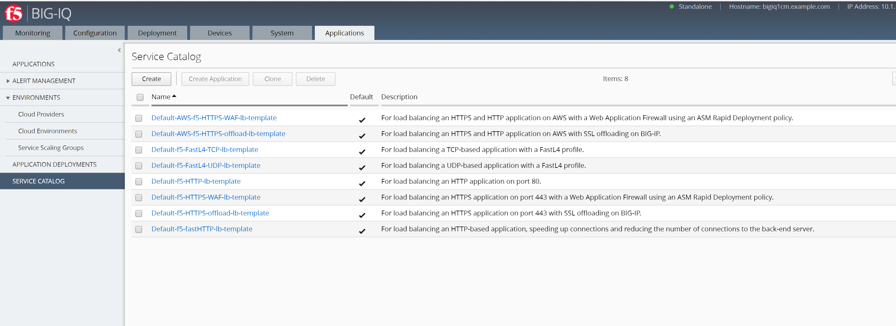

Lab 1: Built-in templates
---------------------------
BIG-IQ 6.0 will have the default templates below built-in. These default templates cannot be modified but they can be cloned.
They can be used to deploy various type of applications. These default templates are only displayed after BIG-IQ is managing a BIG-IP device.

- ``Default-AWS-f5-fastHTTP-lb-template``: For load balancing an HTTP-based application, speeding up connections and reducing the number of connections to the back-end server. (only for AWS PerAppVE License)
- ``Default-AWS-f5-HTTPS-WAF-lb-template``: For load balancing an HTTPS application on port 443 with a Web Application Firewall using an ASM Rapid Deployment policy. (only for AWS PerAppVE License)
- ``Default-f5-FastL4-TCP-lb-template``: For load balancing a TCP-based application with a FastL4 profile.
- ``Default-f5-FastL4-UDP-lb-template``: For load balancing a UDP-based application with a FastL4 profile.
- ``Default-f5-HTTP-lb-template``: For load balancing an HTTP application on port 80.
- ``Default-f5-fastHTTP-lb-template``: For load balancing an HTTP-based application, speeding up connections and reducing the number of connections to the back-end server.
- ``Default-f5-HTTPS-WAF-lb-template``: For load balancing an HTTPS application on port 443 with a Web Application Firewall using an ASM Rapid Deployment policy.
- ``Default-f5-HTTPS-offload-lb-template``: For load balancing an HTTPS application on port 443 with SSL offloading on BIG-IP.

``****TASKS****``

#. In BIG-IQ, confirm you are logged in as **marco** (top right corner)
#. If not, login as **marco** with the password of **marco**
#. Go to **Applications** >> **SERVICE CATALOG**
#. Look through the different default templates.

