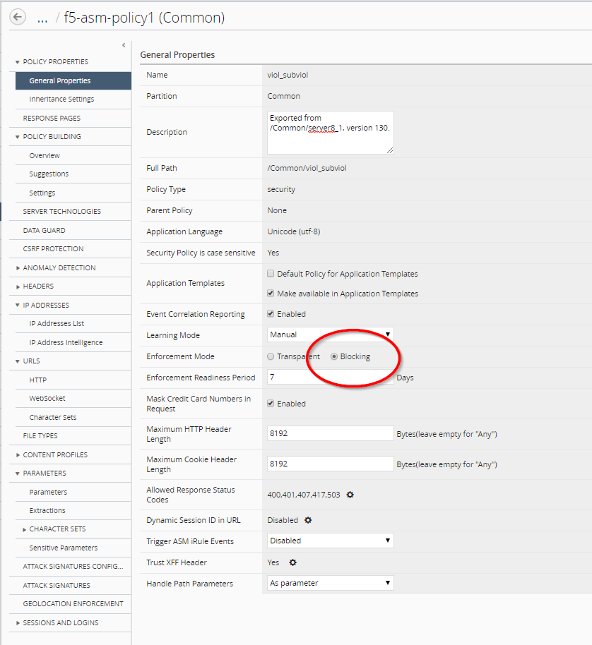
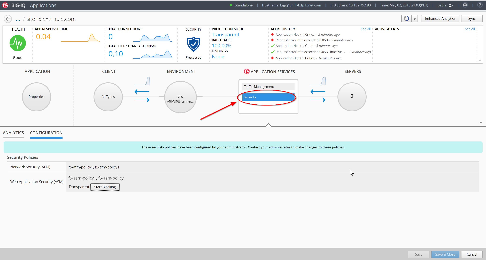

Lab 2.4: Security workflows
---------------------------
Login to BIG-IQ as **larry** with password of **larry**

Check the Firewall policy.

Navigate to **Monitoring** >> **REPORTS** >> **Security** >> **Network Security** >> **Rule Statistics** and select
**vs_site18.example.com_https**

Review Hit Count

|

Check the Web Application Security for ``f5-asm-policy1`` ASM Policy.

Go to **Configuration** >> **SECURITY** >> **Web Application Security** >> **Policies**

Click on that policy and then click on Suggestions, then **Accept** the all of the learning suggestions.

|

#. Confirm you are logged in as **Larry**
#. Go to **Deployment** >> **EVALUATE & DEPLOY** >> **Web Application Security**
#. Under **Deployments**, click on **Create**
#. Name it **seattleasm**
#. On **Method** select **Deploy immediately**
#. Select **SEA-vBIGIP01.termmarc.com** (move to right box)
#. Click **Deploy** button (ignore warning message)

.. image:: ../pictures/module2/img_module2_lab4_3b.png
  :align: center
  :scale: 50%

|

#. Go back to **Configuration** >> **SECURITY** >> **Web Application Security** >> Policies
#. Update the **Enforcement Mode** to ``Blocking`` on the policy you created
#. Click **Save & Close** (bottom right)

|

Connect as **paula** with password of **paula**

Select ``site18.example.com``

Enforce the policy APPLICATION SERVICES > Security > CONFIGURATION tab > click on ``Start Blocking``

|

|

**Let's generate some bad traffic**

Using the IP from the Training Portal, SSH into the **Ubuntu Lamp Server** server with username **f5** and password **agility**

Execute the following script:

``# /home/f5/scripts/generate_bad_traffic.sh``

Now back on BIG-IQ, click on **ANALYTICS** in the **Application Services** - **Security** (to the left of the **CONFIGURATION** tab you are in) and notice the malicious transactions.

Logout of BIG-IQ and login as **larry** with password of **larry**

**Check ASM type of attacks**

**Monitoring** >> **EVENTS** >> **Web Application Security** >> **Event Logs** >> **Events**

.. image:: ../pictures/module2/img_module2_lab4_7.png
  :align: center
  :scale: 50%
