Lab 4.1: Custom Service Template
--------------------------------
An application template allows you to specify a set of objects that define
an application that you can then deploy to your BIG-IP device(s).

You can think of the objects in an application template as a baseline
that serves as a starting place for creating a new application.

For example, if you create a template with a virtual server, two pools, and 5 nodes,
then when you create a new application using that template each of those objects
(with the default values you specified in the template) are included.

When you define the application, you can omit or include these objects. Parameters you define
as not visible are included using the default values specified in the application template.
This allows you to maintain a consistent environment. Parameters that you define as editable are visible and can be revised.

``****TASKS****``

Connect to BIG-IQ as **marco** with password of **marco**. Create a Custom Service Template, go to **Applications** >> **SERVICE CATALOG**, click on **Create**.

In the Name field, type in a name for the application template you are creating.
In the Description field (optional), type in a brief description for the application template you are creating to help identify it when you want to use it later.

- Name: ``f5-HTTP-lb-custom-template``
- Description: ``My HTTP custom template``

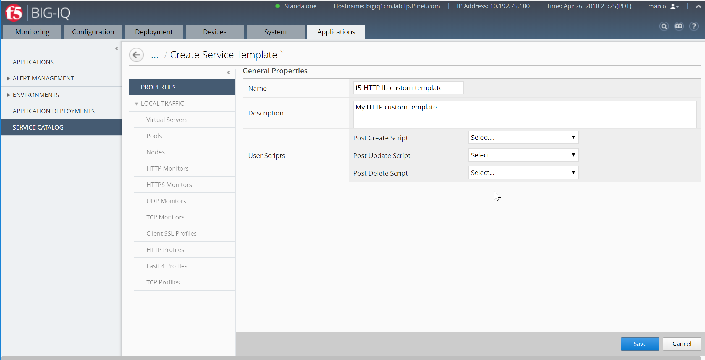

|

Save the template, click **Save**

Now, define the default objects for this template.
You can either create these objects manually, or you can import objects that already exist on this BIG-IQ.
On the left, under Properties, expand Local Traffic and then select the object type you want to define.

To add a default nodes, you would expand Local Traffic, and then click Nodes.
Click *Create*. The screen you use to define the selected object type (for example New Node) displays.

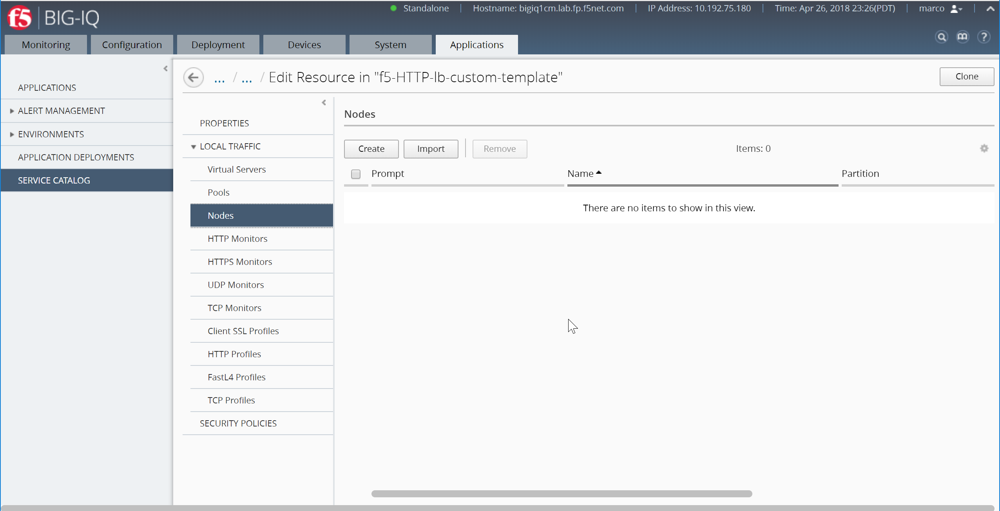

|

Create your nodes with the following parameters:

- Prompt: ``Server``
- Allow Multiple Instances: ``Enable``
- Name and Address: ``10.1.20.116``

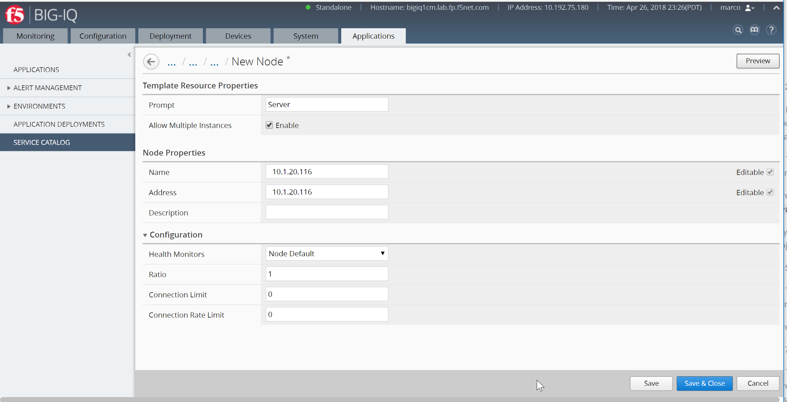

|

Click **Save & Close** (bottom right)

Repeat the same with the 2nd node:

- Prompt: ``Server``
- Allow Multiple Instances: ``Enable``
- Name and Address: ``10.1.20.117``

.. image:: ../pictures/module4/img_module4_lab1_4.png
  :align: center
  :scale: 50%

|

If you want applications created with this template to be able to include more than one copy of the object you are adding, select Enabled for Allow Multiple Instances as you just did.

Add a default pool, you would expand Local Traffic, and then click Pools.
Click *Create*. The screen you use to define the selected object type (for example New Pool) displays.

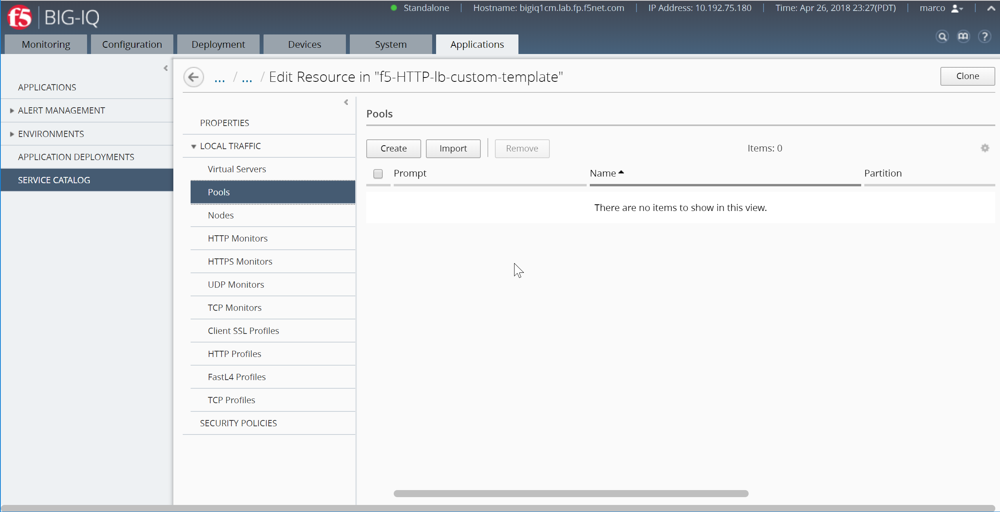

|

Create your pool with the following parameters:

- Prompt: ``Pool``
- Name: ``myPool``
- Health Monitor: ``/Common/http``

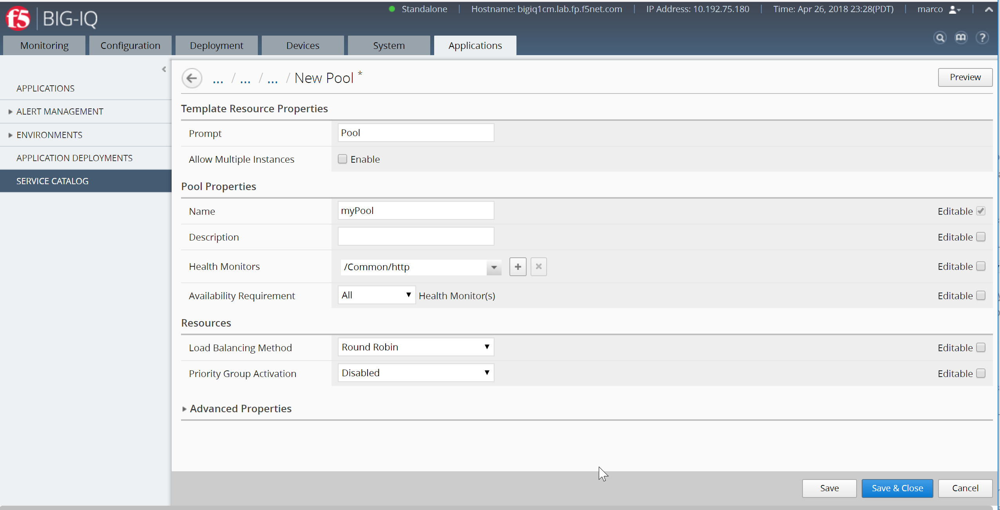

|

Save the template, click **Save*** (not **Save & Close**)

Resources should now display, Click **New Member**

Add the nodes previously created to the pool template:

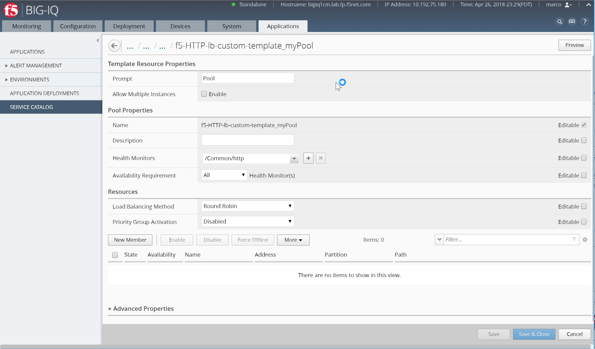

|

Node 1:

- Note Type: ``Existing Node``
- Node: ``# /f5-HTTP-lb-custom-template_10.1.20.116``
- Port: ``80``

Click **Save & Close** (bottom right)

Click **New Member**

Node 2:

- Note Type: ``Existing Node``
- Node: ``# /f5-HTTP-lb-custom-template_10.1.20.117``
- Port: ``80``

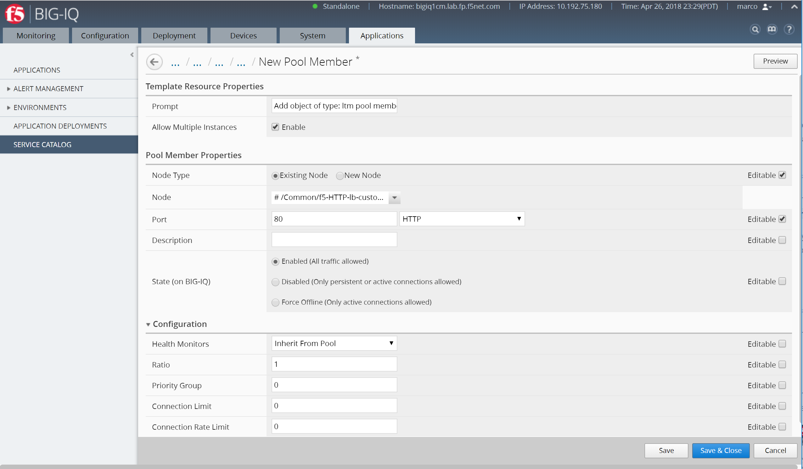

|

Once both nodes are added to the Pool template, you should see both nodes attached to the pool template.

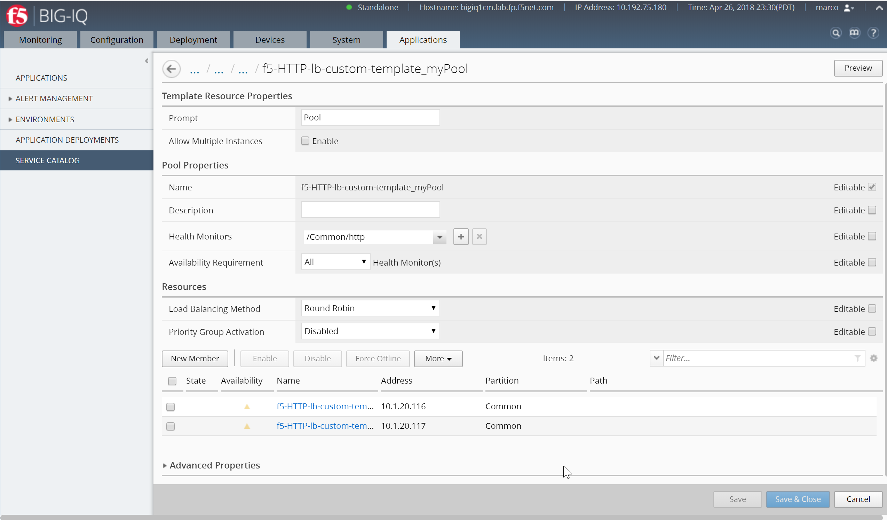

|

Click **Save & Close** (bottom right)

Click the back arrow next to the breadcrumbs by ``... / ... / ... /f5-HTTP-lb-custom-template`` to back to the template settings.

To add a default virtual server, you would expand Local Traffic, and then click Virtual Servers.
Click *Create*. The screen you use to define the selected object type (for example New Virtual Server) displays.

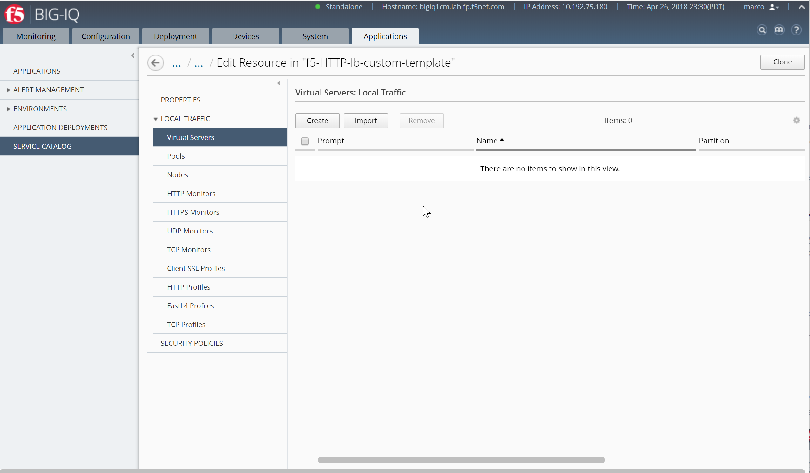

|

In the Prompt box, type the text string that you want to display for this object when
someone uses this template to create a new application.
To specify a virtual server, you only need to provide a name, a destination address, and a service port,
even though there are another fifty or so settings you could specify.

Create your virtual server with the following parameters:

- Prompt: ``Load Balancer``
- Name Virtual Server: ``vs_site16.example.com``
- Source Address: ``0.0.0.0/0``
- Destination Address: ``10.1.10.116``
- Service Port: ``80``
- Protocol Profile (Client): ``/Common/f5-tcp-wan``
- Protocol Profile (Server): ``/Common/f5-tcp-lan``
- HTTP Profile: ``/Common/http``
- Source Address Translation: ``Auto-Map``
- Default Pool: ``# /Common/f5-HTTP-lb-custom-template_MyPool``

.. note:: Do not apply the default ASM Policy.

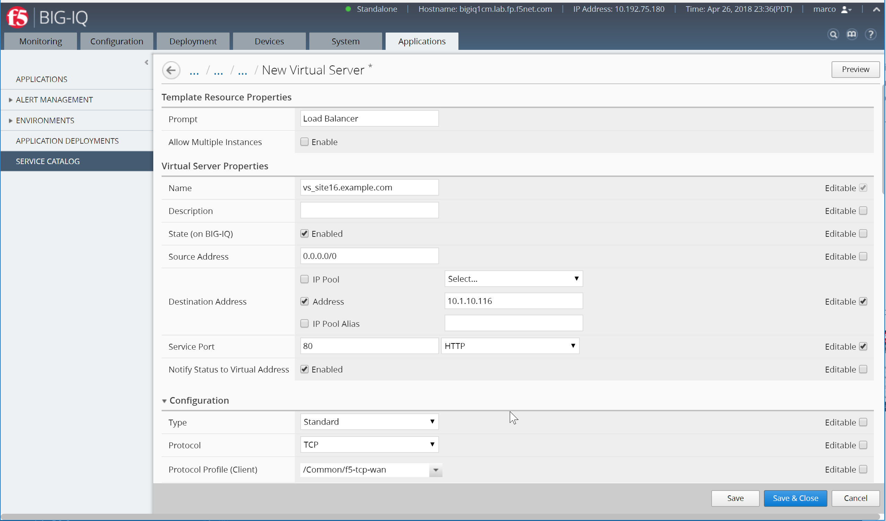

|

Specify all of the default parameters that you want to define for this object.
Before you can add an object to the template, you must specify at least the required parameters for that object type.

For each parameter that you specify, determine whether you want the person who deploys
an application using this template to be able to edit the default settings you are defining.

For parameters that you want to allow to be changed, select Editable.
Other parameters will be present (with the settings that you specify here), but they will not be visible in the user interface.

Only the parameters you select will appear in the user interface when someone deploys an application using this template.
As you specify parameter values for this template object.

Click **Preview** in the upper right corner to see what the user interface will look like when someone uses this template to deploy an application.

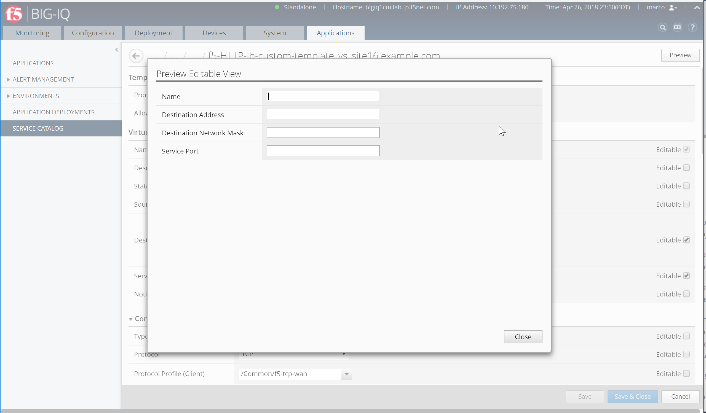

|

Save the template, click **Save & Close**

When asked to apply the default ASM Policy.  Click **No**

Your custom template is now showing in the Service Catalog.  Woot!

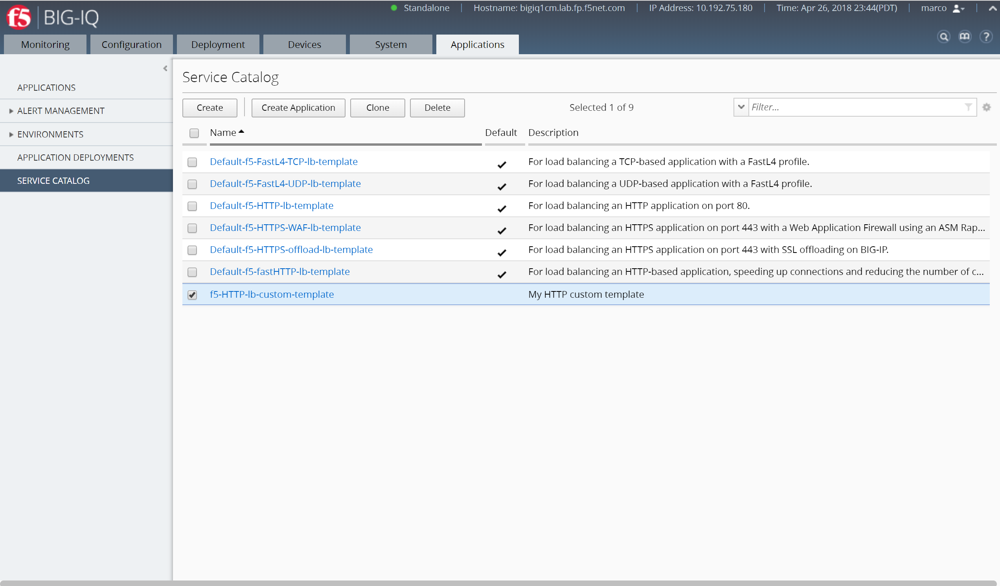

|

In order to allow **Paula** to use the custom application template, go to : *System* > *Role Management* > *Roles*
and select *CUSTOM ROLES* > *Application Roles* > *Application Creator VMware* role (already assigned to Paula). Select the Template *f5-HTTP-lb-custom-template*, drag it to the right.

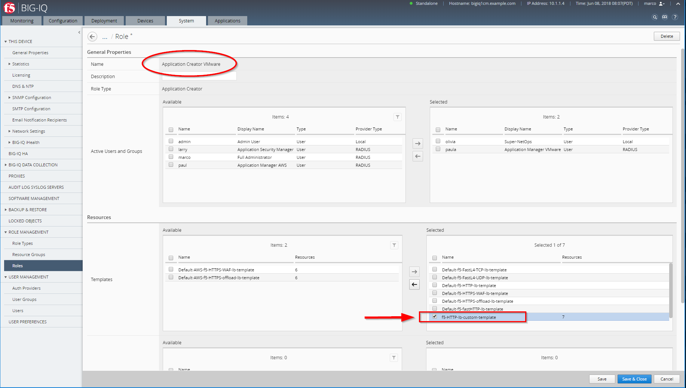

|

Click on **Save & Close**
