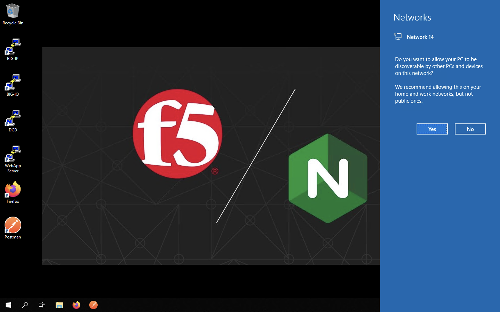
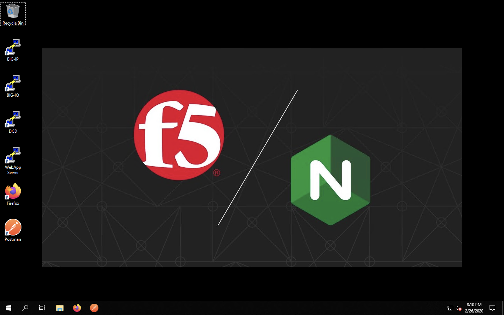
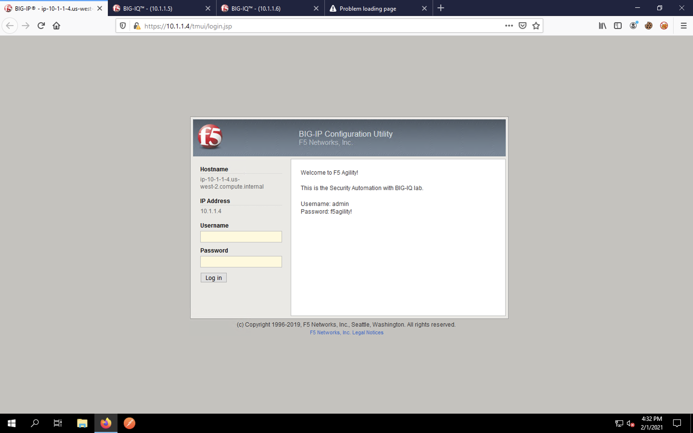
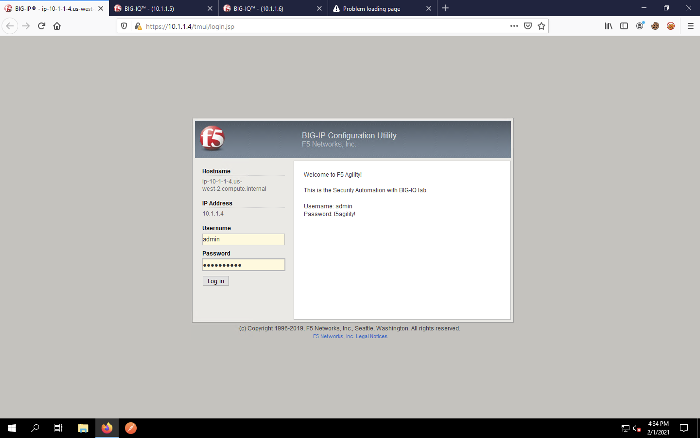
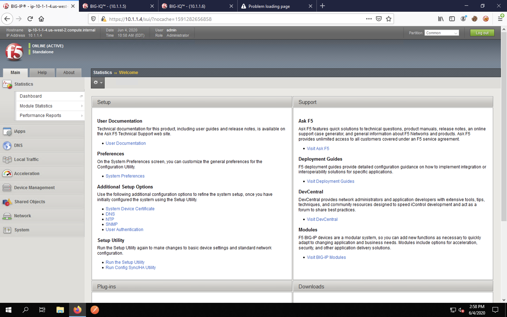
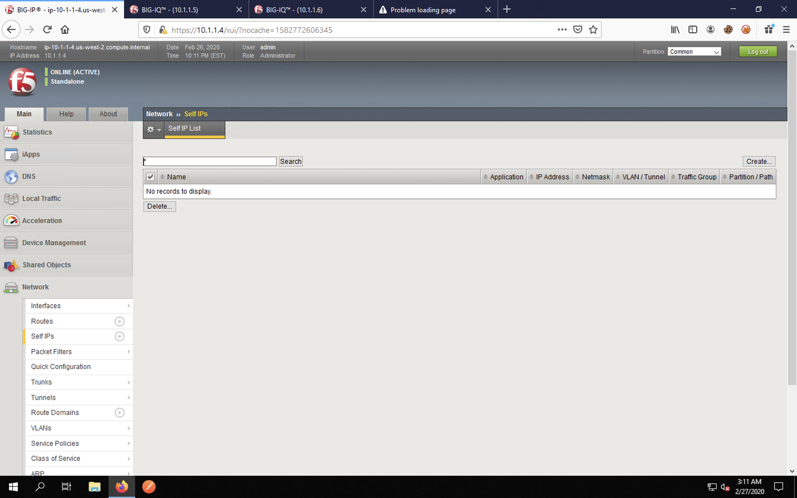
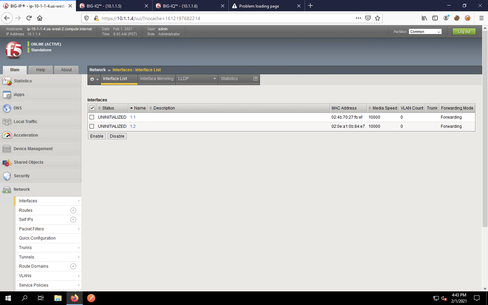

Pre-Device Configuration Review (BIG-IP)
========================================

BIG-IP Configuration Review
---------------------------

First, access the Windows Jump Host via RDP. If you see the network discovery prompt shown below, select No.

On the desktop, you will see icons for Firefox, Postman and several SSH hosts. 

We'll use Firefox to access the web interface of the BIG-IP and BIG-IQ appliances, as well as our test application. We'll use Postman to send API calls to the BIG-IQ for provisioning the BIG-IP's services and application configurations. We'll use the SSH host links to jump on the CLI of these devices in some exercises to see what's going on under the hood.

Let's open Firefox and explore the BIG-IP.

:**NOTE**: If you see any requests to upgrade Firefox, please close and ignore the notification.

Firefox should automatically open four tabs. They are: 
 - BIG-IP 
 - BIG-IQ Centralized Management (CM)
 - BIG-IQ Data Collection Device (DCD) 
 - Test App (will 404 until we start the service)
 
Click on the first tab and log into the BIG-IP using **admin** as the username and **f5agility!** 
as the password.

 
You will be presented with the BIG-IP TMUI as shown below.

Navigate to **System** -> **Resource Provisioning** in the left navigation bar. Notice that LTM is provisioned. We'll need the Advanced Firewall Manager (AFM) and the Application Security Manager (ASM) modules for our lab, **but do not provision them now.** We'll manage service provisioning via our DO declaration. 
 
 .. image:: _media/image7.png

Navigate to **System** -> **Configuration** -> **Device** -> **NTP**. Notice that there are no NTP servers 
configured.
 
Let's verify the blank configuration sections for the networking configuration. Navigate to **Network** ->
**VLANs**. 

.. image:: _media/image8.png

Also click on **Self IPs**, **Routes** and **Interfaces** under the Network section of the
navigation menu. You will see that there are no L2/L3 objects and the interfaces are UNINITIALIZED, meaning
they are not configured for traffic flow.

NOTE: The Advanced Firewall Manager (AFM) and Application Security Manager (ASM) security modules would be configured in a **Security** section, but since those modules are not provisioned, the menus are not accessible at this time.

Feel free to navigate through **Local Traffic** -> **Virtual Servers**. The **Pools** and **Nodes** sections will also be empty. 

Other than a license being installed for lab purposes and the hostname/IP address information configured via DHCP, this VE has no network or application configuration. 

Continue to the next section of the lab.
