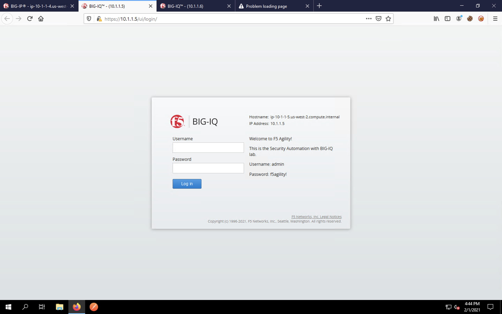
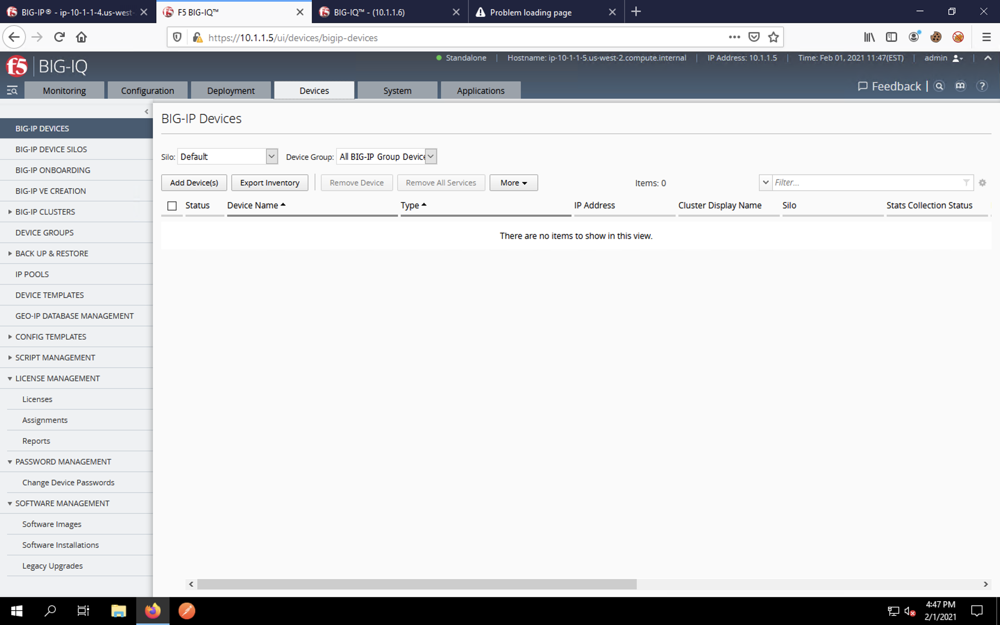

Declarative On-boarding (DO) using BIG-IQ
=========================================

BIG-IQ Configuration Review
---------------------------

Before we make any configuration changes, let's take a glance at BIG-IQ.

Again, Firefox should automatically open four tabs. They are: 
 - BIG-IP 
 - BIG-IQ Centralized Management (CM)
 - BIG-IQ Data Collection Device (DCD) 
 - Test App (will 404 until we start the service)
 
Click on the second tab and log into the BIG-IQ using **admin** as the username and **Agility2020ORlando!** 
as the password.

Once logged into the BIG-IQ, click the **Applications** menu tab. This is the dashboard that shows deployed applications
and corresponding status/statistics. Since we haven't deployed any applications, this area has no data. 

Click on the **Devices** tab at the top of the BIG-IQ window. Under **BIG-IP Devices**, which is the section
automatically displayed, you will see that no BIG-IP devices exist in BIG-IQ.

We're ready to begin configuring and importing the BIG-IP!
