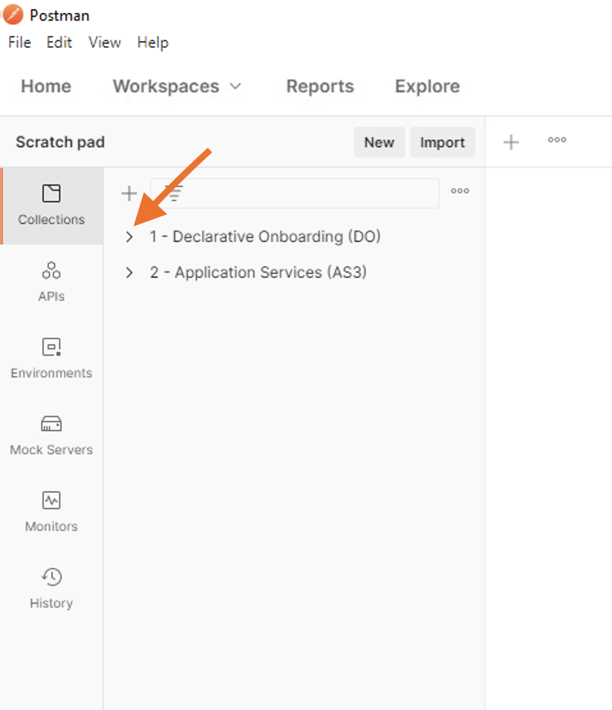
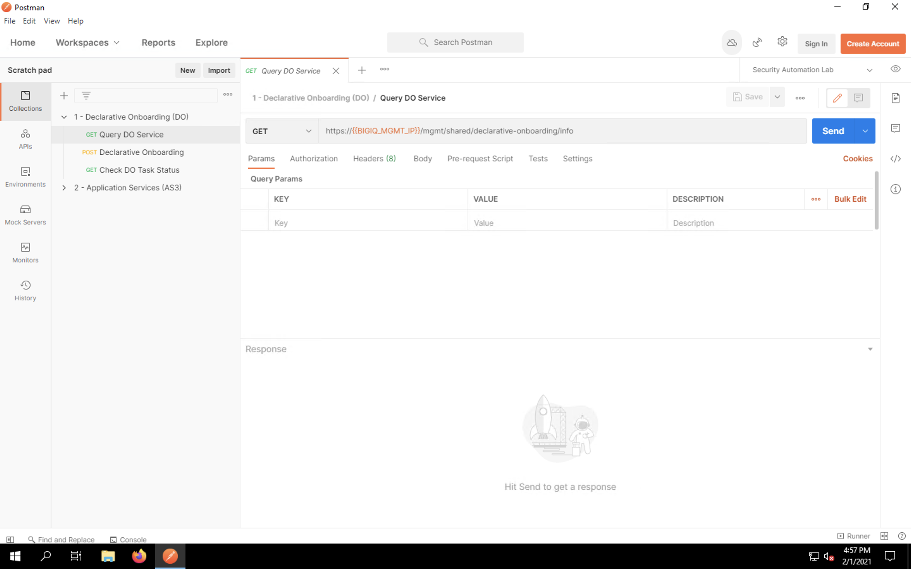
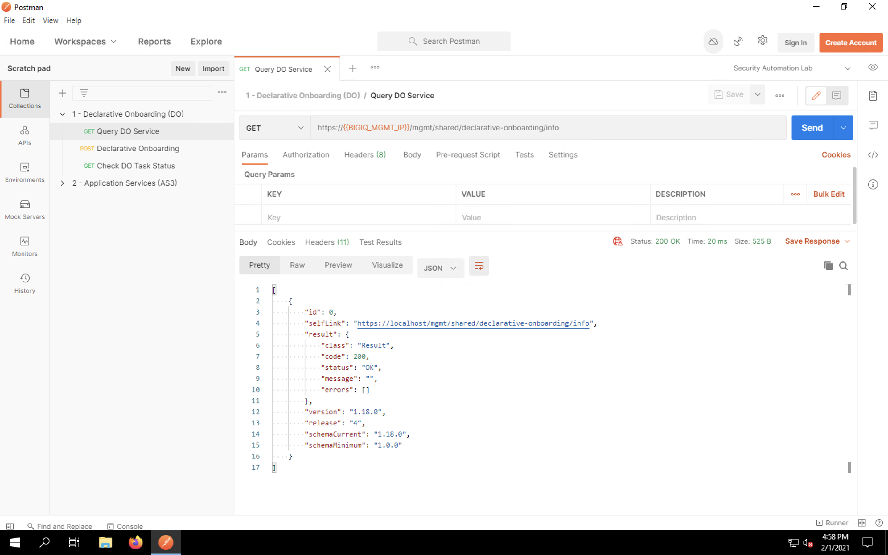
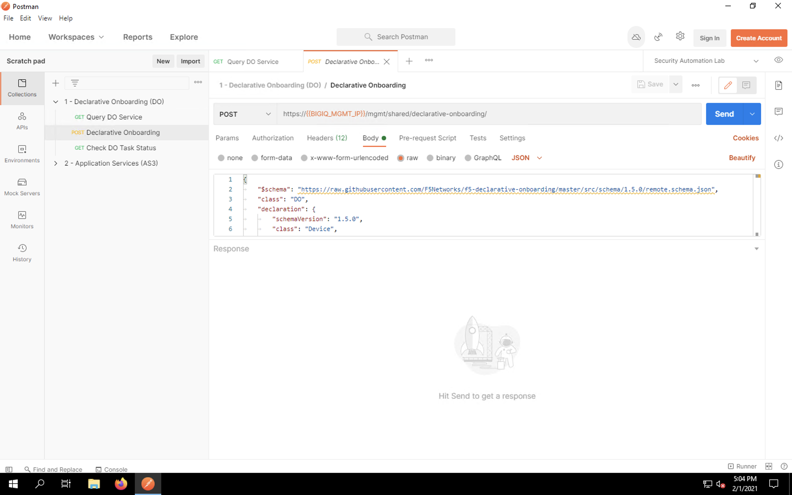
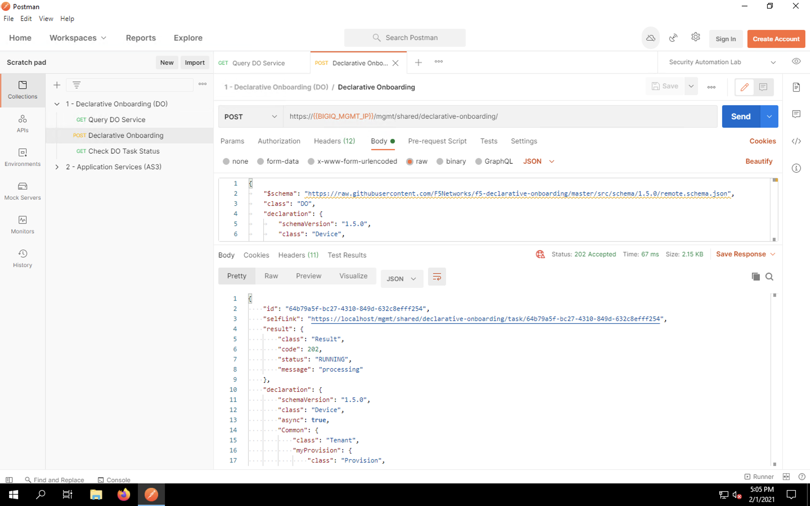
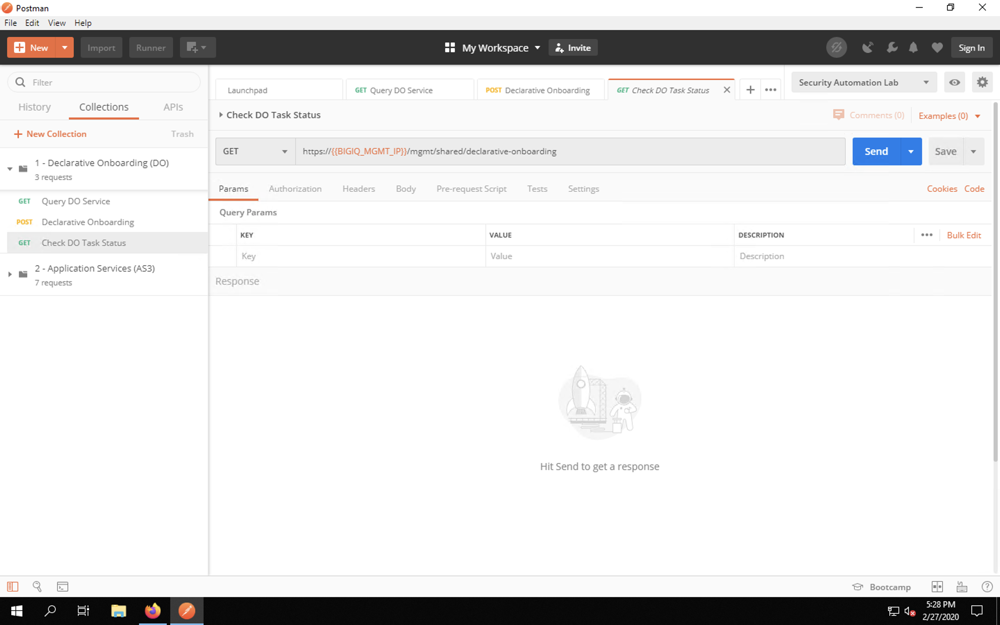
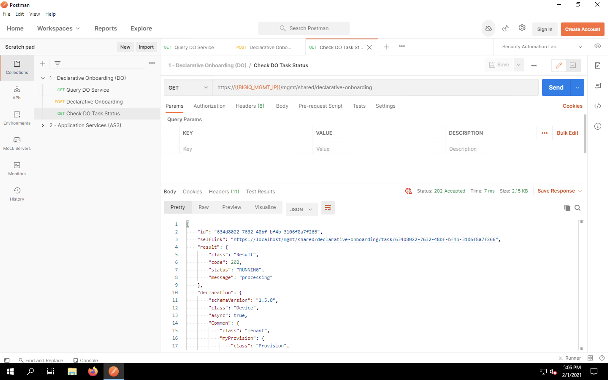

Declarative On-boarding (DO) using BIG-IQ
=========================================

A Note on HTTP Methods
^^^^^^^^^^^^^^^^^^^^^^

For those who are not familiar with APIs, its important to understand briefly the HTTP methods that APIs often utilize. While methods is the official term, they are also called HTTP operation types or HTTP verbs. The BIG-IP uses GET, POST, PUT, PATCH and DELETE methods that are part of the HTTP protocol.

* GET is used to retrieve data in a read-only manner 
* POST is used to create an object that doesn't exist
* PATCH is used to modify specific attributes of an existing object
* PUT is used to modify an existing object as well; however, unspecified attributes are reset to their default values
* DELETE is used to delete an object

For the sake of this lab, we'll be using GET to view information and POST to create new configurations.

Declarative On-boarding using Postman
-------------------------------------

Minimize all open windows so that the desktop icons are viewable. Click on the Postman icon on the desktop
to launch the application.

.. image:: _media/image15.png

On the left side of the screen, expand the collection *1 - Declarative Onboarding (DO)* by clicking on the small
grey arrow to the left of the collection title, as highlighted by the orange arrow.

First, we'll query the BIG-IQ's Declarative On-boarding API to ensure it's awake. Click on the **Query DO Service**
item in the collection to open the request in a new tab. This is a simple GET request to a URL that will
return information about the DO API running on the BIG-IQ. 

Click the **Send** button to send the request. The BIG-IQ response will be displayed. This information
includes the status of the request (200 OK), the API version and current/minimum schema versions for DO.

Next, let's open the request for the actual DO task. On the left side of the screen, single-click on the
*Declarative Onboarding* request in the collection. This time, you'll see that we're making a POST request.
Click on the **Body** tab. Look at the JSON fields in the payload to see the relevant items that will be
configured. Notice that BIG-IQ import settings are specified as well. 

:**NOTE**: The current schema reference for Declarative On-boarding can be found at https://clouddocs.f5.com/products/extensions/f5-declarative-onboarding/latest/schema-reference.html.

Click **Send** to send the request. You should see a 202 response indicating that the task was successfully
received by the DO API.

Declarative On-boarding is not instantaneous. To query the task status, load the last item in the collection,
**Check  DO Task Status** request by clicking on it once in the request list. This is a basic
GET request to the DO API endpoint which will return the current status. 

Press **Send**.

You should continue see a 202 response and a message that the task is still running. Depending on the complexity
of your DO declaration, this could take anywhere from 2 seconds to 5 minutes. Because we're provisioning modules
in this lab, the task will take a few minutes to run. This is due to service instantiation/restarts, memory reservation
reallocations, etc. 

Continue querying the task status by clicking **Send** every few seconds. Eventually, you should
see a 200 OK message indicating that the provisioning task is complete, as shown below.

Declarative on-boarding is complete! Let's take a look at the configurations now. 