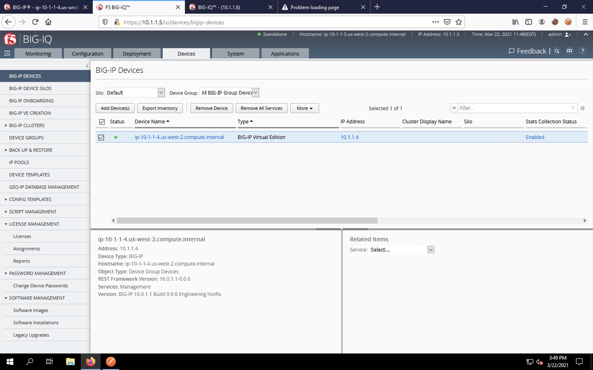
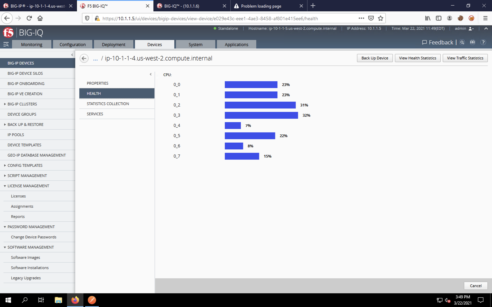
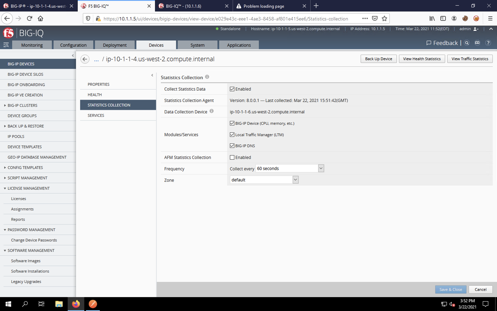
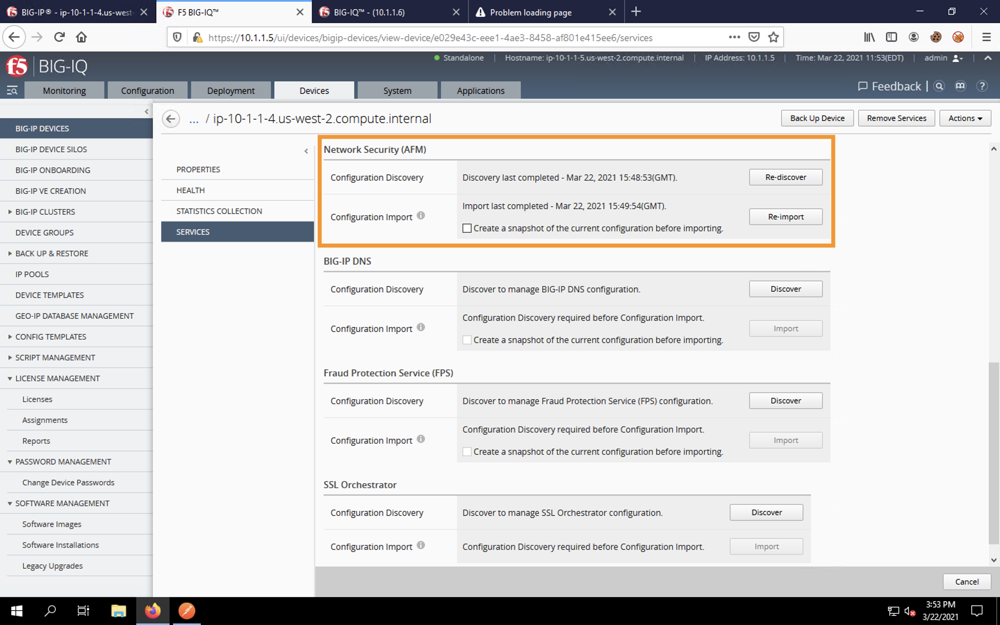

Post-DO Configuration Review (BIG-IQ)
-------------------------------------

BIG-IQ Configuration/Stats
^^^^^^^^^^^^^^^^^^^^^^^^^^

Since everything looks to be complete from the API perspective, let's **maximize Firefox** and click on the second tab to return to the BIG-IQ UI.

BIG-IQ will now show the BIG-IP device under **Devices** -> **BIG-IP Devices**.

.. image:: _media/image24.png

Click the checkbox next to the BIG-IP. You will see a bit of information listed about the appliance below.

Click on the device name itself to enter the device properties page.

Clicking on the **Health** and **Properties** sections to view more information about the imported BIG-IP.

.. image:: _media/image28c.png

Click on **Statistics Collection** section of the device menu. We've enabled statistics collection which tells the BIG-IP to send stats to the BIG-IQ Data Collection Device (DCD). 

:**NOTE**: A BIG-IQ instance can be used for Centralized Management (CM) or Data Collection (DCD) but never both. A typical BIG-IQ deployment will have multiple CMs and DCDs for HA/scale. Sizing is outside of the scope of this lab and dependent on the size of a BIG-IP deployment; please refer to your F5 account team for BIG-IQ sizing questions.

Click on the **Services** section. This will show the device's services menus (the *Importing Services* task may still be running). Scroll through the list and see that LTM (ADC services), ASM (WAF), AFM (Firewall) and SSM (Shared Security, which is a management module) services are enabled. BIG-IQ allows you to specify which modules on the BIG-IP are managed by the CM; we've selected all the modules we're provisioning.

In the next section, we'll review the BIG-IP's configuration.
