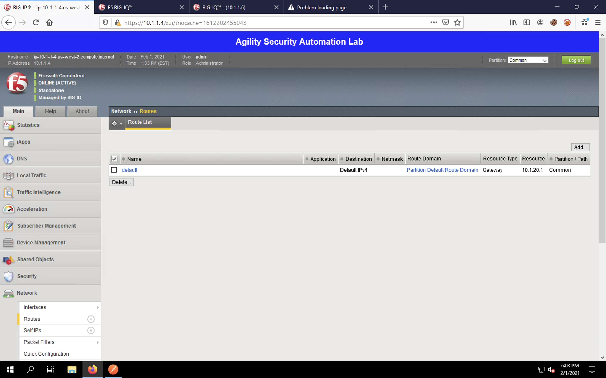
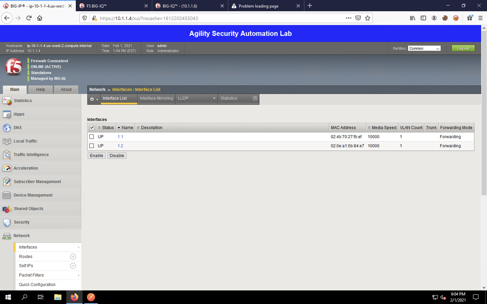
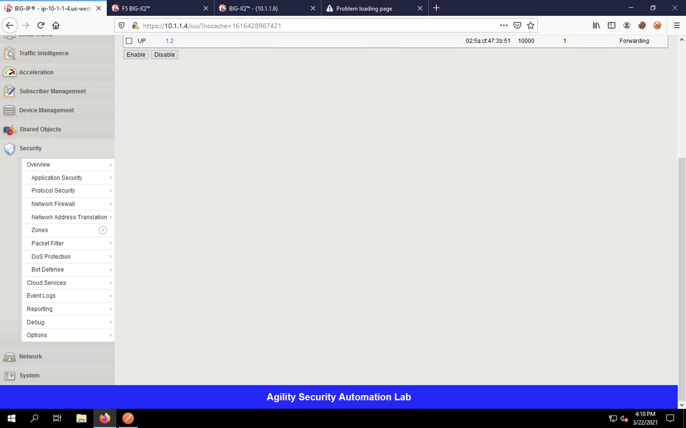

Post-DO Configuration Review (BIG-IP)
-------------------------------------

BIG-IP Configuration/Stats
^^^^^^^^^^^^^^^^^^^^^^^^^^

Let's return to the BIG-IP web UI by clicking on the first tab in Firefox.

We defined a password and SSH certificate for the **admin** user when we sent the DO declaration, thus you'll be
asked to log in again. Log in using the **admin** username and the **f5agility!** password.

.. image:: _media/image29.png

Remember the "dbvars" we set with DO? That placed the blue banner around the UI. You should notice that change immediately
after logging in.

Click on **System** -> **Resource Provisioning**. Notice that AFM, ASM and iRulesLX are now provisioned.

**System** -> **Configuration** -> **Device** -> **NTP** will now contain NTP servers. 

Navigate to **Network** -> **VLANs**. Notice that we have an internal and external VLAN so that
application traffic flows through the BIG-IP for traffic going to our WebApp Server.

Navigate to **Network** -> **Self IPs** to see the VLAN self IP addresses. 

Navigate to **Network** -> **Routes** to see the default static route.

Navigate to **Network** -> **Interfaces** to see that the interfaces are now UP and ready to accept traffic.

Notice that **Security** and **Shared Objects** menu items have been created. Under **Security**, we can now configure
the ASM and AFM modules. Declarative On-boarding did not configure these modules themselves; it simply enabled them. 

Finally, if we look at **Local Traffic** -> **Virtual Servers**, we'll see nothing included. DO doesn't configure
applications, security, DNS, etc. We'll cover that in the next section on Application Services 3.0 (AS3).

This completes the Declarative On-boarding section of the lab. 

