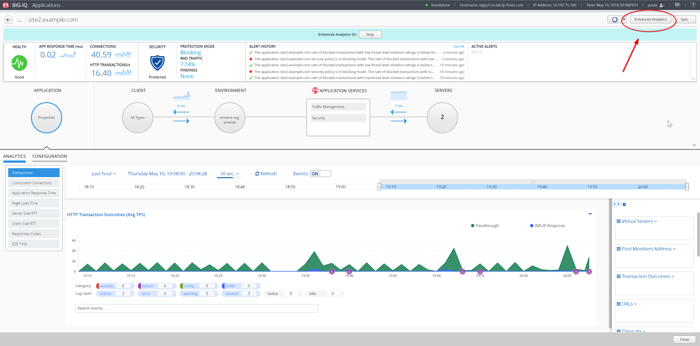
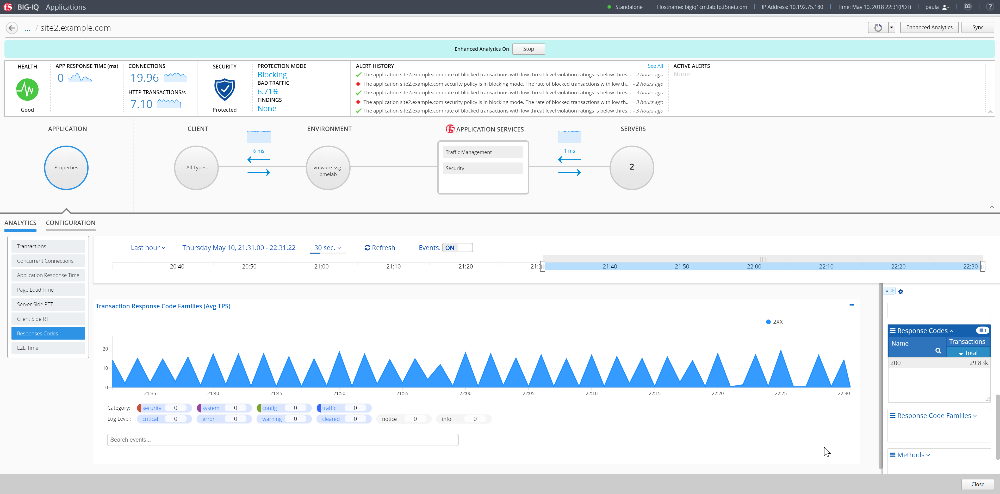
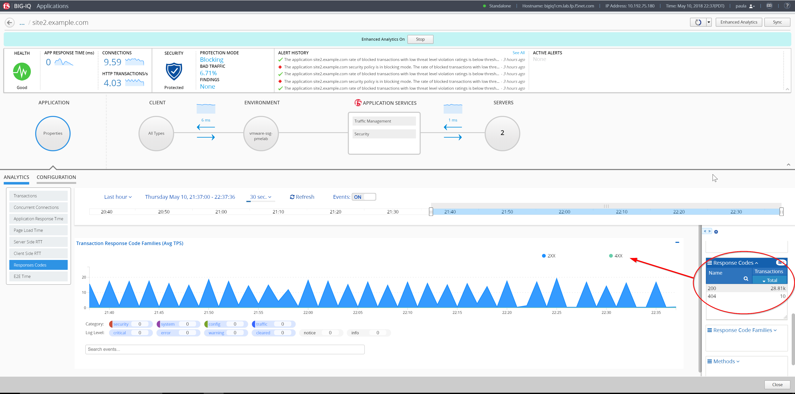
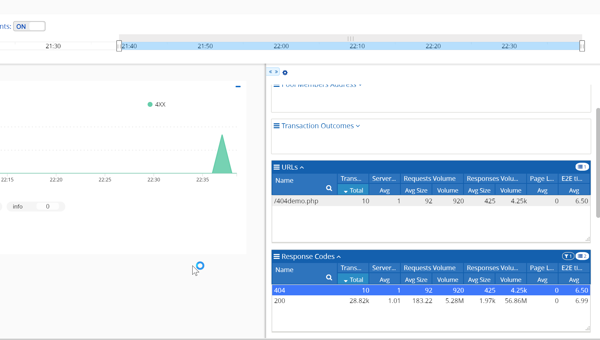

Lab 2.1: Troubleshooting 404
----------------------------
Logout and login to BIG-IQ as **paul** with the password of **paul**

Select one of the applications ``site40.example.com`` and turn on **Enhanced Analytics**, click on the button at the top right of the screen, and click on **Start**.

The Enhanced Analytics allows you to increase the application data visibility by collecting additional data for all, or specific, client IP addresses sending requests to the application.
Note: When this option is enabled, a banner appears at the top of the screen and highlights the application health icon in the applications list.

|

Expand the right-edge of the analytics pane to get the response code filter. Notice the current traffic only returns 200 OK.

|

**Generate 404 errors on the web application**

Using the IP from the Training Portal, SSH into the **Ubuntu Lamp Server** server with username **f5** and password **agility**

Execute this command::

    curl -k -i https://site40.example.com/404demo.php

Push the up arrow and enter to repeat the command around 10 times.

After about 30 seconds or so (default refresh time on that page) the 404 errors should appear on the **Response Codes** chart and pane.

We have seen in this lab on rare cases updates not working.  Click back out of the site in BIG-IQ and then back into site40.

|

Filter on 404 errors on right panel, this should give you only the URL that is missing as well as the pool member which is missing the content.

|

You could then take action on that pool members with the missing data by disabling it in the pool until that server is fixed.