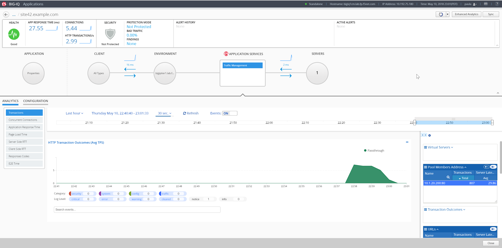
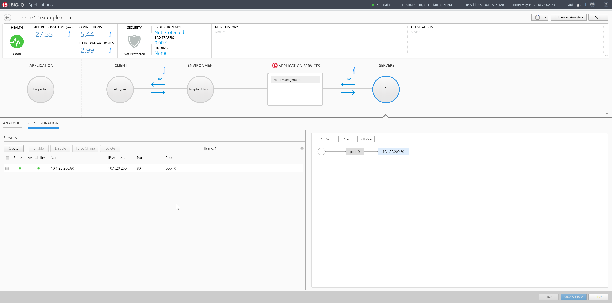
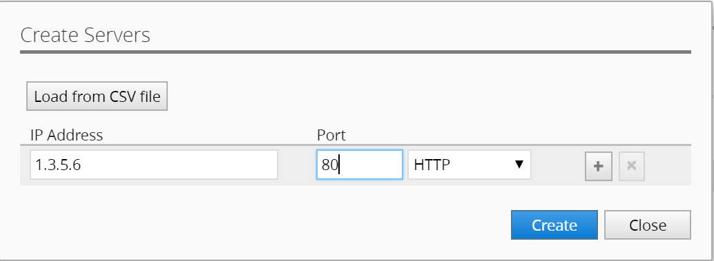
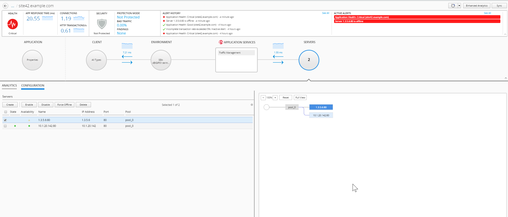

Lab 2.2: Troubleshooting Pool Member
------------------------------------
Logout of BIG-IQ and Login as **paula** with the password of **paula**

Select one of the applications ``site42.example.com``.

|

Click on **SERVERS** (circle button), then select the **CONFIGURATION** tab.

One node should be displayed.

|

Click on **Create** and add a wrong node ``1.3.5.6`` with port ``80``, click **Create**

|

You should see a **Deploying application changes...** yellow banner indicating the deployment is in-progress.  It may take a minute or so to deploy.

Once deployed, you should see the pool member in the list and it should be ``red`` as that IP address doesn't exist and is not responding to our health checks configured for this application.

In a few more minutes, an alarm is raised showing the unhealthly pool member.

You can see the alerts under **Active Alerts**.  If you click back out of the site in the dashboard, you will see that site42 is in ``Critical`` Health.

.. note:: The health monitors for this template are set to 1 minute polling in order to reduce network traffic in the lab.

|

**Remove Pool Member**

Delete the unhealthy pool member you just created to clear the alarm.

|

|

**Congratulations you have completed the lab!!**

**Thank you for participating!**

|
