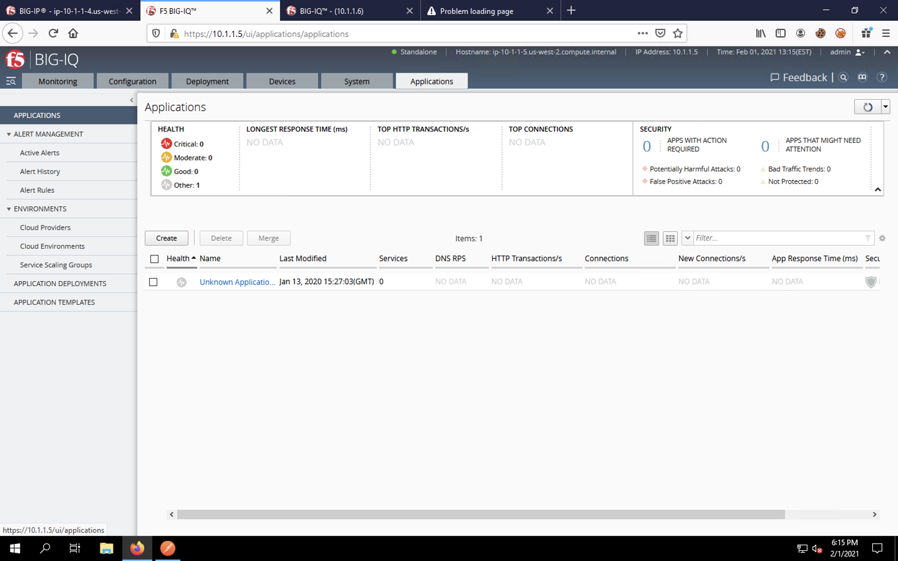
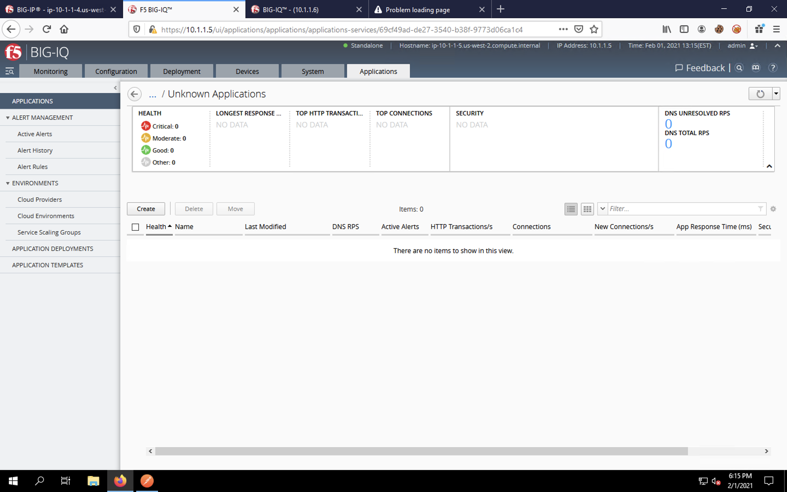
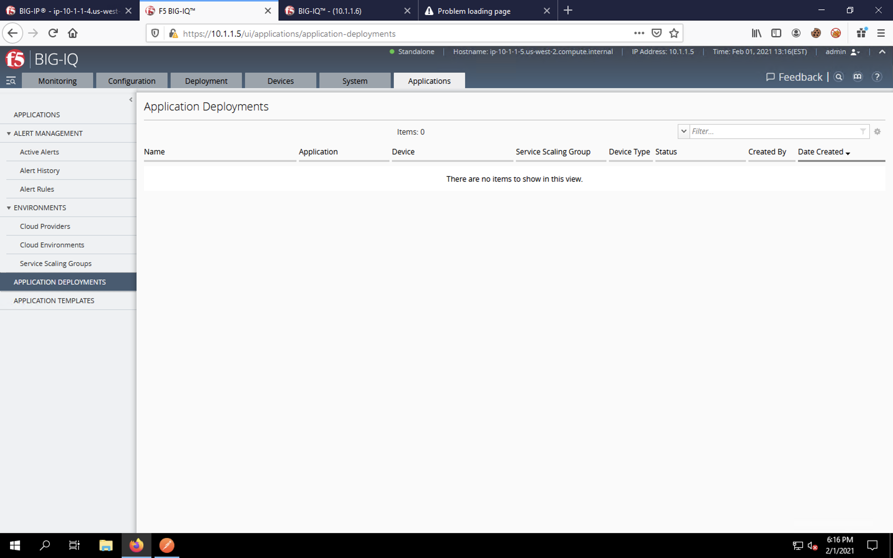

Pre-AS3 BIG-IQ Configuration Review
-----------------------------------

Before we start our AS3 deployment, let's review the BIG-IQ's current configuration
in regards to applications, which is mostly non-existent.

Kindly find your way to the second tab in Firefox, which is the web UI for the BIG-IQ centralized
management instance.

.. image:: _media/image11.png

Log into the BIG-IQ using the **admin** / **f5agility!** credentials.

.. image:: _media/image12.png

You'll likely return to the *Devices* tab on the BIG-IQ. Let's click on the **Applications**
tab.

    
In the *Applications* tab, you will see an application group called *Unknown Applications*. This
group exists by default and is empty. Let's click on the group name **Unknown Applications** under the 
*Name* column of the list. You'll see that there aren't any existing applications in this group.

Finally, click on **Application Deployments** on the navigation bar on the left. There are no
application deployments listed. Current and past deployments will be listed here.

Now that we've verified that the BIG-IP and BIG-IQ have no application/security configurations,
its time to spin up our WebApp Server and deploy our AS3 application. 
