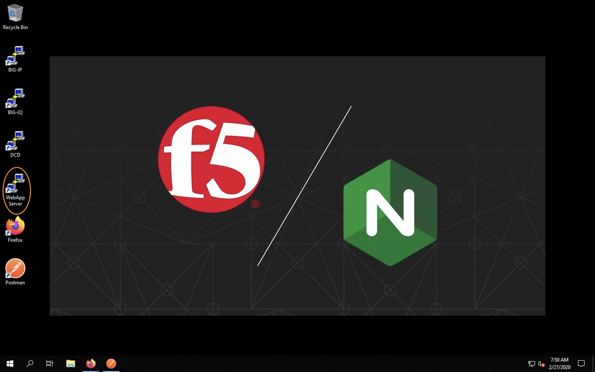
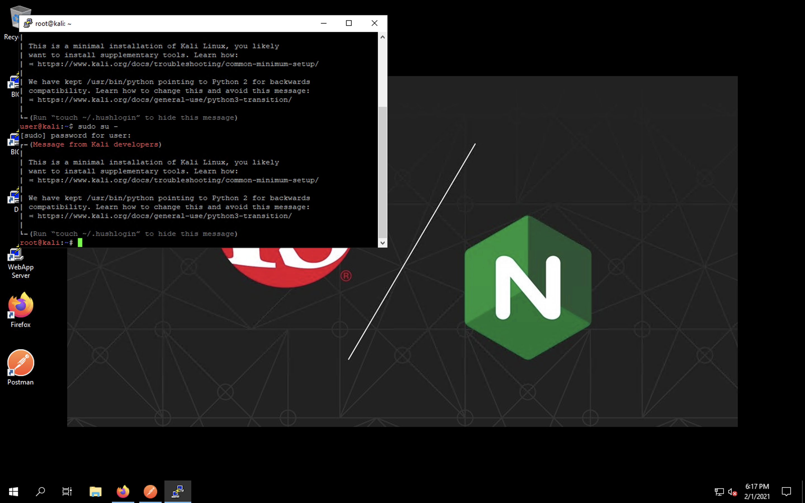
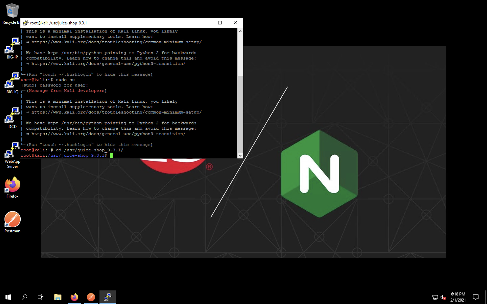
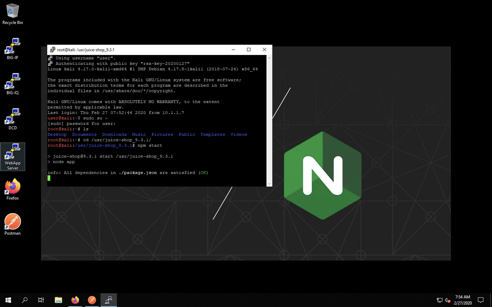
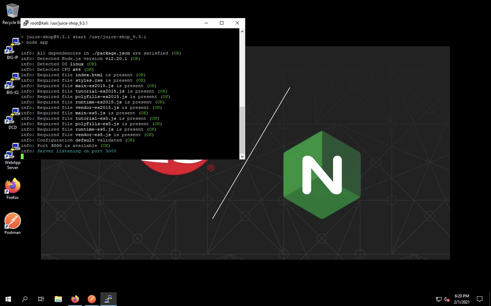
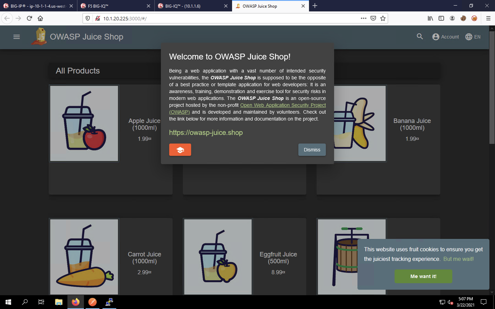

Enabling the Juice Shop Server
------------------------------

Before we can provision our app, we need a working pool member. Juice Shop is a vulnerability testing 
web server maintained by OWASP. Let's log into our lab WebApp Server and start the server on port 3000.

Let's minimize all current windows so we can see the desktop. 
Click on the WebApp Server link on the desktop.

If you see the error below, simply click **Yes** to continue.

.. image:: _media/image46b.png

You should be automatically logged in the CLI as shown below.

.. image:: _media/image51b.png

Switch to the root user context using the following command:

``sudo su -``

You'll need to supply the **f5agility!** password when prompted.

Change to the /usr/juice-shop_9.3.1/ folder using this command:

``cd /usr/juice-shop_9.3.1``

Issue the following command to start the app server:

``npm start``

You should see the server spinning up and logging to the console as shown below.

You'll know the server is fully up when you see this message:

``Server listening on port 3000``

Leave your console window open so the app continues to run. It's useful to come back to the CLI, for any vulnerabilities triggered will be logged to the console output.

Finally, refresh the fourth tab in the browser to test connectivity directly to the app server. 

Let's move forward with the AS3 configuration.

