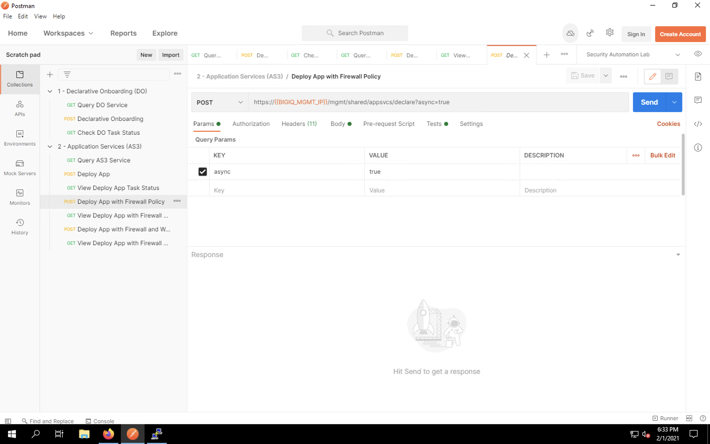
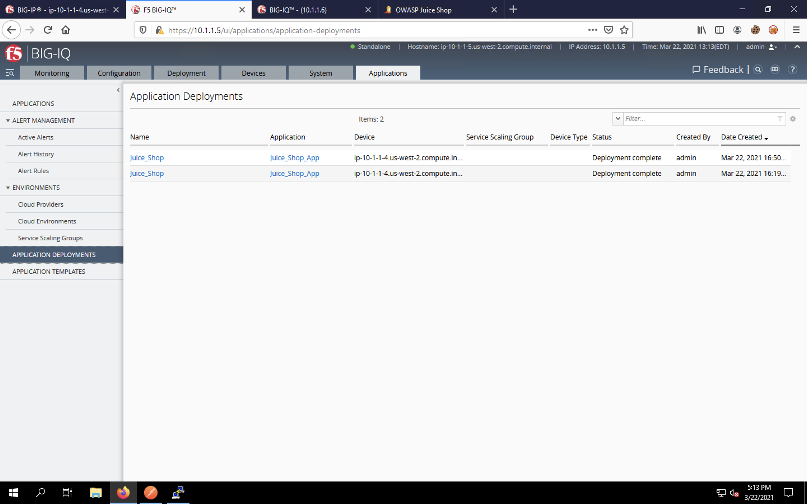
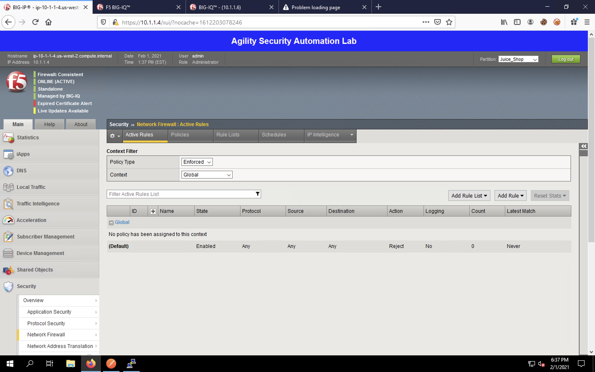
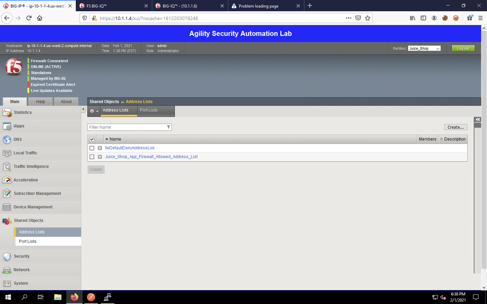
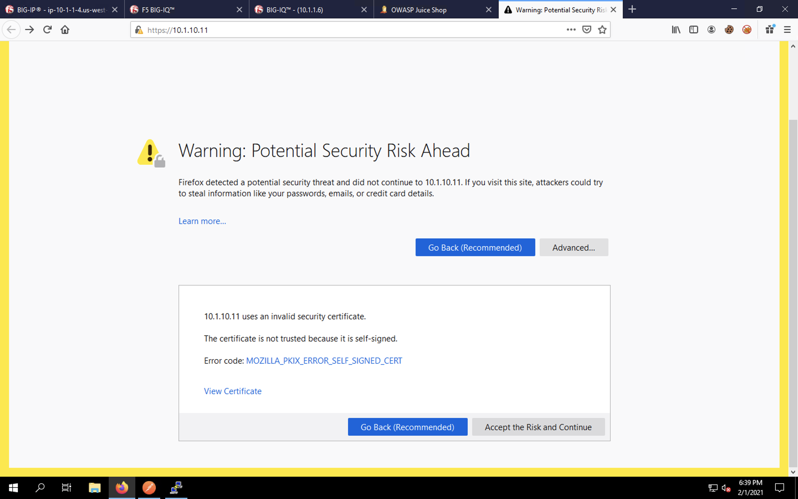
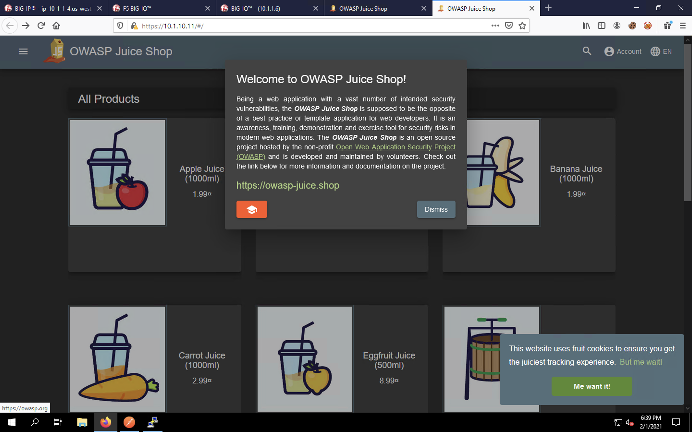

Web App with Firewall Policy Deployment
^^^^^^^^^^^^^^^^^^^^^^^^^^^^^^^^^^^^^^^

Back in Postman, single-click on the **Deploy App with Firewall Policy**. 

This request adds an AFM firewall policy onto our app. If you click on the **Body** tab and look
at the JSON payload, you'll notice that we're re-using our last declaration with a few additional
lines for firewall configuration.

Click **Send** to submit the declaration. You should see a message that the declaration was submitted
successfully. This does not mean that the configuration was deployed; it simply means no syntax
errors were detected prior to processing the payload.

Click on the **View Deploy App with Firewall Policy** item in the requests list. Click **Send** to query
the task status. You may see an "in progress" message such as the one below.

.. image:: _media/image27.png

Click **Send** every few seconds to refresh the task status. Eventually, you should see a 200 OK success message
from the AS3 API. This indicates that the application was deployed successfully.

Return to Firefox and click on the second tab to return to BIG-IQ. Click the **Applications** tab at the top of
the UI, then click the **Applications** item from the menu on the left side of the page. This returns us to the
Applications dashboard. 

Click on the "Juice_Shop_Juice_Shop_App" link under the Unknown Applications list.

The Juice Shop app dashboard should show that the app is in good health, but still not protected. Our firewall
policy is applied, but since that's a network level protection, you won't see statistics in this dashboard.

Click on **Application Deployments** on the left-side menu. You should see your deployment tasks listed. You
can view a task status and additional details by clicking on a task name.

Click on the first Firefox tab to switch back to the BIG-IP. Navigate to **Local Traffic** -> **Virtual Servers**.
Ensure that "Juice_Shop" is selected from the **Partition** drop-down at the top-right of the web UI. 

Click on the **serviceMain** virtual server. The virtual server configuration page will load.

Click on the **Security** tab at the top of the configuration page. Select **Policies**. You will see that our
firewall policy has been applied to our virtual server.

Next, navigate to **Security** -> **Network Firewall**. The statistics will appear empty. 

Change the **Context** drop-down box to **Virtual Server...** and select the **serviceMain** virtual server in the 
drop-down that appears to the right. You'll then see how the hierarchical firewall policies are being enforced for
our virtual server.

Now click **Policies** to load the firewall policy list. Our declared firewall policy appears in the list. 

Click on the policy name to view the policy itself. 

Click the + icon to expand the first rule in our list. You will see the rules that were defined listed, using the
port and address lists we created.

Navigate to **Shared Objects** -> **Address Lists** to view the address-list.

Navigate to **Shared Objects** -> **Port Lists** to view the port-list.

In a new tab in Firefox, enter **https://10.1.10.11** in the URL bar. You'll be presented with a certificate error.
Click the **Advanced...** button. Scroll down to view the entire dialog box that appears and click **Accept the Risk
and Continue** to proceed. 

The OWASP Juice Shop app will launch. Feel free to click around and explore. This shows that our firewall policy
is correctly permitting our web traffic.

In the next section, we'll apply a web application firewall policy using AS3. 
