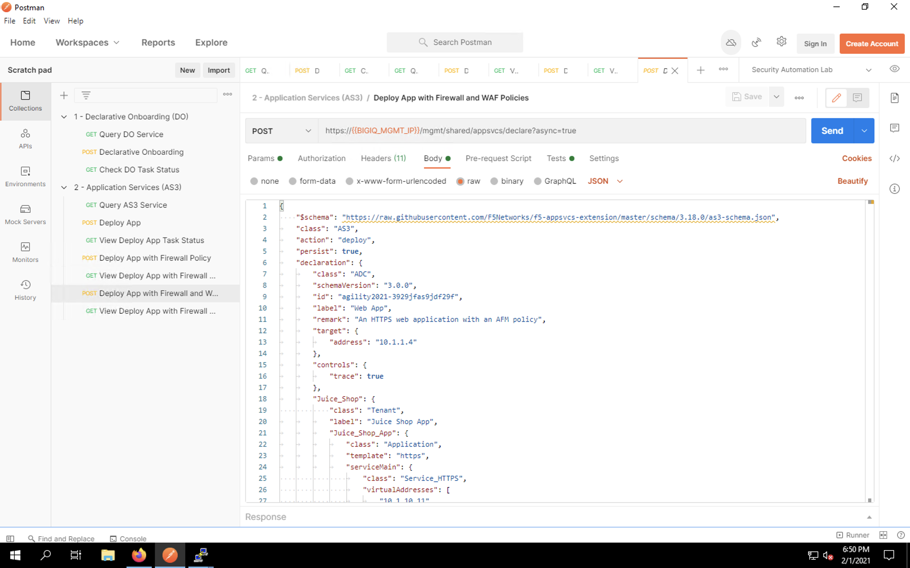
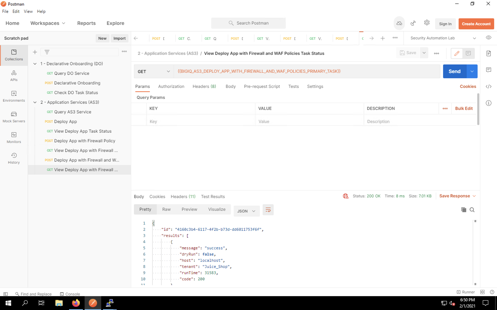
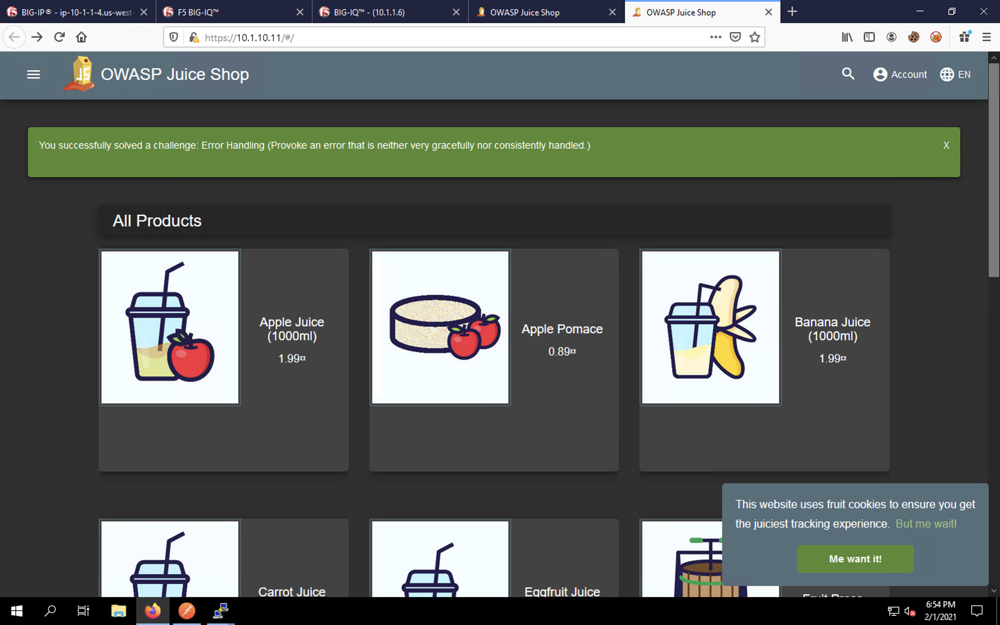
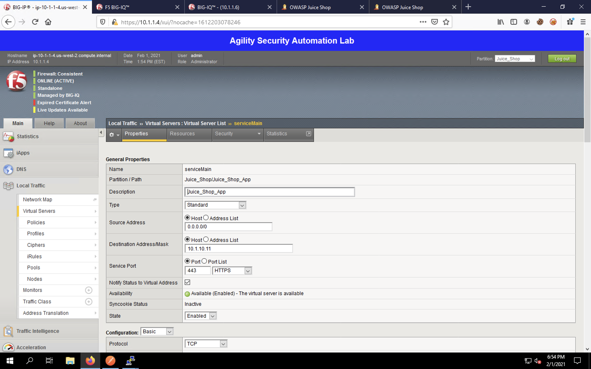
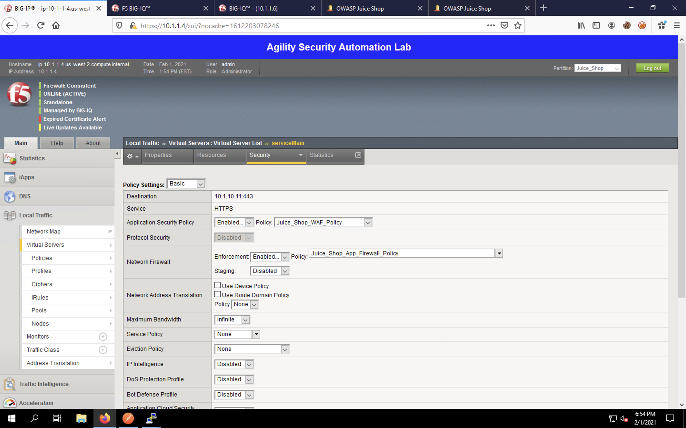

Web App with Firewall and WAF Policy Deployment
^^^^^^^^^^^^^^^^^^^^^^^^^^^^^^^^^^^^^^^^^^^^^^^

Back in Postman, single-click on the **Deploy App with Firewall Policy** to open the request in a new tab.

Click on the **Body** tab to view the payload. We're using the same payload as the last section but adding
an ASM web application firewall policy. 

This lab uses the OWASP Auto Tune Policy. This policy will block against the OWASP Top 10 as well as incorporate auto-tuning. Auto-tuning allows the policy to monitor the application's behavior over time and create dynamic signatures based on observed patterns.   

Policy templates are updated regularly and available from https://github.com/f5devcentral/f5-asm-policy-templates 

Click **Send** to submit the declaration. You should see a message that the declaration was submitted
successfully. This does not mean that the configuration was deployed; it simply means no syntax
errors were detected prior to processing the payload.

.. image:: _media/image52.png

Click on the **View Deploy App with Firewall and WAF Policies Task Status** item in the requests list. This is a
simple GET request that will monitor the status of the deployment task.

Click **Send** to view the current request status. You will likely see that your request is in progress, as shown
below.

Click **Send** every few seconds to refresh the task status. Eventually, you'll see a 200 success message indicating
that your application has been deployed.

Back in BIG-IQ (Firefox, 2nd tab), click **Applications** on the top menu and select **Applications** on the left menu.
This returns us to the Applications dashboard/list.

Click on **Unknown Applications** to pull up the list of apps in the group.

Click on the **Juice_Shop_Juice_Shop_App** link to pull up the application's dashboard. Notice that our app is
showing good health and we're now securing the app using the WAF policy. 

Go back to the Juice Shop tab in Firefox and refresh the page to ensure the application is working properly.

Return back to the BIG-IQ application dashboard in the second tab. You should see your session/connection in the
dashboard.

Click on the **Application Deployments** item in the left menu. You will see a list of all the deployments we've
run in this lab.

.. image:: _media/image62.png

On the BIG-IP in the first Firefox tab, navigate back to **Local Traffic** -> **Virtual Servers**.

Click on the **serviceMain** virtual server in the list to open the virtual server configuration page.

Click on the **Security** tab at the top of the configuration page and select **Policies** from the list. Notice
that our Network Firewall and Application Security Policy items are applied to the virtual server.

Finally, navigate to **Security** -> **Application Security** -> **Policies List** to view the ASM policy in use
by our application. 

.. image:: _media/image66.png

Re-run the WAF tester tool to see the WAF preventing the test attacks. You can view statistics about the attacks 
in BIG-IQ under the application service's dashbaord.

You will see that the WAF is now blocking the majority of attacks.

This concludes the AS3 portion of our lab. 
