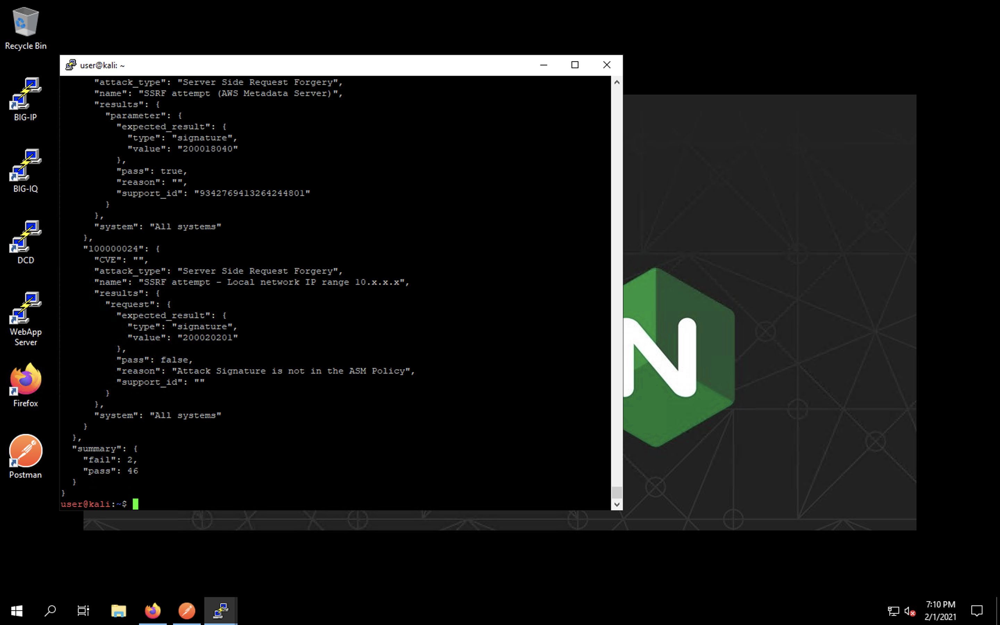
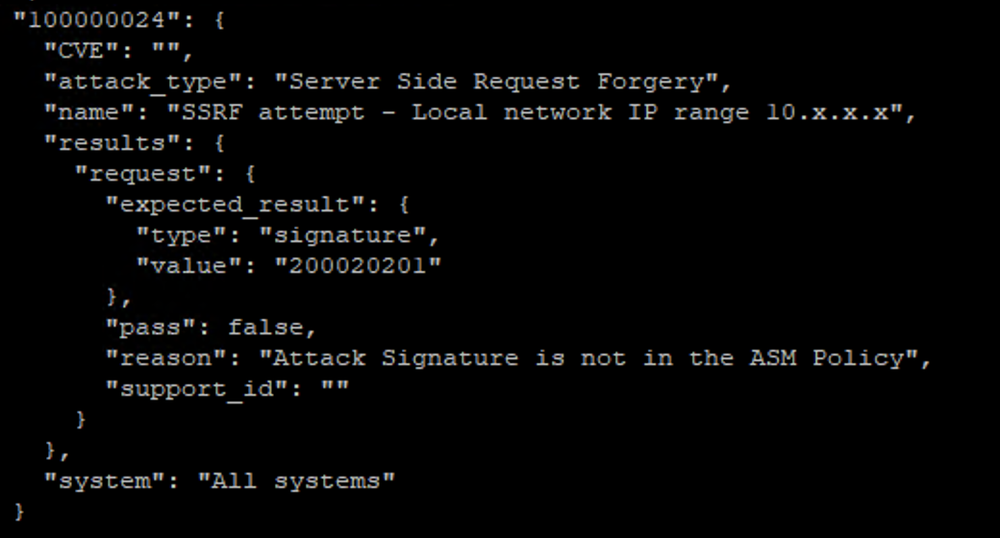

Application Performance and Security -  Status and Statistics
=============================================================

In this section of the lab, we will run the F5 WAF Tester tool to generate attack traffic and view statistics in the BIG-IQ UI.

Minimize Firefox and Postman. Return to the Web App Server session where we left off with the WAF Tester tool.

Modify the configuration of the WAF tester to specify the newly installed policy. 

To accomplish this, simply rerun the initilization command:

``sudo f5-waf-tester –-init`` 

Use the new values below; press Enter to accept defaults for all other values.

``[BIG-IP] Host []: 10.1.1.4`` 

``[BIG-IP] Username []: admin``

``[BIG-IP] Password []: f5agility!``

``ASM Policy Name []: Juice_Shop_WAF_Policy``

``Virtual Server URL []: https://10.1.10.11``

Once reconfigured, re-run the WAF tester with the command:

``sudo f5-waf-tester`` 

You’ll quickly notice the tests are now passing.

Note that the Support ID is also being included in the detailed test results. This is a unique identifier presented on every ASM block page presented to a web client that can be used to correlate that user's block action with a log entry. 

Maximize Firefox and return to the BIG-IQ UI. 

Click on the *Applications** tab at the top, and then **Applications**. Click on the application listed and select **Juice_Shop_Juice_Shop_App**. This will give a quick view of the now protected application.

Peruse the various dashboard components to view statistics. 

The final AS3 declaration also enabled the ability to send logs to BIG-IQ for both AFM firewall logging and ASM WAF logging. 

For ASM transactions, within BIG-IQ navigate to the *Monitoring tab* and then select **Events** -> **Web Application Security** -> **Event Logs** -> **Events**. 

The output will resemble the screen shot below: 

.. image:: _media/image5.png

For AFM transactions, within BIG-IQ navigate to the *Monitoring tab* and then select **Events** -> **Network Security** -> **Firewall**. 

The output will resemble the screen shot below: 

.. image:: _media/image6.png

This concludes our lab. Continue forward to view a list of resources used in this lab, available in the Resources section of this document.
