BIG-IQ Access Policy Manager
============================

Objective
^^^^^^^^^

BIG-IQ can create, modify, and delete APM access and per-request
policies.

WORKFLOW 1: Access Policy Review
~~~~~~~~~~~~~~~~~~~~~~~~~~~~~~~~

Navigate to Configuration Access Access Groups BostonAG Access Policies
Per-Session Policies TestAccessProfile

|image5|

The access policy will be displayed in a new screen as shown below.
Compare the Access policy in BIG IQ with the policy in BIG IP source
device and ensure that they are exactly same. Open the browser shortcut
for the BIG-IP01 in a new tab from Chrome.

|image6| |image7|

WORKFLOW 2: Location Specific Object Modification
~~~~~~~~~~~~~~~~~~~~~~~~~~~~~~~~~~~~~~~~~~~~~~~~~

-  Navigate to Configuration Access Access Groups BostonAG
   Authentication Active Directory Active Directory

    |image8|

    LSO or Location Specific Objects are objects within an access
    profile/policy that relate to more specific geographic areas
    normally and are not shared between all devices by default to
    prevent misconfigurations. As an example, AAA servers are located in
    all office/data centers globally however if an end user is accessing
    a policy on an APM in Europe we wouldn’t want their authentication
    requests to be sent over a WAN link to some Domain Controller in
    another country and cause a tremendous delay for that user.

-  Click the check box for the FrogPolicy-olympus-ad for the BIGIP02
   device.

-  Click the Mark Shared button and accept the warning

    |image9|

    This will move the object from the device specific location to the
    Shared resources location.

-  Click on the AAA object to edit the properties

-  Change the Timeout value from 15 to 1500

-  Click Save & Close

    |image10|

    BIG IQ provides the ability to transition LSO objects to Shared
    Objects and vice versa. When an LSO object is made Shared it will
    have the same configuration across all the BIG IPs after deployment.

WORKFLOW 3: Modifying an existing APM access policy using VPE
~~~~~~~~~~~~~~~~~~~~~~~~~~~~~~~~~~~~~~~~~~~~~~~~~~~~~~~~~~~~~

-  Navigate to ConfigurationAccessAccess Groups

-  Select BostonAG

|image11|

Click on Access Policies -> Per Session Policies:

Select TestAccessProfile and add the following objects:

-  Logon page (accept default settings)

-  AD Auth using FrogPolicy-Olympus-AD

-  If AD Auth successful, your allowed access

|image12|

Start by hovering the mouse over the blue line in the policy flow
between the Start and Ending points and clicking the Green Plus sign.

|image13|

Now select the “Logon Page” object on the right side of the pop up
window. Then click “Save” on the next pop up window.

|image14|

The result should look like the picture below.

|image15|

Now repeat the steps by hovering the mouse on the blue line between the
Logon Page object and the Ending Deny and click the Green plus sign to
add the Authentication object of AD Auth.

|image16|

Now click the Server drop down to select FrogPolicy-olympus-ad and then
click “Save”.

|image17|

Change the Ending DENY to ALLOW.

Notice the Yellow Banner warning that there are un-saved changes. Click
the Save button at the bottom of the profile page. Click OK on the
Policy Save Conformation pop up window.

|image18|

After modifying the access profile, go to “Deployment tab- > Evaluate &
Deploy -> Access”

Click on Create in Evaluation section. Enter a name in the Name Field
then click the Checkbox in the Available section of Target Devices and
Click the arrow to the right to move both BOS BIGIP deivces to the
Selected area and then click the Create button at the bottom.

|image19|

The BIG-IQ will now start evaluating the configurations on the BIG-IP
devices and provide a comparison of the changes between the stored
configuration within the BIG-IQ versus the current running
configurations on the BIG-IP systems. When the evaluation completes you
will see a screen like the one below. Click the “VIEW” link under the
Access column.

|image20|

In the evaluation section, you will be able to view the added/changed
items. After reviewing click the Cancel button at the bottom of the pop
up window.

|image21|

Now click the Deploy button in the Evaluations section and wait for the
Deployment tast to complete.

|image22|

You can verify on BigIP that the access profile changes were pushed:

|image23|

WORKFLOW 4: Create a new VPN Access profile
~~~~~~~~~~~~~~~~~~~~~~~~~~~~~~~~~~~~~~~~~~~

-  Navigate to ConfigurationAccessAccess Groups

-  Select BostonAG

|image24|

You can see all of the access policies listed in the Per Session
Policies:

|image25|

Click Create and you will see the Access Policy creation screen. Give it
a name of “VPN-AP” and click on **Save & Close**. You can change the
view from Basic -> Advanced if you want to modify additional settings
such as timeouts, SSO, logout URI, etc..

|image26|

Then click “New” in macros and select “AD Auth and resources” template.
Then click the “OK” button.

|image27|

Click on the AD Auth object and use the Server drop down to select
FrogPolicy-olympus-ad then click Save.

|image28| |image29|

Now click the Resource Assign object. In the pop up window click the Add
button. Expand the Network Access section and move the
/Common/FrogPolicy-F5\_VPN from the Available section to the Selected
section and click the Save button.

|image30|

The result will look like the picture below, click the Save button on
this screen.

|image31|

Then add the macro into the VPE by hovering mouse over blue line and
selecting the Green plus sign. Then change the ending on the
“Successful” branch to **Allow**. Then click Save buttons to complete.

|image32|\ |image33|

|image34|

After creating and saving the access profile, go to “Deployment - >
Evaluate & Deploy -> Access”.

Click on “Create” in Evaluations, give it a name, and select
BOS-vBIGIP01/02 devices.

|image35|

Click on View after the evaluation is done to view the changes in Green.

|image36|

|image37|

Then Click on Deploy and verify the new VPN Access Profile is pushed
onto the BIG-IP device BOS01.

|image38|

|image39|

Objective
^^^^^^^^^

In this workflow the Student will learn how to navigate through and use
the BIG-IQ Centralized Management Access Monitoring tools to understand
how they can benefit an Administrators day to day Access tasks and also
how it can help with troubleshooting Access related issues.

WORKFLOW 5: View APM Audit logs and Dashboards
~~~~~~~~~~~~~~~~~~~~~~~~~~~~~~~~~~~~~~~~~~~~~~~

Navigate to Monitoring Audit Logs Access

|image40|

Note: In case you do not have any data in BIG-IQ, check the active
session in Access tab in BIG-IP Boston Active cluster. If the session
shows pending (blue), restart the apmd process on the BIG-IP (bigstart
restart apmd).

We will now walk through several different Dashboards available under
the Access portion of BIG-IQ. During this exercise we will bring
attention to several key areas of interest for Adminstrators.

Start by following along the separate menu paths below to each sub-menu
section for Access Dashboards:

Navigate to Monitoring Dashboards Access

-  View Access Summary

   |image41|

   Notice the layout provides a great overview of usage of the entire
   Access infrastructure of devices which are currently under management
   with BIG-IQ. This single page view provide a quick snapshot view of
   license usage, Geographic access usage, top users, Session counts and
   Denied Sign-Ins. There is a time slider at the top of the page
   allowing the Admin to apply constraints of the time period for which
   the graphs and session counts should display. Take notice of the
   current Session counts and Sign-In Denied count, then adjust the left
   time slider moving it to the right slightly. Then adjust the right
   slider moving it to the left slightly. You will notice the session
   counts have changed. Now notice from this point an Admin could
   quickly drill down into certain areas of interest for
   troubleshooting. Click on the Sign-in Denied number to review further
   details. On the lower portion of this page you will find a list of
   denied sessions. You can see the duration of the session for the
   given user along with the username, client ip, and in this example
   IP-Reputation matched that prevented access for many of the sessions.

-  Application Summary

   |image42|

   On the Application Summary screen we can see useage request for Top
   10 apps along with Bytes In/Out details and number of Unique Users
   per application. By clicking on an application name like Confluence
   we can drill down to the details for that specific application.

-  Federation -> SAML ->SP -> SP Summary

   |image43|

   Federation is being used more widely these days. The BIG-IP Access
   Policy Manager can perform both SAML Service Provider as well as
   Identity Provider functions. In this summary screen we see the
   Federated Assertions for foreign Identity Providers for Services
   (Applications) hosted from the Access Policy Managers in the
   organization.

   Once again an Admin can use this screen to start diagnosing issues
   like Failed Assertions by clicking the lines in that section for
   drill down details.

-  Federation -> SAML ->IdP -> IdP Summary

   |image44|

   In the IdP Summary screen we see when the BIG-IP Access Policy
   Manager is acting as the Identity Provider and providing assertions
   to external Service Provider hosted applications. Same drill
   down/troubleshooting benefits can be found here for the
   Administrators of the Access environment.

-  Remote Access -> Network Access -> Network Access Summary

   |image45|

   In the Network Access Summary screen you will notice something new
   between the user counts number at top and the graph below them. There
   are three TABS, Sessions, Connections, Bytes Transferred. You will
   currently be selected/presented with the Sessions Tab information.
   Click the Connections tab and review. Now click the Bytes Transferred
   tab. As of version 13.1 TMOS code that runs on the BIG-IPs the BIG-IQ
   5.4 can display these details for reporting and troubleshooting and
   capacity usage and planning.

-  Remote Access -> Network Access -> Network Access Usage

   |image46|

   This screen again is providing more detailed reporting of the Bytes
   In/Out/Transferred by given users for the Admin to utilize.

-  Remote Access -> VDI Summary

   |image47|

   Many companies have implemented the use of Virtual Desktop
   Infrastructures of the years for deploying either individual
   published applications or full desktops for users. This summary
   screen provides reporting on the usage of those VDI objects being
   served through the BIG-IP Access Policy Manager working as a VDI
   Proxy for the three major flavors of VDI technology from Microsoft
   RDP, VMWare Horizon and Citrix XenApp/XenDesktop.

-  Sessions -> Sessions Summary

   |image48|

   As we review the Session Summary screen you should notice under the
   ACTIVE column there are Green Dots for sessions that are currently
   active however this screen is displaying the list of all sessions
   even those denied sessions we reviewed earlier. You can click on the
   session ID to review the policy events for a given session.

-  Sessions -> Active

   |image49|

   In this screen we are only reporting the Currently Active Sessions.
   Notice the check box to the left of eash session. You can click to
   check a box and the button above “Kill Selected Sessions” will be
   un-grayed allowing the Admin to kill the checked sessions. If the
   Admin were to click the check box in the Column header it would check
   all sessions boxes and the Kill All Sessions and/or Kill Selected
   Sessions buttons would then perform the kill on all sessions. In both
   scenarios the Admin is presented with a Confirmation Screen before
   actually killing those checked sessions.

-  Sessions -> Bad IP Reputation

   |image50|

   In this section we can see the reported IP Reputation data for
   incoming requests to the APM Policies.

-  Sessions -> Bowsers and OS

   |image51|

   This screen provide details of browser types and OSes being used to
   access the APM policies. This is great information if an organization
   has specific policies in place that stipulate which Browsers and OSes
   that support. The Admin can quickly see where they fall in line with
   those policies.

-  Sessions -> By Geolocation

   |image52|

   This reporting screen provides a Heatmap displaying from where access
   attempts are being initiated from. If an organization only allowed or
   supported access from certain geographic regions this screen can
   provide quick details on possible bad actor attempts to the
   organizations Access infrastructure.

-  Endpoint Software -> Endpoint Software Summary

   |image53|

   You may need to reset the Timeframe either by adjusting the sliders
   or using the Timeframe dropdown. This screen provides information of
   Endpoint Software in use by clients and detected via the Endpoint
   Inspection helper applications that run on clients systems and report
   back to the BIG-IP Access Policy Manager during access.

-  Endpoint Software -> Endpoint Software Details

   |image54|

   This is another great troubleshooting screen to review versions of
   client AV software.

-  License Usage

   |image55|

   This screen provides an overview of the Access Policy Manager license
   usage for both Access Session licenses as well as Connectivity
   Session licenses per APM Device.

-  User Summary

   |image56|

   In the user summary screen one item that can be useful to an Admin is
   the Filter Search field by Username. If your organization has a large
   community of users accessing in many different methods or
   applications the ability to filter by username and drill into those
   sessions for a specific user are helpful for troubleshooting issues.

These were just a few of the screens available however taking the time
to review this Monitoring Dashboards with live data can be helpful in
getting familiar with Admin duties for Access Policy infrastructure
using the BIG-IQ Centralized Manager.

.. |image5| image:: images/image6.png
   :width: 5.63056in
   :height: 2.99033in
.. |image6| image:: images/image7.png
   :width: 2.47222in
   :height: 2.09016in
.. |image7| image:: images/image8.png
   :width: 3.38525in
   :height: 1.15301in
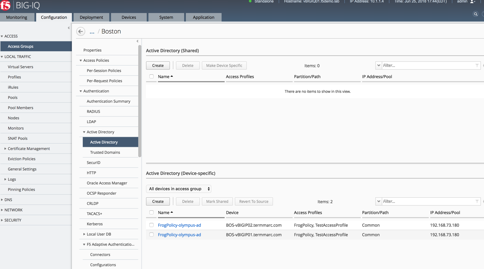
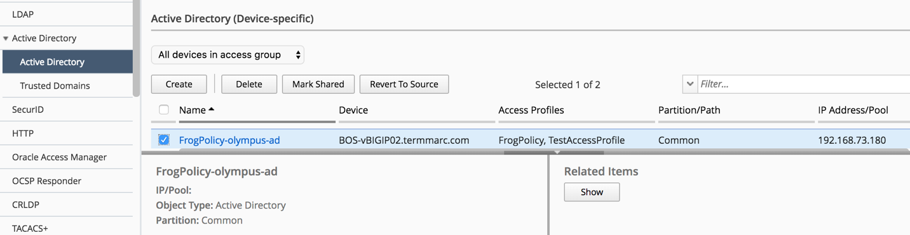
.. |image10| image:: images/image11.png
   :width: 5.08264in
   :height: 3.92222in
.. |image11| image:: images/image12.png
   :width: 4.32020in
   :height: 2.10656in
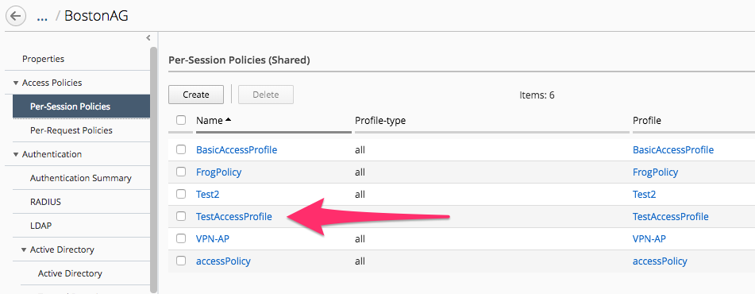
.. |image13| image:: images/image7.png
   :width: 2.47222in
   :height: 2.09016in
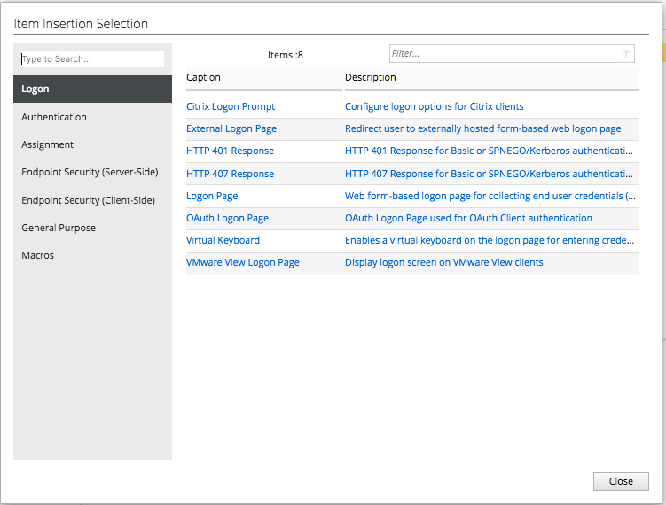
.. |image15| image:: images/image15.png
   :width: 3.07377in
   :height: 1.79768in
.. |image16| image:: images/image16.png
   :width: 4.77869in
   :height: 2.19636in
.. |image17| image:: images/image17.png
   :width: 3.31246in
   :height: 2.75083in
.. |image18| image:: images/image18.png
   :width: 4.09836in
   :height: 1.84640in
.. |image19| image:: images/image19.png
   :width: 6.27138in
   :height: 3.25000in
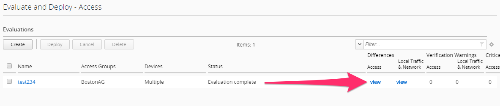
.. |image21| image:: images/image21.png
   :width: 5.69672in
   :height: 2.82593in
.. |image22| image:: images/image22.png
   :width: 3.99163in
   :height: 1.47222in
.. |image23| image:: images/image23.png
   :width: 6.49097in
   :height: 2.34236in
.. |image24| image:: images/image24.png
   :width: 4.65572in
   :height: 1.92569in
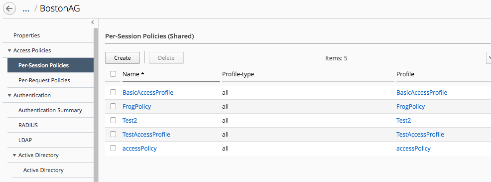
.. |image26| image:: images/image26.png
   :width: 6.50000in
   :height: 2.50820in
.. |image27| image:: images/image27.png
   :width: 4.68368in
   :height: 1.79508in
.. |image28| image:: images/image28.png
   :width: 2.02459in
   :height: 1.45833in
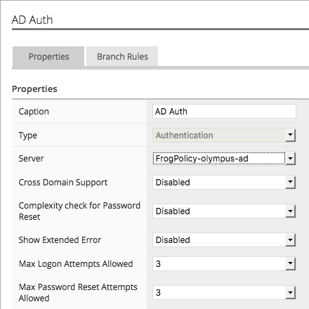
.. |image30| image:: images/image30.png
   :width: 4.45082in
   :height: 2.90920in
.. |image31| image:: images/image31.png
   :width: 5.20370in
   :height: 2.30328in
.. |image32| image:: images/image32.png
   :width: 2.23084in
   :height: 1.94221in
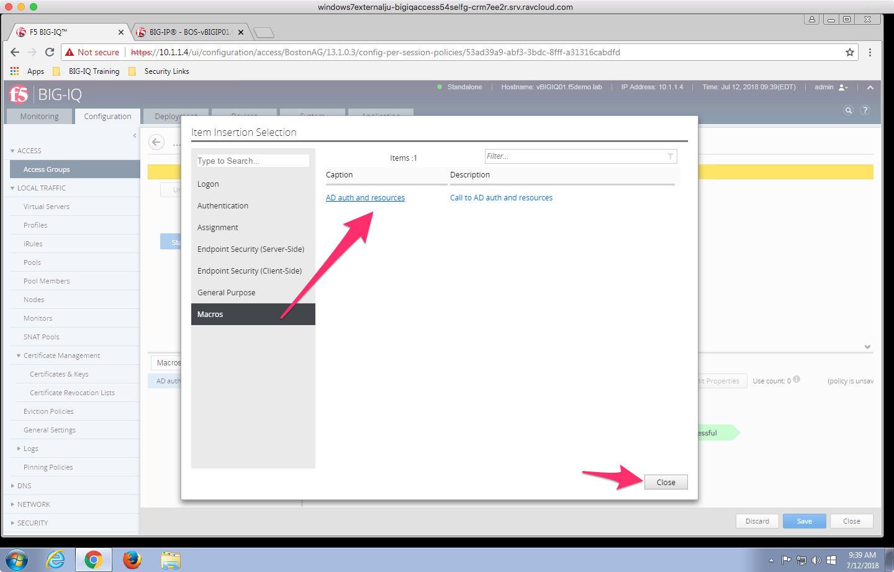
.. |image34| image:: images/image34.png
   :width: 6.50000in
   :height: 3.47222in
.. |image35| image:: images/image35.png
   :width: 6.49097in
   :height: 3.44444in
.. |image36| image:: images/image36.png
   :width: 6.49097in
   :height: 1.23770in
.. |image37| image:: images/image37.png
   :width: 6.48125in
   :height: 2.13934in
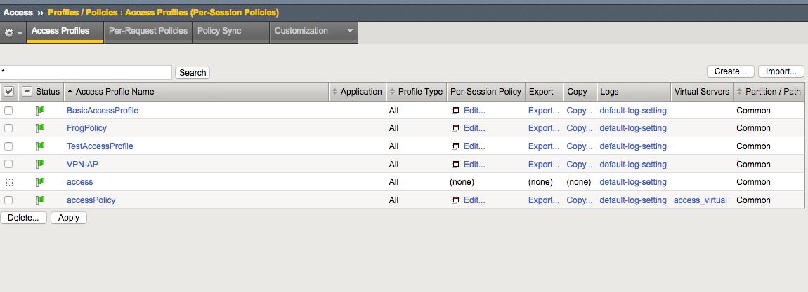
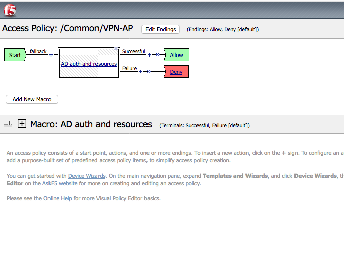
.. |image40| image:: images/image40.png
   :width: 6.49097in
   :height: 3.51875in
.. |image41| image:: images/image41.png
   :width: 5.74642in
   :height: 3.22131in
.. |image42| image:: images/image42.png
   :width: 5.62564in
   :height: 3.12295in
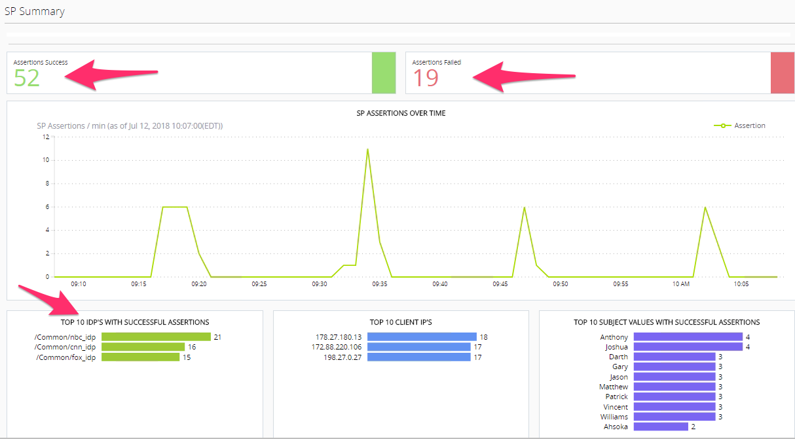
.. |image44| image:: images/image44.png
   :width: 5.55220in
   :height: 3.69672in
.. |image45| image:: images/image45.png
   :width: 5.78628in
   :height: 3.79508in
.. |image46| image:: images/image46.png
   :width: 5.63562in
   :height: 2.88525in
.. |image47| image:: images/image47.png
   :width: 4.54079in
   :height: 2.68033in
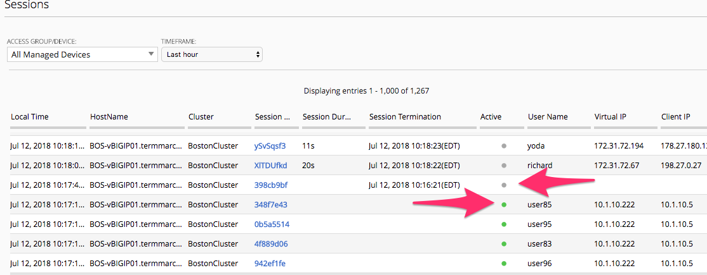
.. |image49| image:: images/image49.png
   :width: 5.33607in
   :height: 2.58012in
.. |image50| image:: images/image50.png
   :width: 5.89531in
   :height: 7.63934in
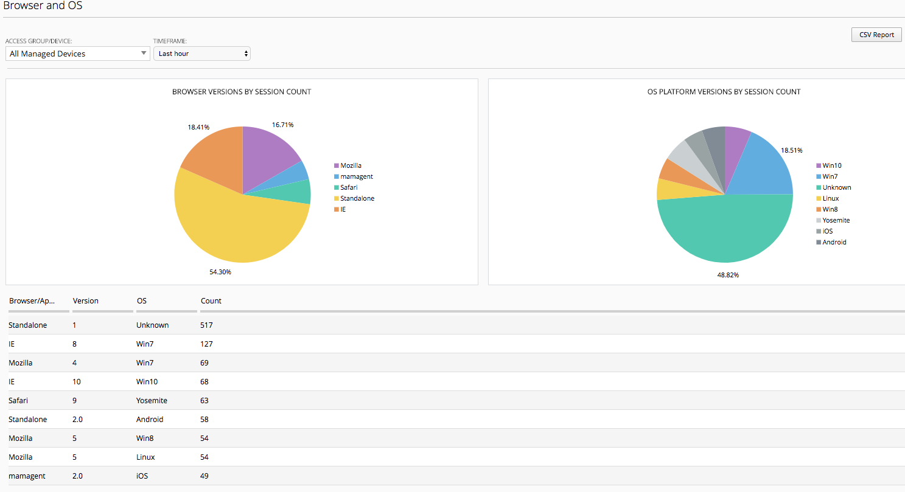
.. |image52| image:: images/image52.png
   :width: 5.77749in
   :height: 3.49180in
.. |image53| image:: images/image53.png
   :width: 5.79029in
   :height: 3.34426in
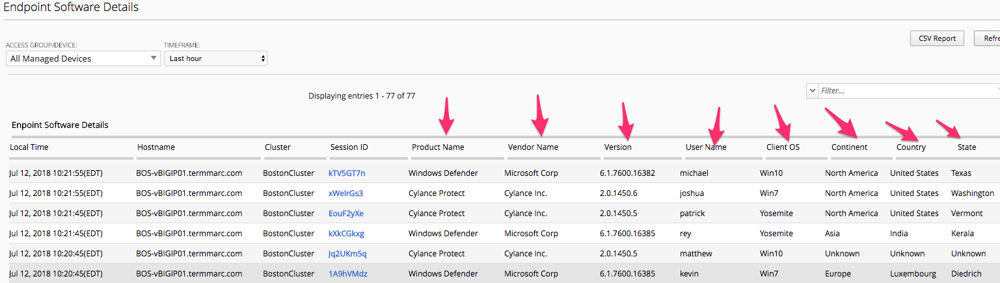
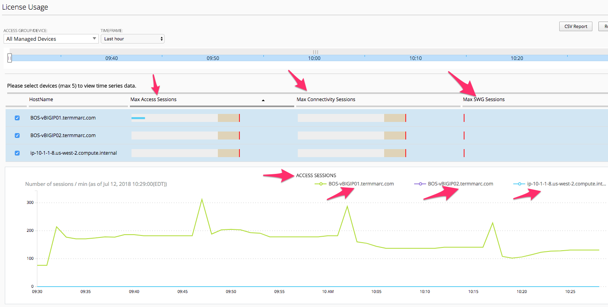
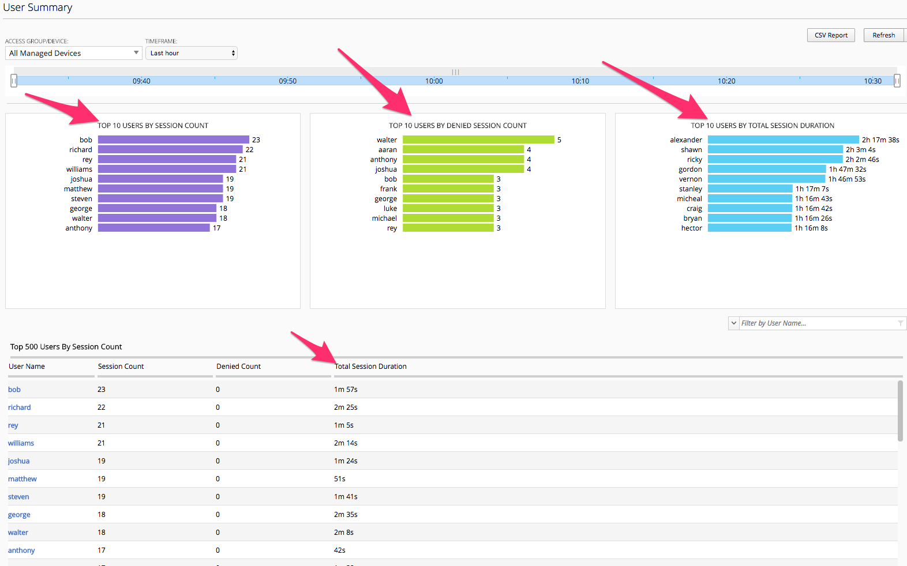
