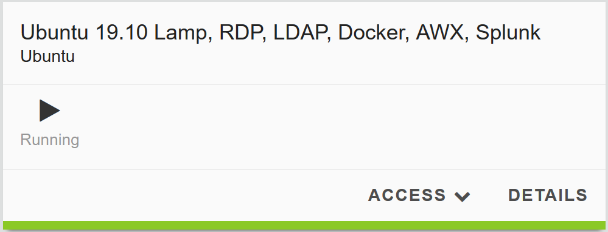
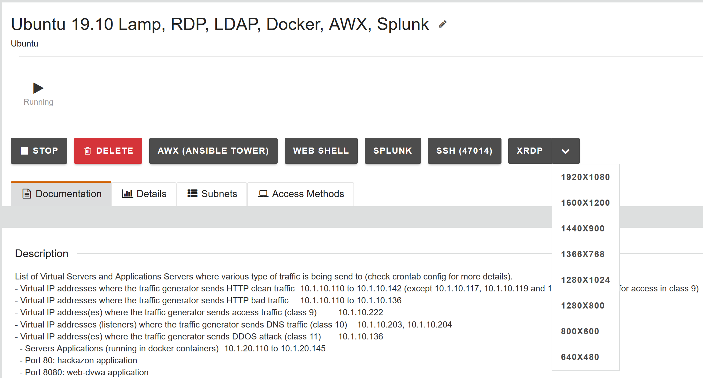
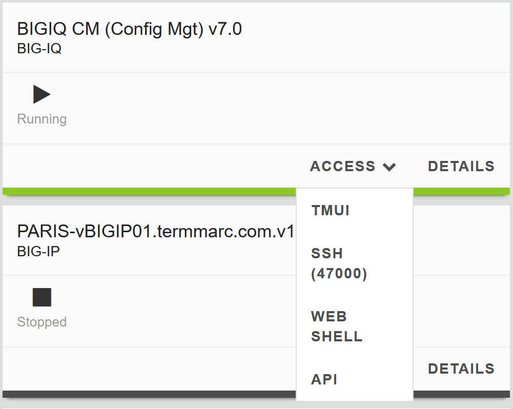
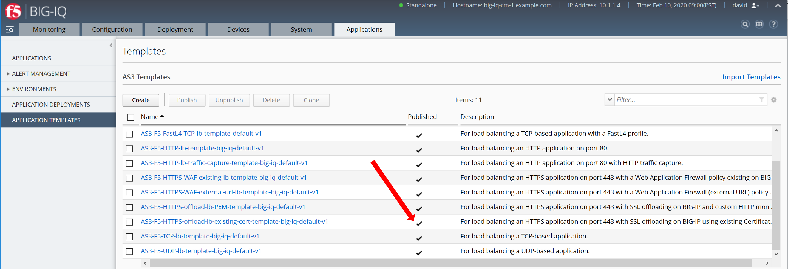
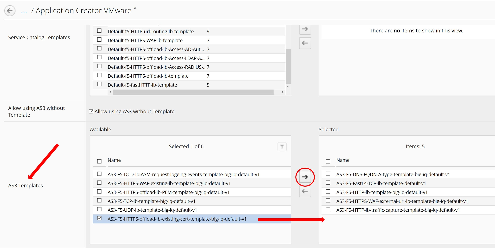
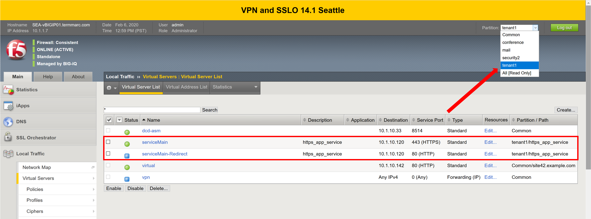

**Exercise 1 – Manage AS3 Templates on BIG-IQ**

   **Exercise 1.1 – Import AS3 templates**

From the UDF lab environment, launch a Console/RDP session to have access to
the Ubuntu Desktop. To do this, in your lab deployment, click on
the \ *Access* button of the \ *Ubuntu Lamp Server* system and
select \ *Console* or *XRDP*.

**Note**

Modern laptops with higher resolutions you might want to use 1440x900
and once XRDP is launched Zoom to 200%)

|image0|

View AS3 templates section

1. Logon to BIG-IQ by opening a browser and go to: \ https://10.1.1.4

2. Go to Applications > Application Templates and review the top section
   which is titled \ **AS3 Templates**.

3. A new BIG-IQ v7.0 deployment will NOT include AS3 templates out of
   the box. If you want to start using AS3 templates which are provided
   by F5, then those AS3 templates can be found through the following
   link: \ https://github.com/f5devcentral/f5-big-iq

..

   **Note**

   *The F5 default AS3 BIG-IQ templates are already imported in the lab
   environment blueprint.*

Import AS3 BIG-IQ templates

1. Select \ **Import Templates** at the right top corner.

..

   |image1|

2. Make yourself familiar with the Github page and understand which AS3
   templates are available.

3. When the AS3 templates are already imported in BIG-IQ you don’t need
   to perform next step, instead continue with the following step.

4. Use the provided instructions on the Github page to import the
   templates into BIG-IQ.

..

   **Note**

   The F5 default AS3 BIG-IQ templates are already imported in the lab
   environment blueprint.

5. Walk through the provided templates and select them to understand the
   structure. If familiar with AS3 you will notice the structure.
   Otherwise, visit \ `AS3 Example
   declarations <https://clouddocs.f5.com/products/extensions/f5-appsvcs-extension/latest/userguide/examples.html.>`__.

..

   **Exercise 1.2 – Deploy application via BIG-IQ using a default AS3
   template**

Create HTTPS Service using AS3 via BIG-IQ GUI
---------------------------------------------

1. Log in as \ **Paula** in BIG-IQ.

2. Select \ **Application** to and then **Create** to create an
   Application Service

+-----------------------------------------------------------------------+
| Application properties:                                               |
+=======================================================================+
| -  Grouping = New Application                                         |
|                                                                       |
| -  Application Name = \ **LAB_Module1.2**                             |
|                                                                       |
| -  Description = My first AS3 template deployment through a GUI       |
+-----------------------------------------------------------------------+
| Select an Application Service Template:                               |
+-----------------------------------------------------------------------+
| -  Template Type =                                                    |
|    Select AS3-F5-HTTPS-offload-lb-existing-cert-template-big-iq-defau |
| lt- [AS3]                                                             |
+-----------------------------------------------------------------------+

**Warning**

   You will notice that the template is not available. If we want Paula
   to deploy this template, we first need to have those templates
   assigned to her via an administrator.

3. Logout as \ **Paula** and login to BIG-IQ as David. (if asked: Leave
   site? Select: Leave)

4. Select \ **Applications > Application Templates** and notice the
   ‘Published’ templates. The template \ **Paula** wants to use is
   listed as a ‘Published’ template.

|image2|

5. Go to \ **System > Role Management > Roles** and
   select \ **Application Roles** under the \ **CUSTOM ROLES** section.
   Here you will see the collection of the Custom Application Roles.

|image3|

6. **Paula** is assigned to the
   exiting Application Creator VMware custom role. Select it and scroll
   down to AS3 Templates. As you can see, \ **Paula** does not have
   permission to deploy an AS3 application
   using AS3-F5-HTTPS-offload-lb-existing-cert-template.

|image4|

7. Select AS3-F5-HTTPS-offload-lb-existing-cert-template-big-iq-default-<version> AS3
   Template and click the arrow to get it in
   the \ **‘Selected’** section. Then, select \ **Save & Close**.

8. Logout as David and log back in as \ **Paula** and
   click \ **Create** application.

9. Select Create Application to Create an Application Service:

+-----------------------------------------------------------------------+
| Application properties:                                               |
+=======================================================================+
| -  Grouping = New Application                                         |
|                                                                       |
| -  Application Name = \ **LAB_Module1.2**                             |
|                                                                       |
| -  Description = My first AS3 template deployment through a GUI       |
+-----------------------------------------------------------------------+
| Select an Application Service Template:                               |
+-----------------------------------------------------------------------+
| -  Template Type =                                                    |
|    Select AS3-F5-HTTPS-offload-lb-existing-cert-template-big-iq-defau |
| lt [AS3]                                                              |
+-----------------------------------------------------------------------+
| General Properties:                                                   |
+-----------------------------------------------------------------------+
| -  Application Service Name = https_app_service                       |
|                                                                       |
| -  Target = SEA-vBIGIP01.termmarc.com                                 |
|                                                                       |
| -  Tenant = tenant1                                                   |
+-----------------------------------------------------------------------+
| Analytics_Profile. Keep default                                       |
+-----------------------------------------------------------------------+
| Pool                                                                  |
+-----------------------------------------------------------------------+
| 1. Members: 10.1.20.120                                               |
|                                                                       |
| 2. Members: 10.1.20.121                                               |
+-----------------------------------------------------------------------+
| Service_HTTPS                                                         |
+-----------------------------------------------------------------------+
| -  Virtual addresses: 10.1.10.120                                     |
+-----------------------------------------------------------------------+
| Certificate. Keep default                                             |
+-----------------------------------------------------------------------+
| TLS_Server. Keep default                                              |
+-----------------------------------------------------------------------+

|image5|

10. Go to View Sample API Request in the right upper corner and select
    it. You will have a full AS3 declaration schema, scroll through it
    and hit close when done.

|image6|

11. Click \ **Create**.

12. Check the Application LAB_Module1.2 has been created.

|image7|

**Note**

   If not visible, refresh the page.

13. Select \ **LAB_Module1.2** Application. You will
    notice \ **LAB_Module1.2 **\ acts as a group of Application Services
    where underneath multiple services can be grouped. The next window
    will show you that a new Application Service has been created
    named: tenant1_https_app_service.

|image8|

14. Now, let’s look on the BIG-IP and verify the Application is
    correctly deployed in partition tenant1.

Logon to SEA-vBIGIP01.termmarc.com BIG-IP from the lab environment.
Select the partition tenant1 and look at the objects created on the
BIG-IP.

|image9|

15. You can test the application service by open a browser in the Ubuntu
       Jumphost and type the Virtual Server IP address 10.1.10.120.

16. Back on the BIG-IQ as \ **Paula**,
       select tenant1_https_app_service Application Service and look
       HTTP traffic analytics.

|image10|

**Note**

   An HTTP traffic generator is running on the Jumphost.

   **Exercise 1.3 - Modify template**

Through the GUI and when allowed, the application owner can make small
modifications.

1. In tenant1_https_app_service, select Servers and Configuration and
   add a Pool Member.

-  Click the + next to Server Addresses and add: 10.1.20.122.

-  Click \ **Save & Close**.

|image11|

2. Check SEA-vBIGIP01.termmarc.com (partition tenant1) Local Traffic >
   Pools and find \ **Pool**. It will have tenant1/https_app_service as
   the partition/path (or use search). Select Pool and go to members.

|image12|

3. Now back to the BIG-IQ and tenant1_https_app_service application and
   select \ **Application Service > Configuration.** Scroll down in the
   AS3 declaration and find that the schema has added the second pool
   member.

|image13|

Through the API you can’t modify the application service once deployed.
With AS3 via the GUI you can. Remember, that through the API you would
do a redeploy to add additional services. From the flipside, the GUI
only allows you to modify what has been permitted (made ‘editable’) when
the template was created.

.. |image3| image:: images/image4.png
   :width: 6.5in
   :height: 3.52847in

.. |image5| image:: images/image6.png
   :width: 6.5in
   :height: 4.13125in

.. |image7| image:: images/image8.png
   :width: 6.5in
   :height: 3.48333in
.. |image8| image:: images/image9.png
   :width: 6.5in
   :height: 2.1125in
.. |image9| image:: images/image10.png
   :width: 6.5in
   :height: 2.30694in
.. |image10| image:: images/image11.png
   :width: 6.5in
   :height: 3.45278in
.. |image11| image:: images/image12.png
   :width: 6.5in
   :height: 4.00903in

.. |image13| image:: images/image14.png
   :width: 6.5in
   :height: 6.55347in
