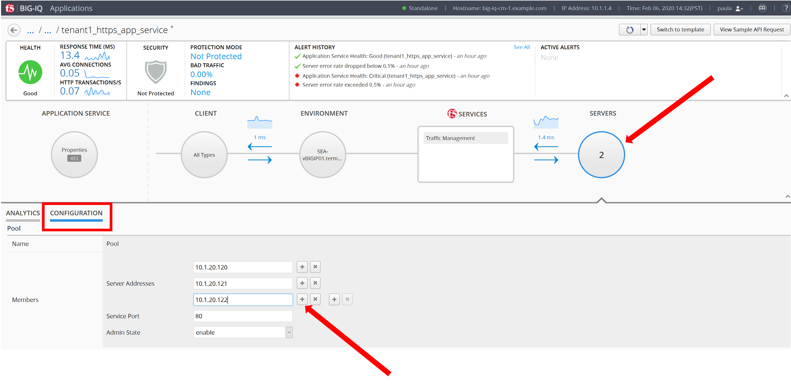
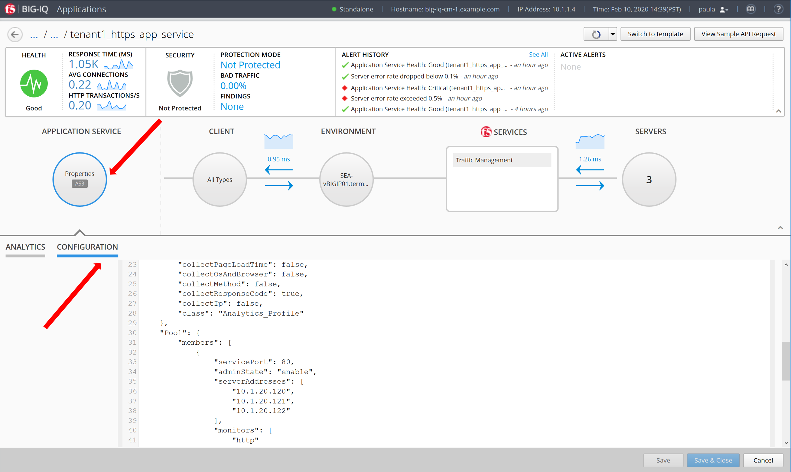
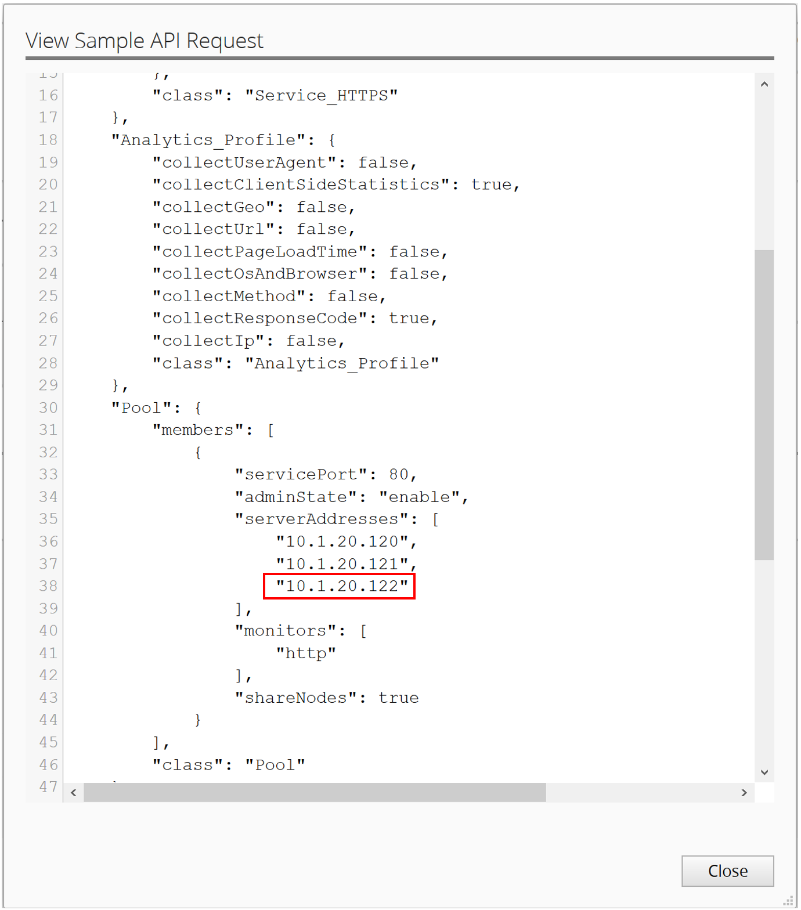
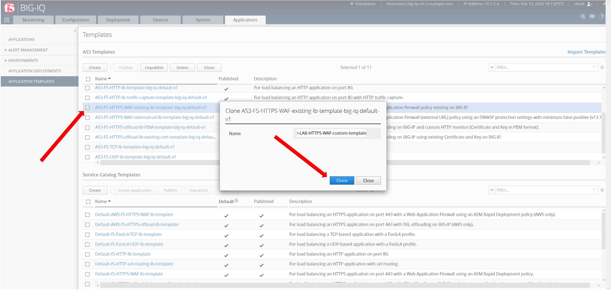

**Exercise 2 – Working with custom AS3 Templates in BIG-IQ**

   **Exercise 2.1 – Create Custom AS3 template via BIG-IQ GUI**

We imported the default “out-of-the-box” AS3 templates (available
on \ https://github.com/f5devcentral/f5-big-iq) that can be used for
deploying an application service. However, it is a good practice to
clone the default AS3 templates and use them for your custom needs.

1. Logon as David and go to the Application > Application Templates and
   select AS3-F5-HTTPS-WAF-existing-lb-template-big-iq-default-<version> and
   press \ **Clone**.

2. Give the Cloned template a
   name: AS3-LAB-HTTPS-WAF-custom-template and click Clone.

|image14|

3. Open the template AS3-LAB-HTTPS-WAF-custom-template and select
   the Analytics_Profile AS3 class. Change to Override the
   Properties Collect Client-Side Statistics, as well
   as Collect URL and Collect User Agent.

|image15|

**Note**

   Response Code, User Method and Operating System and Brower are
   already enabled by default in the AS3 schema.

4. Click \ **Save & Close**.

5. Select AS3-LAB-HTTPS-WAF-custom-template and click \ **Publish**.

..

   **Exercise 2.2 – Deploy application via BIG-IQ using a customized AS3
   template**

1. Before **Paula** can use this AS3 template, David needs to update her
   role. Use the previous steps in lab **1.2** to add AS3 Template
   AS3-LAB-HTTPS-WAF-custom-template to Application Creator VMware
   custom role assigned to **Paula**.

2. Login as Paula and select previously created **LAB_Module1.2**
   Application and click **Create**.

3. Select Create Application to Create an Application Service:

+-------------------------------------------------------------------+
| Application properties:                                           |
+===================================================================+
| -  Grouping = Part of an Existing Application                     |
|                                                                   |
| -  Application Name = **LAB_Module1.2**                           |
|                                                                   |
| -  Description = My second AS3 template deployment through a GUI  |
+-------------------------------------------------------------------+
| Select an Application Service Template:                           |
+-------------------------------------------------------------------+
| -  Template Type = Select AS3-LAB-HTTPS-WAF-custom-template [AS3] |
+-------------------------------------------------------------------+
| General Properties:                                               |
+-------------------------------------------------------------------+
| -  Application Service Name = https_waf_app_service               |
|                                                                   |
| -  Target = SEA-vBIGIP01.termmarc.com                             |
|                                                                   |
| -  Tenant = tenant2                                               |
+-------------------------------------------------------------------+
| Analytics_Profile. Keep default                                   |
+-------------------------------------------------------------------+
| Pool                                                              |
+-------------------------------------------------------------------+
| -  Members: 10.1.20.123                                           |
+-------------------------------------------------------------------+
| Service_HTTPS                                                     |
+-------------------------------------------------------------------+
| -  Virtual addresses: 10.1.10.122                                 |
|                                                                   |
| -  policyWAF: /Common/asm-lab3                                    |
+-------------------------------------------------------------------+
| Certificate. Keep default                                         |
+-------------------------------------------------------------------+
| TLS_Server. Keep default                                          |
+-------------------------------------------------------------------+

|image16|

4. Click **Create**.

5. Check the Application Service https_waf_app_service has been created
   under Application LAB_Module1.2.

|image17|

6. Now, let’s look on the BIG-IP and verify the Application is correctly
   deployed in partition tenant2.

Logon to SEA-vBIGIP01.termmarc.com BIG-IP from the lab environment.
Select the partition tenant2 and look at the objects created on the
BIG-IP.

|image18|

-  Notice that new https_waf_app_service comes with a redirect.

-  Select the HTTPS VS, Select Security and hit Policies. Application
   Security Policy is Enabled and the Log Profile has a
   Security_Log_Profile selected.

-  Go to Security > Application Security > Security Policies and select
   the **asm-lab3** policy to get more detail of the deployed
   application security policy.

-  The enforced WAF policy is taken from a Github repository which
   contains F5 WAF ready templates:
   https://github.com/f5devcentral/f5-asm-policy-templates, please use
   the URL to get yourself familiar with other available WAF ready
   templates.

|image19|

6. Back to the BIG-IQ and logged in as **Paula**, select
   tenant2_https_waf_app_service. What is the enforced Protection Mode?

.. |image15| image:: images/image16.png
   :width: 6.5in
   :height: 4.45139in

