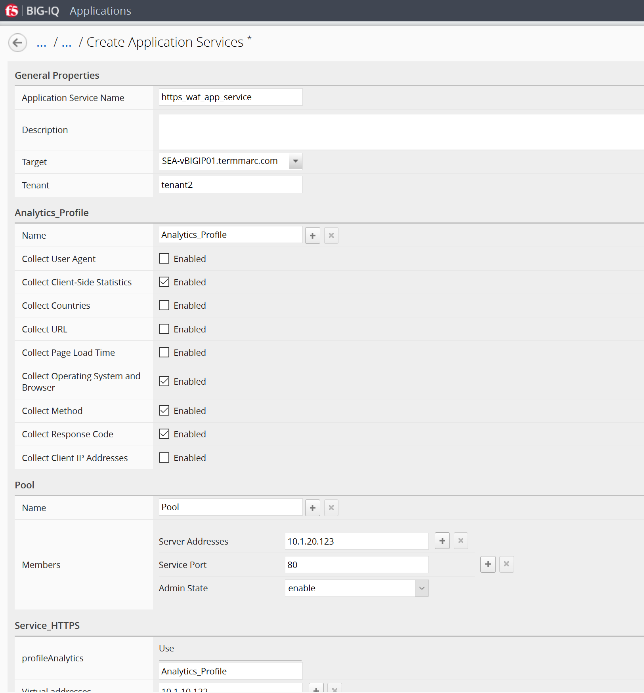
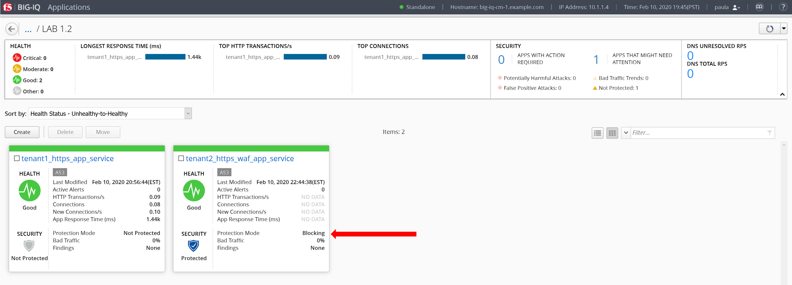
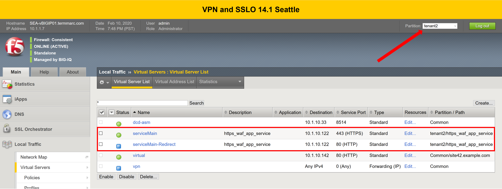
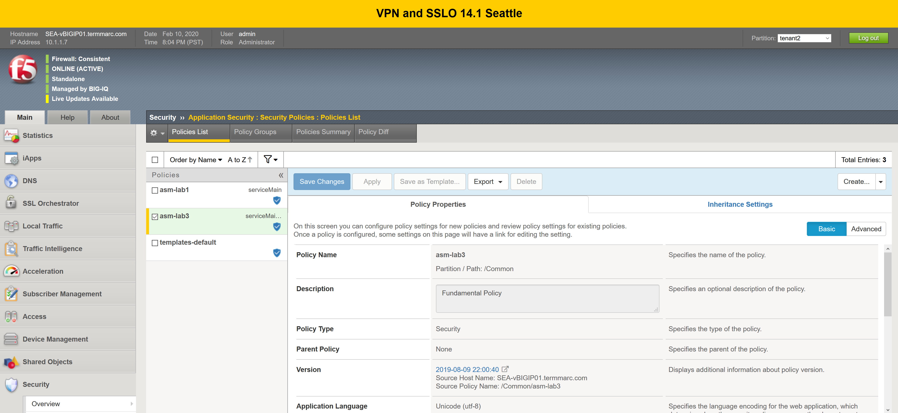
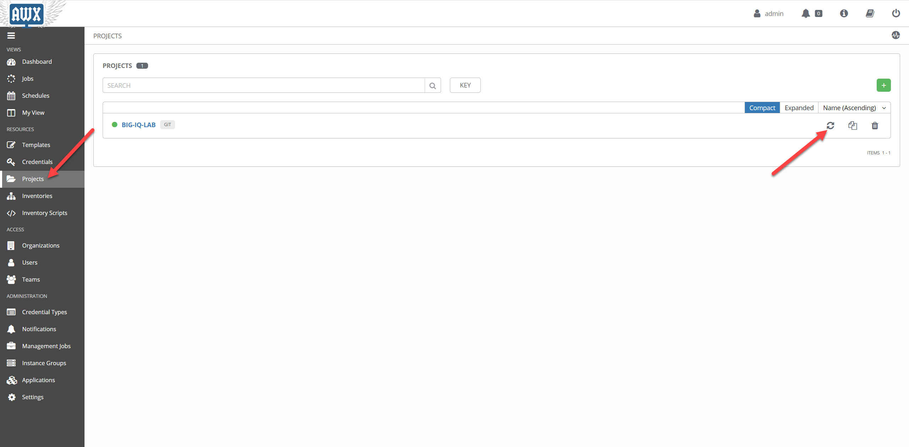
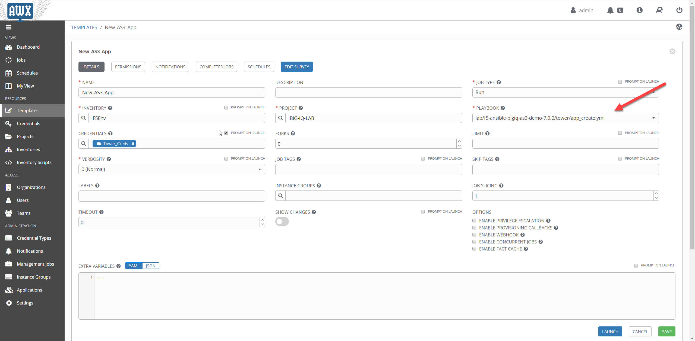
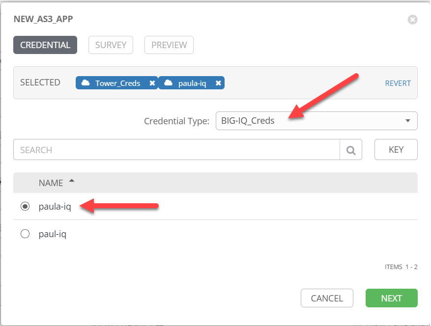
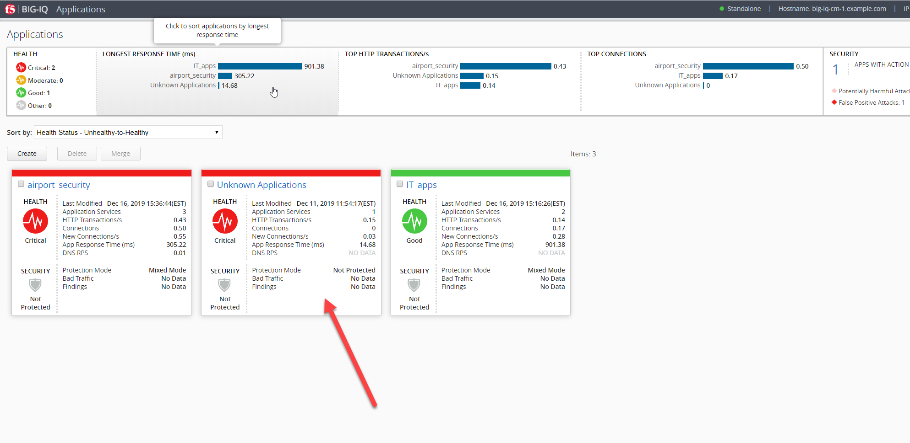
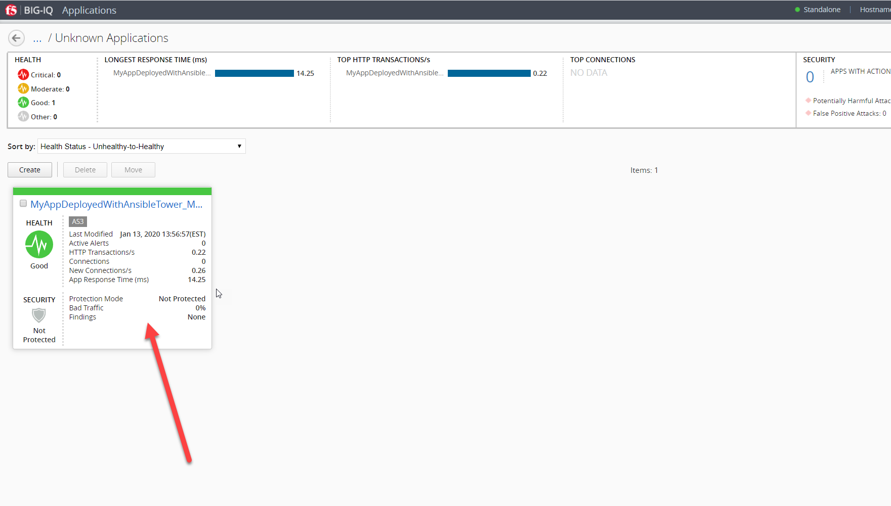
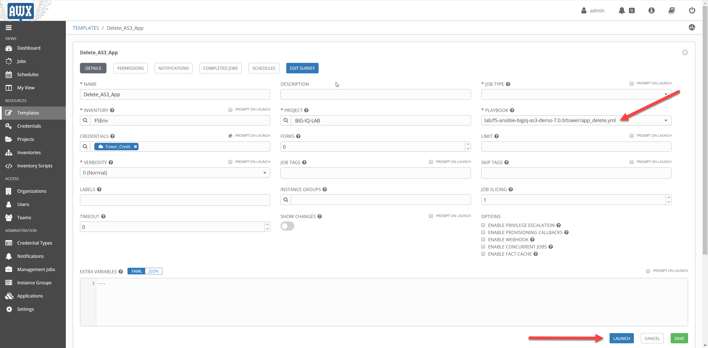

**Exercise 3 – AS3 Application creation and deletion using AWX/Ansible
Tower and BIG-IQ**

**Exercise 3.1 – Application Creation**

1. Click on the \ *AWX (Ansible Tower)* button on the system \ *Ubuntu
   Lamp Server* in the Lab Environment. Use admin/purple123 to
   authenticate.

|image20|

2. Navigate to the \ **Projects** page and click on the refresh button
   to get the latest version of the templates.

|image21|

3. Navigate to the \ **Templates** page and review New_AS3_App

|image22|

4. Make sure the \ **PLAYBOOK** lab/f5-ansible-bigiq-as3-demo
   7.0.0/tower/app_create.yml is selected.

|image23|

**Note**

You can go on the \ `GitHub
repository <https://github.com/f5devcentral/f5-big-iq-lab/tree/develop/lab/f5-ansible-bigiq-as3-demo-7.0.0/tower>`__ and
check review the playbooks and Jinja2 templates.

5. On the \ **Templates**/*New_AS3_App* template page, click on
   the \ *Launch button to start a job using this template*.

|image24|

6. **CREDENTIAL**: Select BIG-IQ Creds as \ **Credential Type**. Then
   select paula-iq.

   |image25|

7. **SURVEY**: Enter below information regarding your application
   service definition

+-----------------+-------------------------------+
| **APP NAME:**   | MyAppDeployedWithAnsibleTower |
+=================+===============================+
| **APP TYPE:**   | http_app or waf_app           |
+-----------------+-------------------------------+
| **SERVICE IP:** | 10.1.10.124                   |
+-----------------+-------------------------------+
| **NODES:**      | 10.1.20.120 and 10.1.20.121   |
+-----------------+-------------------------------+

|image26|

8. **PREVIEW**: Review the summary of the template deployment, then
   click on \ **LAUNCH**

   |image27|

9. Follow the JOB deployment of the Ansible playbook.

   |image28|

**Note**

The \ *FAILED - RETRYING* messages are expected as the playbook runs
into a LOOP to check the AS3 task completion and will show failed until
loop isn’t completed.

10. When the job is completed, check the PLAY RECAP and make sure there
    are no failed.

    |image29|

10. Logon on \ **BIG-IQ** as **paula** *(paula\paula)*, go to
    Application tab and check the application is displayed and analytics
    are showing.

11. Select Unknown Applications Application

|image30|

12. Select MyAppDeployedWithAnsibleTower_M... Application Service.

    |image31|

**! Warning**

*Starting 7.0, BIG-IQ displays AS3 application services created using
the AS3 Declare API as Unknown Applications. You can move those
application services using the GUI, the \ *\ `Move/Merge
API <https://clouddocs.f5.com/products/big-iq/mgmt-api/latest/ApiReferences/bigiq_public_api_ref/r_public_api_references.html>`__\ * or
create it directly into Application in BIG-IQ using the \ *\ `Deploy
API <https://clouddocs.f5.com/products/big-iq/mgmt-api/latest/ApiReferences/bigiq_public_api_ref/r_public_api_references.html>`__\ * to
define the BIG-IQ Application name.*

13. Review the HTTP traffic analytics.

    |image32|

**Exercise 3.2 – Application Deletion**

1. Navigate to the \ **Templates** page and review Delete_AS3_App

|image33|

2. Make sure
   the \ **PLAYBOOK** lab/f5-ansible-bigiq-as3-demo-7.0.0/tower/app_delete.yml is
   selected. Click on the \ *Launch button to start a job using this
   template*.

|image34|

**Note**

You can go on the \ `GitHub
repository <https://github.com/f5devcentral/f5-big-iq-lab/tree/develop/lab/f5-ansible-bigiq-as3-demo-7.0.0/tower>`__ and
check review the playbooks and Jinja2 templates.

3. **CREDENTIAL**: Select BIG-IQ Creds as \ **Credential Type**. Then
   select paula-iq.

   Click *NEXT.*

   |image35|

4. **SURVEY**: Enter below information regarding your application
   service definition.

   Click *NEXT.*

+-----------+-------------------------------+
| APP NAME: | MyAppDeployedWithAnsibleTower |
+-----------+-------------------------------+

|image36|

5. **PREVIEW**: Review the summary of the template deployment, then
   click on \ **LAUNCH**

   |image37|

6. Follow the JOB deployment of the Ansible playbook.

   |image38|

**Note**

The \ *FAILED - RETRYING* messages are expected as the playbook runs
into a LOOP to check the AS3 task completion and will show failed until
loop isn’t completed.

7. When the job is completed, check the PLAY RECAP and make sure there
   are no failed.

   |image39|

8. Logon on \ **BIG-IQ** as **paula**, go to Application tab and check
   the application is displayed and analytics are showing.
   Select Unknown Applications Application

|image40|

Notice that the application is now deleted.

|image41|

.. |image20| image:: images/image20.png
   :width: 3.79545in
   :height: 2.69677in
.. |image21| image:: images/image21.png
   :width: 7.49167in
   :height: 3.6933in
.. |image22| image:: images/image22.png
   :width: 7.52216in
   :height: 3.70833in

.. |image27| image:: images/image27.png
   :width: 4.68333in
   :height: 3.48193in

.. |image29| image:: images/image29.png
   :width: 7.52216in
   :height: 3.70833in

.. |image31| image:: images/image31.png
   :width: 6.69697in
   :height: 3.80723in

.. |image33| image:: images/image33.png
   :width: 7.28788in
   :height: 3.59284in
.. |image34| image:: images/image34.png
   :width: 7.31818in
   :height: 3.60778in
.. |image35| image:: images/image35.png
   :width: 5.20833in
   :height: 3.92957in
.. |image36| image:: images/image36.png
   :width: 5.80303in
   :height: 2.12465in

.. |image39| image:: images/image39.png
   :width: 7.54167in
   :height: 3.71795in
.. |image40| image:: images/image40.png
   :width: 7.48333in
   :height: 3.47171in

