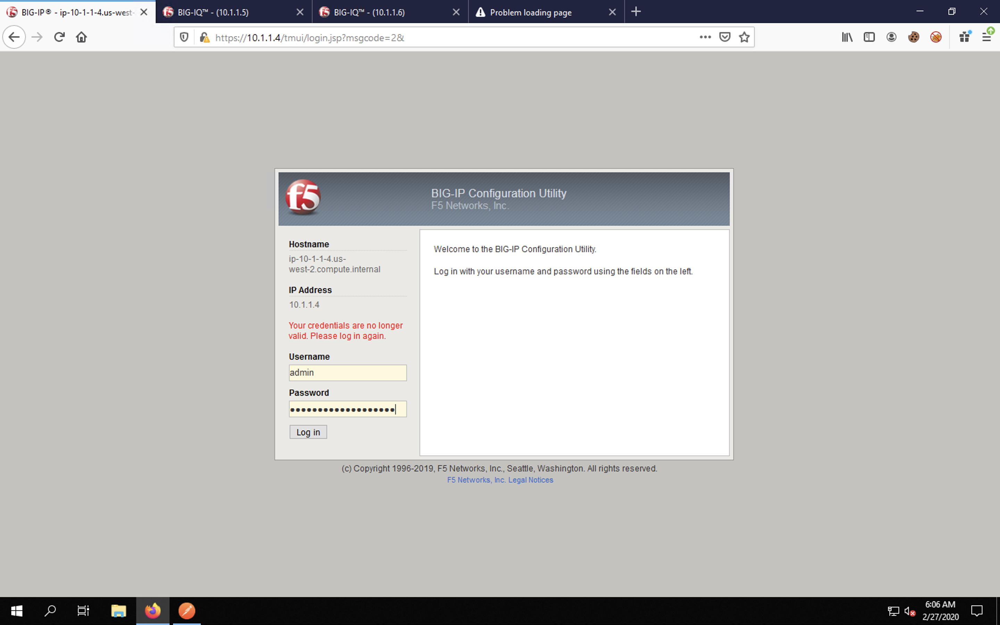
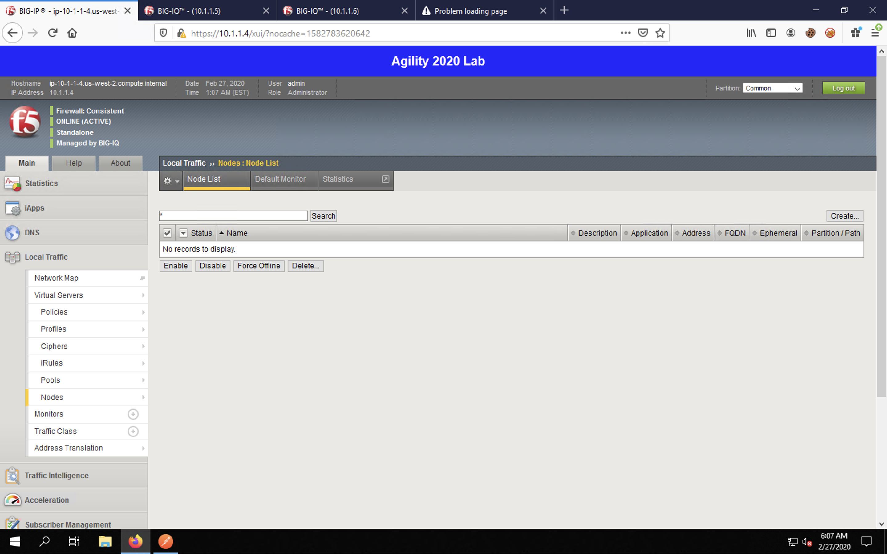
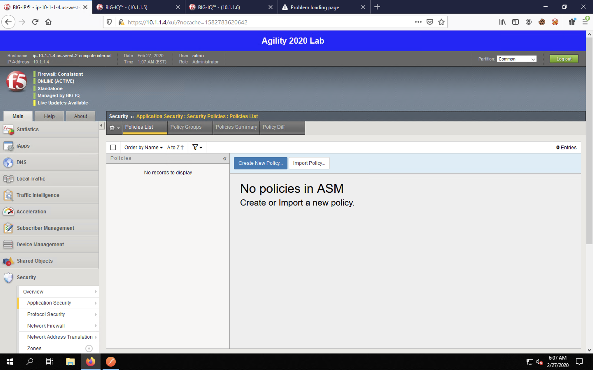
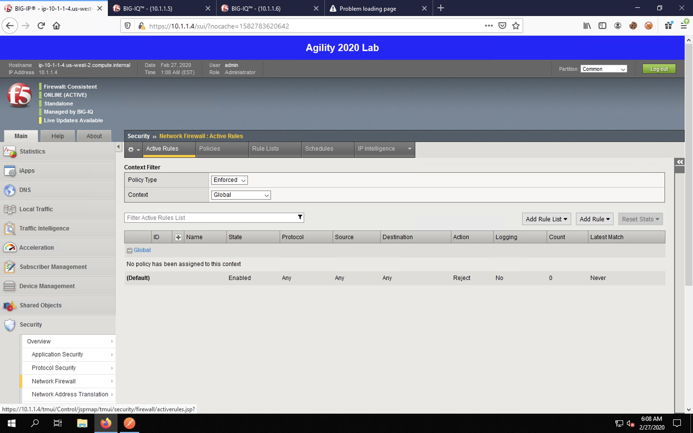
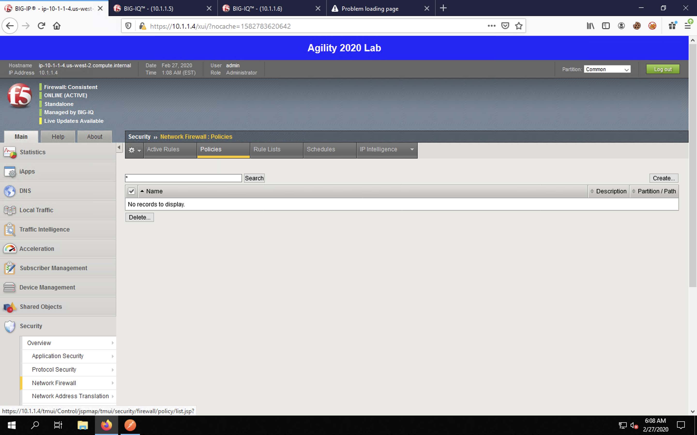

Application Services 3 (AS3) using BIG-IQ
=========================================

Pre-AS3 BIG-IP Configuration Review
-----------------------------------

AS3 allows us to define an entire application configuration, including security policies, in a single
API call. AS3 declarations allow an app administrator to specify what should be configured and not
how. The AS3 API will build the necessary components to ensure the full configuration is deployed. 

Return to Firefox and click on the first tab to return to the BIG-IP web UI.

.. image:: _media/image1.png

Log in using **admin** / **Agility2020Orlando!** credentials.

Again, navigate to **Local Traffic** -> **Virtual Servers**. Notice that there are no virtual servers
in our configuration.

.. image:: _media/image3.png

Navigate to **Local Traffic** -> **Pools**. Notice that the list of pools is empty.

.. image:: _media/image4.png

Navigate to **Local Traffic** -> **Nodes**. Notice that the list of nodes is also empty.

Click on **Shared Objects** -> **Address Lists**. Note that there are no address lists created.

.. image:: _media/image6.png

Click on **Shared Objects** -> **Port Lists**. The two port lists present exist by default; thus, 
there are no created port lists on the BIG-IP.

.. image:: _media/image7.png

Navigate to **Security** -> **Application Security**. Notice that there are no ASM (WAF) policies
on the BIG-IP.

Next, navigate to **Security** -> Network Firewall. The default tab, *Active Rules*, shows that
there are no rules being enforced. 

Click on the **Policies** tab. You will see that no AFM firewall policies exist.

Essentially, the BIG-IP has no application or security configuration. We'll review the BIG-IQ
configuration and then start configuring via AS3 in the next sections.

