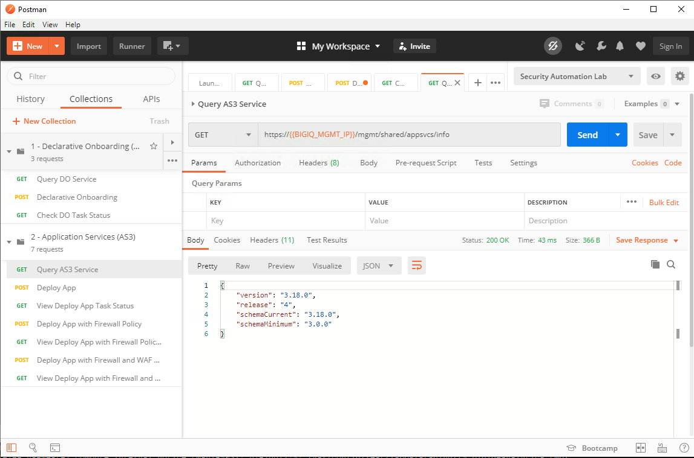
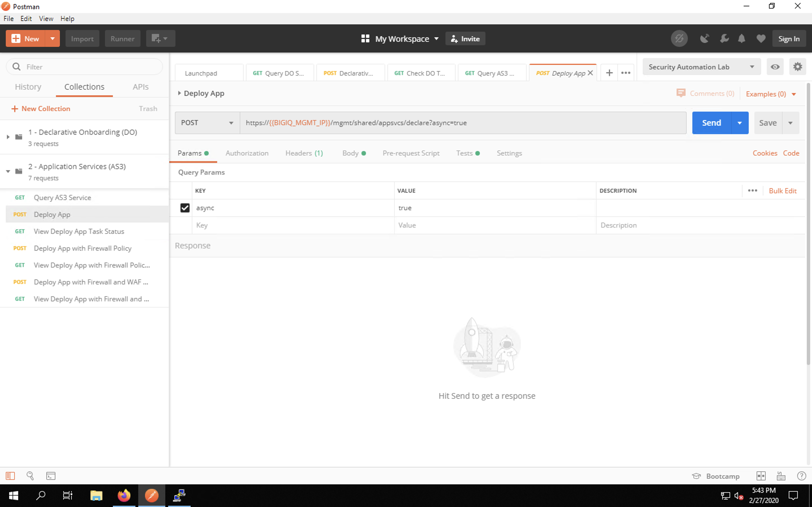
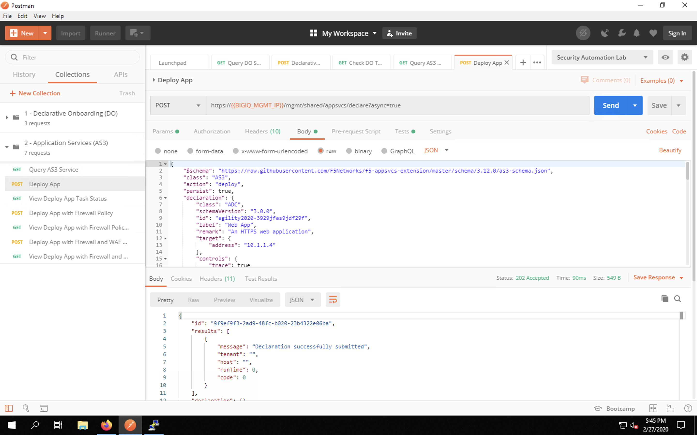
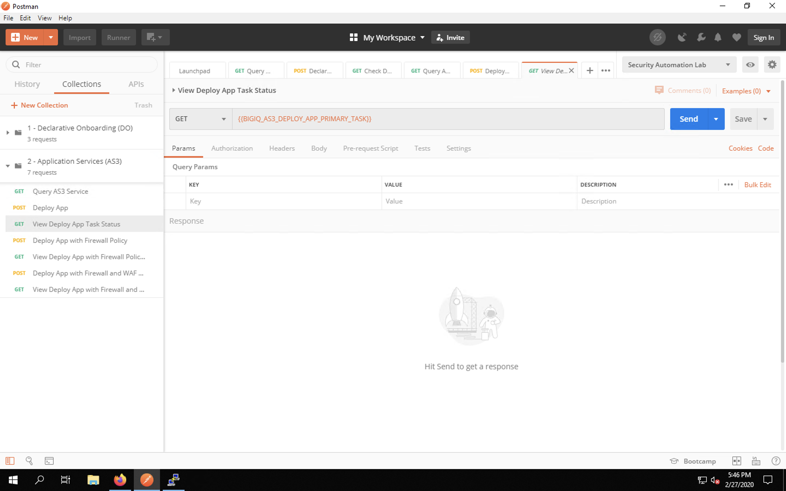
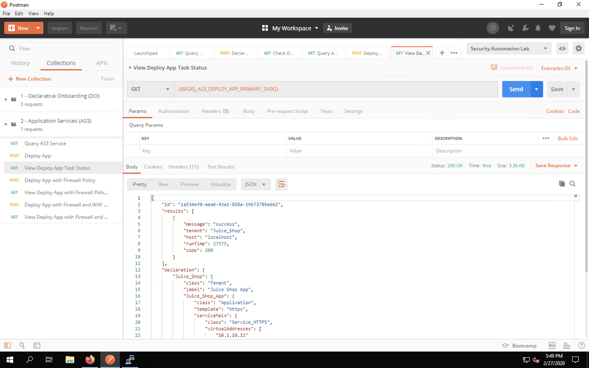
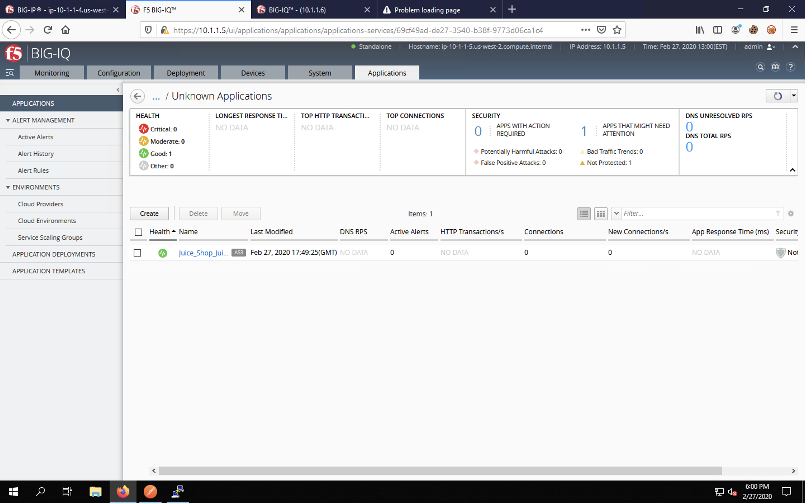
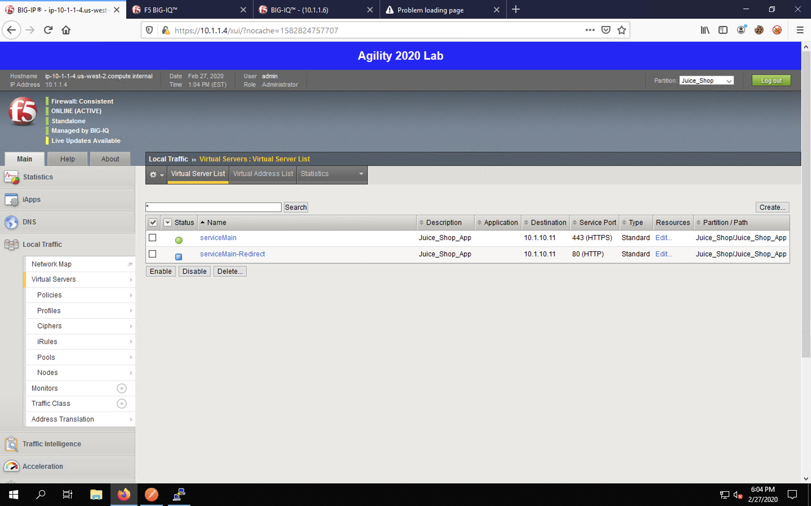
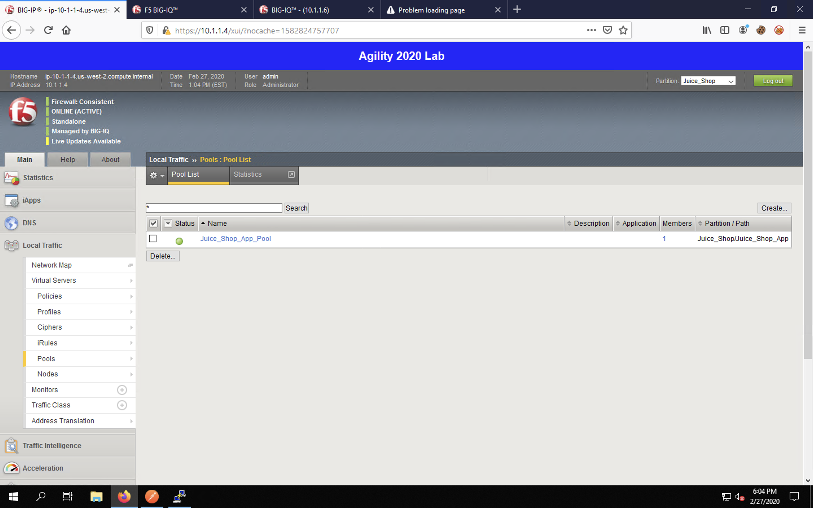

Deploying AS3 via BIG-IQ
------------------------

Simple HTTP App Deployment
^^^^^^^^^^^^^^^^^^^^^^^^^^

Let's return to Postman.

.. image:: _media/image1b.png

Expand the second collection, *2 - Application Services (AS3)*, by clicking on the small grey
arrow next to the name as you did for DO. This will show the list of all requests for deploying
our app via AS3.

.. image:: _media/image2b.png

Click on **Query AS3 Service** item to load the request into a tab. This simple GET request will 
simply query the state and status of the AS3 API. 

.. image:: _media/image3b.png

Click **Send** to query AS3. You will receive a response that includes the installed API version
as well as the minimum and current schema versions.

Now, let's deploy a basic web application. Click the **Deploy App** item to load the request into
a tab. Once again, we're using POST to send a JSON payload that outlines our application
configuration.

Review the JSON payload by clicking on the **Body** tab. You will see the virtual server configuration, along with the pool and node. 
AS3 will create the required objects via BIG-IQ and deploy them automatically to the BIG-IP. 

:**NOTE**: The AS3 schema reference is available at https://clouddocs.f5.com/products/extensions/f5-appsvcs-extension/latest/refguide/schema-reference.html. 

.. image:: _media/image6b.png

Click **Send** to send the request. You should see a message that the declaration was submitted
successfully. This does not mean that the configuration was deployed; it simply means no syntax
errors were detected prior to processing the payload.

To monitor the deployment task itself, we'll query the link to the task tha was provided in the
last response. We configured Postman to use a variable to store the URI. Click the **View Deploy
App Task Status** item in the collection list. 

This simple GET request will pull the current status. Click **Send**. You may see that the task
is still in progress, as shown below.

.. image:: _media/image9b.png

When the task finally finishes, you will see a 200 OK message with a success indicator. This means
that the app was deployed successfully.

Head back to Firefox tab #2 and pull up BIG-IQ. Navigate to the **Applications** tab and select
**Applications** from the menu on the left side of the UI.

.. image:: _media/image11b.png

Click on the **Unknown Applications** group to drill-down into the app status.

Now click on **Juice_Shop_Juice_Shop_App** to bring up the application dashboard. On this page, you
can see the the application health is good but that the application is not protected. This means
that a ASM (WAF) policy has not been applied.

.. image:: _media/image13b.png

Click on **Application Deployments** on the left menu. You will see our task listed with a *Deployment complete*
status. This page offers a way to track deployments and troubleshoot failures.

.. image:: _media/image14b.png

Let's head back to the first tab in Firefox and navigate to **Local Traffic** -> **Virtual Servers**.
Is your list empty?!?!

.. image:: _media/image15b.png

That's because AS3 uses authentication partitions to separate logical configurations. Click the
drop-down box on the top-right of the web UI and select **Juice_Shop** as the partition to
which to change the view. You should see the application listed now. 

Head to **Local Traffic** -> **Pools** and you'll see the corresponding pool.

**Local Traffic** -> **Nodes** shows our WebApp Server. The icon is blue because we're monitoring
at the pool level, not the individual node level.

.. image:: _media/image18b.png

If you look at **Security** -> **Application Security**, you see that there are still no ASM policies
on the BIG-IP.

.. image:: _media/image19b.png

Finally, take a look at **Security** -> **Network Firewall** and click on the Policies tab. No
firewall policies have been created. Yet.

.. image:: _media/image20b.png

Continue to the next section where we'll deploy a bit more complex app.