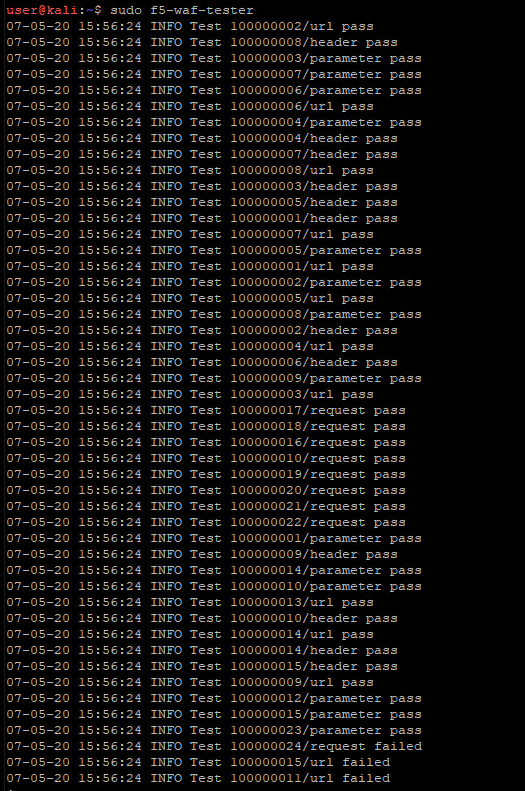

Application Performance and Security -  Status and Statistics
=============================================================

In this section of the lab, we will run the F5 WAF Tester tool to generate attack traffic and view statistics in the BIG-IQ UI.

Back on the Web App Server session, modify the configuration of the WAF tester to specify the newly installed policy. 

To accomplish this, simply rerun the ``sudo f5-waf-tester –-init`` command with the following modified values: 

``[BIG-IP] Host []: 10.1.1.4`` 

``[BIG-IP] Username []: admin``

``[BIG-IP] Password []: Agility2020Orlando!``

``ASM Policy Name []: Juice_Shop_WAF_Policy``

``Virtual Server URL []: https://10.1.10.11``

.. image:: _media/image2.png

Once reconfigured, re-run the WAF tester with the command:

``sudo f5-waf-tester`` 

You’ll quickly notice the tests are now passing.

Note that the Support ID is also being included in the detailed test results. This is a unique identifier presented on every ASM block page presented to a web client that can be used to correlate that user's block action with a log entry. 

.. image:: _media/image4.png

Maximize Firefox and return to the BIG-IQ UI. Navigate to the *Applications* tab. Click on the application listed and select **Juice_Shop_Juice_Shop_App**. This will give a quick view of the now protected application.

Peruse the various dashboard components to view statistics. 

.. image:: _media/image1.tif

This concludes our lab. A list of resources used in this lab are available in the Resources section at the end of this documentation.